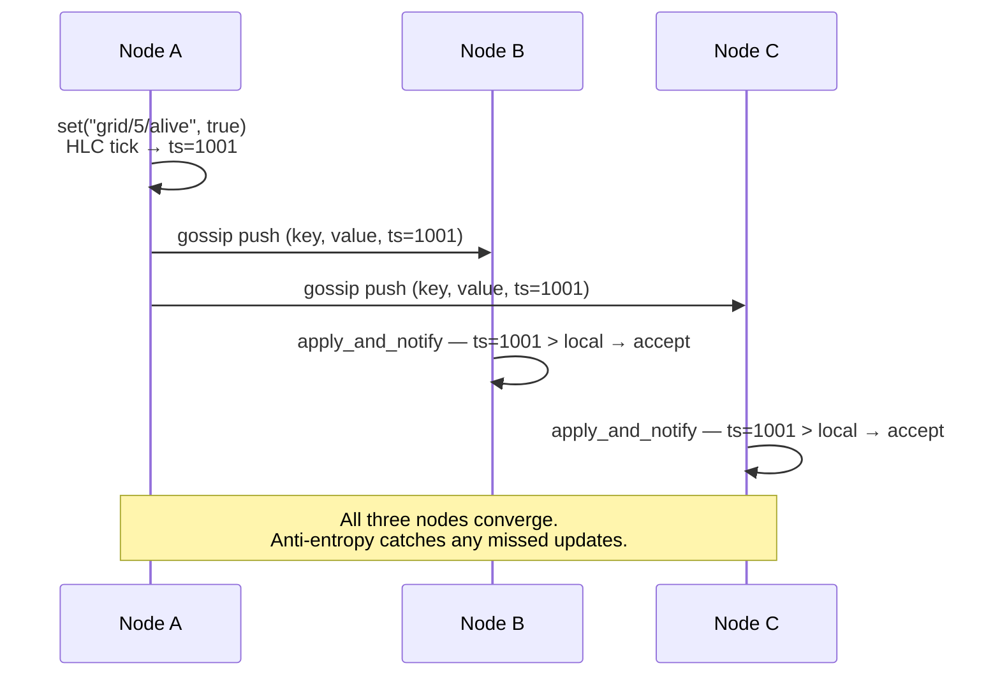

# 01 — Gossip KV: shared state without a broker

## Concept

Most distributed systems assume a coordinator: a Kafka broker, a Redis server,
an etcd cluster. Mycelium's KV store has none. Every node holds a full replica
of the cluster state. Writes propagate by epidemic gossip — each node
periodically fans out updates to a random subset of peers; within a few
round-trip times every node has converged.

**Last-write-wins with causal ordering.** Each value is tagged with a Hybrid
Logical Clock (HLC) timestamp that combines wall-clock time with a logical
counter. Under clock skew the HLC guarantees that any write *after* observing
a remote value has a strictly greater timestamp — so "last write" is "causally
last", not just "physically last".

**TTL-native cleanup.** Every key has a time-to-live. Expired keys are
purged on read and during anti-entropy sync. This means heartbeats, capability
advertisements, and work claims self-clean without a garbage-collection job.



**Anti-entropy.** On reconnect, or on a configurable interval, each node
compares its state digest with a peer's and requests any missing keys. This
means brief network partitions heal automatically — nodes that were isolated
converge as soon as they reconnect.

---

## The Example

**Conway's Game of Life on a 16×16 gossip mesh** — 256 `GossipAgent` instances
run in-process over TCP. Each agent owns one cell. Cell state lives in the KV
store and propagates epidemically. A local timer drives each agent's generation
tick, demonstrating the separation of concerns: gossip handles state
propagation; local timers handle coordination.

**Prerequisites**

```bash
cargo build --example conway
```

**Run**

```bash
cargo run --example conway
# Then open: http://localhost:8090  → switch to "Live (Rust)"
```

**Expected output**

```
conway: raising fd limit to 4096
conway: spawning 256 agents on ports 52000-52255...
conway: all agents started, settling for 3s...
conway: HTTP server listening on :8090
conway: generation loop started
```

The browser shows a 16×16 grid updating every ~300 ms. The glider pattern in
the top-left corner propagates across the toroidal grid.

**What to observe**

- Open the browser during the 3-second settle phase: cells will be
  inconsistent. After settle, the grid converges and generations are clean.
- Resize the window to `Terminal` view to see raw KV churn in the logs.
- Kill and restart `cargo run --example conway` — the grid resets because
  each run uses fresh in-memory state (no persistence configured).

---

## How It Works

`examples/conway.rs:48–60` defines the grid constants. Each agent is created
with a standard `GossipConfig`:

```rust
// conway.rs — one agent per cell
let mut cfg = GossipConfig::default();
cfg.bind_port  = BASE_PORT + idx as u16;
cfg.bootstrap_peers = neighbours(idx)  // 4 cardinal neighbours
    .map(|n| NodeId::new("127.0.0.1", BASE_PORT + n as u16))
    .collect();

let agent = Arc::new(GossipAgent::new(node_id, cfg));
agent.start().await?;
```

The cell key is `grid/{row}/{col}`. Each generation tick:

```rust
// Read neighbour states from local KV (no network call)
let live_neighbours = neighbour_coords(row, col).iter()
    .filter(|(r, c)| agent.get(&format!("grid/{r}/{c}"))
        .map(|b| b.as_ref() == b"1")
        .unwrap_or(false))
    .count();

// Apply Conway rules and write own cell
let next = conway_rule(was_alive, live_neighbours);
agent.set(&format!("grid/{row}/{col}"), Bytes::from(if next { "1" } else { "0" }));
```

`agent.get()` reads from the local in-memory store — no network hop. The
gossip layer ensures that store is a recent replica of the full mesh state.

---

## Dev Notes

**Key namespace design.** All application keys should live under a meaningful
prefix. The KV store is shared across all layers; the namespace table in
`src/lib.rs` documents which prefixes are owned by the library itself. Your
keys should use application-specific prefixes (`app/`, `pipeline/`, `jobs/`).
Avoid `sys/`, `cap/`, `grp/`, `consensus/` — those are library-owned.

**TTL sizing.** The `set` family accepts an optional TTL. Leave it `None` for
durable state. For ephemeral state (heartbeats, work claims, presence) use a
TTL that is comfortably longer than your refresh interval — 3–5× is a good
rule of thumb. Too short and a slow node loses its claim before it finishes.

**`scan_prefix` for bulk reads.** Rather than reading keys one by one, use:

```rust
let cells = agent.scan_prefix("grid/");
// returns Vec<(String, Bytes)> — all keys under prefix, from local store
```

**Persistence across restarts.** By default the KV store is in-memory. To
survive an unclean shutdown, configure a WAL:

```rust
cfg.persistence = Some(PersistenceConfig {
    data_dir:  PathBuf::from("/var/lib/mynode/wal"),
    sync_mode: SyncMode::Flush,  // fsync on every write — forensic grade
});
```

**The KV ring as pipeline buffer.** The fluid pipeline example
([07-pipelines.md](07-pipelines.md)) uses `scan_prefix("pipeline/stage-a/")`
as a distributed work queue. Each item is a KV entry; workers claim items by
writing a claim key with a short TTL; the coordinator drains and routes. No
separate queue infrastructure needed.

**When NOT to use KV for events.** KV is durable-ish shared state. For
ephemeral fan-out events — notifications, triggers, real-time signals — use
the Signal Mesh ([03-signals.md](03-signals.md)) instead. The signal layer
is zero-copy, has no persistence overhead, and is built for high-frequency
fan-out.
