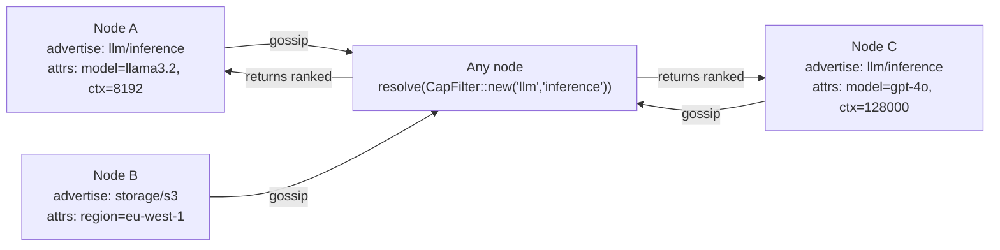

# 02 — Capabilities: find nodes by what they do

> **Run it first (30 s, no LLM):** `cargo run --example hello_capability`
> ([`examples/hello_capability.rs`](../../examples/hello_capability.rs), ~45 readable lines) — one
> node advertises `math/double` and serves it; another resolves it *by name* and calls it over RPC,
> with no address ever configured. This chapter explains what that example does. (`llm_agent` is the
> richer, LLM-driven version.)

## Concept

In a traditional microservice architecture you resolve a service by its address
or a DNS name you configured in advance. In Mycelium you resolve by *what a
node can do*. A node advertises capabilities — `ns/name` pairs with optional
structured attributes — and any other node can ask "give me a provider of
`llm/inference`" and get back a ranked list of live nodes, without any
prior knowledge of their addresses.

This is not service discovery in the traditional sense. There is no registry
service: capability advertisements are KV entries that gossip to every node,
so every node can resolve locally without a network hop. A node that stops
refreshing its advertisement simply evaporates: readers discard entries older
than 3× the refresh interval, so failure detection needs no coordinator either.



**Attributes.** A capability can carry typed attributes (`Text`, `Float`,
`Bool`, `Int`). The resolver can filter on these — e.g. "give me an
`llm/inference` node with `ctx >= 32768`" — before ranking.

**Locality ranking.** When multiple providers exist, Mycelium ranks by
locality first: nodes in the same datacenter or rack are preferred. Locality
is itself a capability (`locality/self` with a region tag), so the ranking
logic is emergent from the same KV substrate.

**Demand pressure.** Nodes can declare requirements — the counterpart to
capabilities. If a required capability is absent from the mesh, the node
writes an opacity entry under `sys/load/` that marks it as temporarily
unavailable to new work. This creates back-pressure without explicit
coordination.

**Emergent groups.** A `CapabilityGroupDef` defines a filter + policy.
Nodes that match the filter self-join the group. No coordinator assigns
membership; group membership emerges from each node independently evaluating
whether it qualifies.

---

## The Example

`examples/llm_agent.rs` creates three nodes that load their capabilities from
TOML manifests (`examples/node_n0.toml`, `node_n1.toml`, `node_n2.toml`).
A probe loop advertises health. The mesh control UI lets you apply any of 11
topology presets and watch capability emergence in real time.

**Prerequisites**

```bash
cargo build --example llm_agent
```

**Run**

```bash
MOCK_LLM=1 cargo run --example llm_agent --features metrics
# Open: http://localhost:8100  (mesh control UI)
```

`MOCK_LLM=1` skips the Ollama probe (no model needed); drop it to drive the presets with a real local
model. `--features metrics` installs the Prometheus recorder so the [Ops Console](../../examples/README.md#ops-console)'s
**Metrics** tab populates when pointed at the demo's gateways (`:9100`–`:9102`).

**What to observe**

- The three nodes appear in the UI within ~2 s of startup.
- Click "Apply preset" → "compute_cluster" — capability badges update live.
- Stop one node (`Ctrl-C` in its terminal or via the UI) — its capability
  advertisement evaporates within 3× its refresh interval (faster with a
  shorter interval in the manifest).
- Click "Probe" — the probe loop writes a `sys/load/` entry and any node
  requiring that capability shows a demand-pressure badge.

---

## How It Works

Advertising a capability returns a `CapabilityReg`. Dropping the handle
stops the refresh loop and the advertisement ages out:

```rust
// llm_agent.rs — advertise at startup
let _cap = agent.capabilities().advertise_capability(
    Capability::new("llm", "inference")
        .with("model",   CapValue::Text("llama3.2".into()))
        .with("ctx_len", CapValue::Integer(8192)),
    Duration::from_secs(60),   // refresh interval
);
// _cap is a CapabilityReg held for the lifetime of the node; drop it to withdraw
```

Resolving picks a live provider. The returned `NodeId` can be used directly
for RPC:

```rust
let providers = agent.capabilities().resolve(&CapFilter::new("llm", "inference"));
if let Some((node_id, cap)) = providers.into_iter().next() {
    let model = cap.attributes.get("model"); // CapValue::Text
    agent.service().rpc_call(node_id, "infer", payload, timeout).await?;
}
```

Declaring a requirement makes the node opaque while unmet. Requirements are
expressed as the same `CapFilter` used for resolution, and the returned
`RequirementHandle` keeps the declaration alive (drop it to withdraw):

```rust
// Node is opaque (won't receive new work) until llm/inference is on the mesh
let _req = agent.capabilities().declare_requirement(
    CapFilter::new("llm", "inference"),
    Duration::from_secs(30),   // re-asserted on this interval
);
```

---

## Dev Notes

**Namespace conventions.** Use `domain/role` for your namespace/name pairs —
e.g. `pipeline/worker`, `storage/blob`, `llm/embedder`. Keep namespaces short
and stable; names can be more specific. Avoid generic names like `service/node`
that will collide if you add a second service type.

**Evaporation, not TTL.** There is no separate TTL parameter: the interval you
pass to `advertise_capability` is both the refresh cadence and the freshness
unit. Readers discard entries whose stamp is more than **3× the interval**
old (`CapEntry::is_fresh`) — so a crashed node's advertisement disappears
from `resolve()` after at most three missed refreshes. The window is
symmetric: an entry stamped further than 3× in the *future* is quarantined
too, so a node with a broken clock cannot make itself un-evaporable. For
services that tolerate ~90 s of stale routing, a 30 s interval is a
reasonable default; for ephemeral workers use 5–10 s.

**Filtering on attributes.** `CapFilter` matches typed constraints, not
closures — constraints travel with the filter, so they also work in
gossip-propagated contexts (requirements, group definitions) where a closure
could not:

```rust
let filter = CapFilter::new("llm", "inference")
    .with("ctx_len", CapConstraint::Gte(CapValue::Integer(32768)));
```

`CapConstraint` covers `Eq`/`Ne`/`Gt`/`Gte`/`Lt`/`Lte`; see
`examples/llm_agent.rs` for `Eq`-on-`Text` used to pick a specific model.

**GroupQuorum pattern.** For operations that require a quorum of a group
(each proposal targets a named *slot*; the result is a `ConsensusResult`,
not a `Result` — match on it):

```rust
let outcome = agent.consensus()
    .group_propose("nlp-workers", "job/assign", payload, ConsensusConfig::default())
    .await;
// or for a durable write with quorum confirmation:
agent.consensus().consistent_set("job/assigned", value).await?;
```

**When NOT to use capabilities.** For a single well-known node (a seed, a
management node) just hardcode the `NodeId` in `bootstrap_peers` — capability
resolution is for dynamic, multi-provider scenarios. For ephemeral workers
that come and go frequently, prefer short TTLs (15–30 s) so stale routes clear
quickly.

**Emergent groups vs static groups.** Static groups (`join_group("workers")`)
are for signal routing. Emergent groups (`CapabilityGroupDef`) are for
quorum-aware operations where membership should track capability presence
automatically. Use static groups for pub/sub; use emergent groups for consensus.

→ Next: [03-signals.md](03-signals.md) — ephemeral events that flow through the same mesh.

---

## Reference — the capability subsystem in depth

*Moved from the repo README (2026-07-10): advertising/resolving, the schema registry (see also [ch. 12](12-schema-lifecycle.md)), requirements, demand pressure, emergent groups, inter-group wiring, locality.*

First-class capability advertisement, discovery, demand pressure, and locality-aware routing — all
built on the Layer I KV store. Nodes declare what they offer (`advertise_capability`), what they
need (`declare_requirement`), and how much demand exists relative to supply (`demand`). No external
registry; everything lives under the `cap/`, `req/`, and `gcap/` namespaces and anti-entropy-syncs
to late joiners automatically.

**Schema versioning** — capabilities carry an optional `schema_id` (e.g. `"acme-ml/v2"`) that is
gossip-propagated alongside the capability entry. Callers that need a specific contract version use
`CapFilter::with_schema("acme-ml/v2")`; providers without that `schema_id` are silently excluded.
This prevents silent semantic mismatches when multiple teams advertise the same `(namespace, name)`
with incompatible payload shapes. Input and output JSON Schemas are also embeddable directly in the
capability (`with_input_schema` / `with_output_schema`) so callers can inspect contracts from
`resolve()` results without a separate KV lookup.

→ The **Capability Market** preset in the [Mesh Control UI](../../examples/mesh_control.html) demonstrates
providers, requirers, and per-capability demand-pressure bars across four capability types.

#### Advertising and Resolving Capabilities

```rust
use mycelium::{Capability, CapFilter, CapabilityHandle};
use std::time::Duration;

// Advertise — periodically reasserts cap/{node_id}/{ns}/{name} in the KV store.
// Drop the handle to stop advertising; the tombstone propagates automatically.
let handle: CapabilityHandle = agent.advertise_capability(
    Capability::new("compute", "gpu")
        .with_schema_id("acme-ml/v2")                      // optional contract version
        .with_input_schema(r#"{"type":"object"}"#)          // gossip-propagated JSON Schema
        .with_output_schema(r#"{"type":"string"}"#),
    Duration::from_secs(30),  // reassert interval
);

// Resolve — snapshot of every node currently advertising a matching capability.
// Without with_schema: all providers regardless of schema_id.
let filter = CapFilter::new("compute", "gpu");
let matches: Vec<(NodeId, Capability)> = agent.resolve(&filter);

// With schema constraint: only providers advertising schema "acme-ml/v2".
// Providers with no schema_id or a different schema_id are excluded.
let filter_v2 = CapFilter::new("compute", "gpu").with_schema("acme-ml/v2");
let v2_providers = agent.resolve(&filter_v2);

// Inspect the payload contract from the resolved capability.
if let Some((node, cap)) = v2_providers.first() {
    if let Some(schema) = &cap.input_schema {
        // validate your payload against schema before rpc_call
    }
}

// Watch — push-based; fires when the matching set changes.
// Debounced: burst KV writes within 50 ms collapse to one notification.
let mut rx: watch::Receiver<Vec<(NodeId, Capability)>> = agent.watch_capabilities(filter);
rx.changed().await?;
let current = rx.borrow().clone();
```

#### Schema Registry — Publish and Govern Contracts

Schemas live in the gossip KV ring under `schemas/{schema_id}`. Any node can read
them; they propagate via anti-entropy like all other KV state. The inline
`input_schema` / `output_schema` fields on each capability are a gossip-propagated
snapshot — callers inspect the contract from `resolve()` without a separate lookup.

```rust
use mycelium::SchemaPublishResult;

// Publish once at startup (or seed a whole directory).
// Returns Published / Unchanged / Conflict — never silently overwrites.
let schema = br#"{"type":"object","required":["prompt"],"properties":{"prompt":{"type":"string"}}}"#;
match agent.schemas().publish_schema("acme/ml-inference/v1", schema).await? {
    SchemaPublishResult::Published          => println!("registered"),
    SchemaPublishResult::Unchanged          => println!("already up to date"),
    SchemaPublishResult::Conflict { existing } => eprintln!("conflict: {:?}", existing),
}

// Seed all *.json files from a directory; schema_id = relative path without extension.
// schemas/acme/ml-inference/v1.json  →  schema_id "acme/ml-inference/v1"
let results = agent.schemas().seed_schemas_from_dir("./schemas").await;

// Look up and enumerate
let bytes  = agent.schemas().get_schema("acme/ml-inference/v1");
let all    = agent.schemas().list_schemas();  // Vec<(schema_id, json_bytes)> sorted by id

// Force-overwrite (development / migration only — never use in production CI)
agent.schemas().force_publish_schema("acme/ml-inference/v1", updated_schema).await?;
```

See [12-schema-lifecycle.md](12-schema-lifecycle.md) for the
full lifecycle guide: naming conventions, CI/CD gate, rollout window, and the
`v1 → v2` migration pattern.

#### Requirements — Declare What You Need

```rust
// Declare — periodically writes req/{node_id}/{ns}/{name} to the KV store.
// Visible to demand watchers on any node; used by orchestrators and autoscalers.
let _handle = agent.declare_requirement(
    CapFilter::new("compute", "gpu"),
    Duration::from_secs(30),
);

// Watch requirement status — fires when the provider set changes relative to this
// node's declared need.
let mut rx = agent.watch_requirement(CapFilter::new("compute", "gpu"));
rx.changed().await?;
let status = rx.borrow();
println!("satisfied: {}", status.is_satisfied());
for provider in &status.providers {
    println!("  provider: {}", provider.node_id);
}
```

#### Demand Pressure

`demand_pressure` is `demanding_nodes.len() / max(providers.len(), 1)`. Pressure > 1.0 means
demand outstrips supply. The library never auto-responds to high pressure — this is a signal
for orchestrators, autoscalers, and dashboards.

```rust
let filter = CapFilter::new("compute", "gpu");

// Snapshot
let status: DemandStatus = agent.demand(&filter);
println!("{} demanding, {} providing, pressure {:.2}",
    status.demanding_nodes.len(), status.providers.len(), status.demand_pressure);

// Push-based — debounced, fires on req/, cap/, or gcap/ changes matching filter
let mut rx = agent.watch_demand(filter);
rx.changed().await?;
let s = rx.borrow();
if s.demand_pressure > 2.0 {
    eprintln!("demand critical: {:.2}", s.demand_pressure);
}
```

#### Emergent Capability Groups

Nodes that share a capability automatically form a named group via `define_capability_group`.
The library projects their collective capability under `gcap/{group}/{ns}/{name}/{contributor}`
and handles group-level requirement wiring. One consolidated task per group keeps task count
O(groups), not O(groups × members).

→ The **Emergent GPU Pool** preset in the [Mesh Control UI](../../examples/mesh_control.html) shows a
20-node worker pool that assembles dynamically and fans out render jobs to all members.

```rust
use mycelium::{CapabilityGroupDef, CapFilter, Capability};
use std::time::Duration;

// Any node that advertises compute/gpu joins the "gpu-pool" group automatically.
// The library maintains gcap/ projections and group-level wiring.
agent.define_capability_group(
    "gpu-pool",
    CapabilityGroupDef {
        filter:   CapFilter::new("compute", "gpu"),
        provides: vec![Capability::new("compute", "gpu")],
        requires: vec![],
    },
    Duration::from_secs(60),  // reassert interval
);
```

#### Inter-Group Wiring

Wiring connects a consumer's declared requirement to provider groups without the consumer needing
to know which nodes are in the group or how many there are. `signal_wired_via` dispatches a signal
to all matching providers in one call.

```rust
use mycelium::CapFilter;

let filter = CapFilter::new("compute", "gpu");

// Snapshot of wiring state — WiringStatus::Wired or WiringStatus::Unwired
let wiring: WiringStatus = agent.resolve_wiring(&filter);

// Push-based wiring watch
let mut rx = agent.watch_wiring(filter.clone());

// Dispatch to all wired providers — returns Emitted{providers} or Unwired{filter}
let outcome = agent.signal_wired_via(&filter, "render-job", payload).await;
```

#### Locality-Aware Resolution

Each node declares a `locality_path` in its config (coarse → fine: `["az1", "rack2", "host3"]`).
`resolve_with_locality` sorts providers by shared-prefix depth with the caller — topologically
closest first. `signal_wired_via_locality` combines wiring with locality preference in one call.

→ The **Locality Mesh** preset in the [Mesh Control UI](../../examples/mesh_control.html) covers 12 nodes
across two availability zones: remove a close provider and the resolver shifts to the next ring.

```rust
// Config — set once before agent.start()
config.locality_path = vec!["az1".to_string(), "rack2".to_string(), "host3".to_string()];

// resolve_with_locality returns (NodeId, Capability, depth) sorted by depth desc.
// depth = length of shared locality prefix between this node and the provider.
let candidates = agent.resolve_with_locality(
    &CapFilter::new("render", "job"),
    LocalityPreference::PreferShared(0),  // prefer closest; fall back to any
);
for (node_id, _cap, depth) in &candidates {
    println!("  {node_id} depth={depth}");
}

// Route to locality-closest provider via wiring
agent.signal_wired_via_locality(
    &CapFilter::new("render", "job"),
    LocalityPreference::PreferShared(0),
    "render-job",
    payload,
).await;
```

`LocalityPreference` variants:
- `Any` — no locality preference; returns all providers
- `PreferShared(min_depth)` — prefer providers at shared depth ≥ min_depth; fall back to any
- `Strict(min_depth)` — only providers at depth ≥ min_depth; empty if none qualify

---
