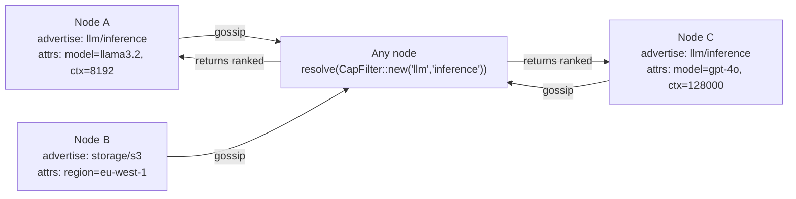

# 02 — Capabilities: find nodes by what they do

## Concept

In a traditional microservice architecture you resolve a service by its address
or a DNS name you configured in advance. In Mycelium you resolve by *what a
node can do*. A node advertises capabilities — `ns/name` pairs with optional
structured attributes — and any other node can ask "give me a provider of
`llm/inference`" and get back a ranked list of live nodes, without any
prior knowledge of their addresses.

This is not service discovery in the traditional sense. There is no registry
service: capability advertisements are KV entries that gossip to every node,
so every node can resolve locally without a network hop. A node that stops
refreshing its advertisement simply evaporates: readers discard entries older
than 3× the refresh interval, so failure detection needs no coordinator either.



**Attributes.** A capability can carry typed attributes (`Text`, `Float`,
`Bool`, `Int`). The resolver can filter on these — e.g. "give me an
`llm/inference` node with `ctx >= 32768`" — before ranking.

**Locality ranking.** When multiple providers exist, Mycelium ranks by
locality first: nodes in the same datacenter or rack are preferred. Locality
is itself a capability (`locality/self` with a region tag), so the ranking
logic is emergent from the same KV substrate.

**Demand pressure.** Nodes can declare requirements — the counterpart to
capabilities. If a required capability is absent from the mesh, the node
writes an opacity entry under `sys/load/` that marks it as temporarily
unavailable to new work. This creates back-pressure without explicit
coordination.

**Emergent groups.** A `CapabilityGroupDef` defines a filter + policy.
Nodes that match the filter self-join the group. No coordinator assigns
membership; group membership emerges from each node independently evaluating
whether it qualifies.

---

## The Example

`examples/llm_agent.rs` creates three nodes that load their capabilities from
TOML manifests (`examples/node_n0.toml`, `node_n1.toml`, `node_n2.toml`).
A probe loop advertises health. The mesh control UI lets you apply any of 11
topology presets and watch capability emergence in real time.

**Prerequisites**

```bash
cargo build --example llm_agent
```

**Run**

```bash
cargo run --example llm_agent
# Open: http://localhost:8100  (mesh control UI)
```

**What to observe**

- The three nodes appear in the UI within ~2 s of startup.
- Click "Apply preset" → "compute_cluster" — capability badges update live.
- Stop one node (`Ctrl-C` in its terminal or via the UI) — its capability
  advertisement evaporates within 3× its refresh interval (faster with a
  shorter interval in the manifest).
- Click "Probe" — the probe loop writes a `sys/load/` entry and any node
  requiring that capability shows a demand-pressure badge.

---

## How It Works

Advertising a capability returns a `CapabilityReg`. Dropping the handle
stops the refresh loop and the advertisement ages out:

```rust
// llm_agent.rs — advertise at startup
let _cap = agent.capabilities().advertise_capability(
    Capability::new("llm", "inference")
        .with("model",   CapValue::Text("llama3.2".into()))
        .with("ctx_len", CapValue::Integer(8192)),
    Duration::from_secs(60),   // refresh interval
);
// _cap is a CapabilityReg held for the lifetime of the node; drop it to withdraw
```

Resolving picks a live provider. The returned `NodeId` can be used directly
for RPC:

```rust
let providers = agent.capabilities().resolve(&CapFilter::new("llm", "inference"));
if let Some((node_id, cap)) = providers.into_iter().next() {
    let model = cap.attributes.get("model"); // CapValue::Text
    agent.service().rpc_call(node_id, "infer", payload, timeout).await?;
}
```

Declaring a requirement makes the node opaque while unmet. Requirements are
expressed as the same `CapFilter` used for resolution, and the returned
`RequirementHandle` keeps the declaration alive (drop it to withdraw):

```rust
// Node is opaque (won't receive new work) until llm/inference is on the mesh
let _req = agent.capabilities().declare_requirement(
    CapFilter::new("llm", "inference"),
    Duration::from_secs(30),   // re-asserted on this interval
);
```

---

## Dev Notes

**Namespace conventions.** Use `domain/role` for your namespace/name pairs —
e.g. `pipeline/worker`, `storage/blob`, `llm/embedder`. Keep namespaces short
and stable; names can be more specific. Avoid generic names like `service/node`
that will collide if you add a second service type.

**Evaporation, not TTL.** There is no separate TTL parameter: the interval you
pass to `advertise_capability` is both the refresh cadence and the freshness
unit. Readers discard entries whose stamp is more than **3× the interval**
old (`CapEntry::is_fresh`) — so a crashed node's advertisement disappears
from `resolve()` after at most three missed refreshes. The window is
symmetric: an entry stamped further than 3× in the *future* is quarantined
too, so a node with a broken clock cannot make itself un-evaporable. For
services that tolerate ~90 s of stale routing, a 30 s interval is a
reasonable default; for ephemeral workers use 5–10 s.

**Filtering on attributes.** `CapFilter` matches typed constraints, not
closures — constraints travel with the filter, so they also work in
gossip-propagated contexts (requirements, group definitions) where a closure
could not:

```rust
let filter = CapFilter::new("llm", "inference")
    .with("ctx_len", CapConstraint::Gte(CapValue::Integer(32768)));
```

`CapConstraint` covers `Eq`/`Ne`/`Gt`/`Gte`/`Lt`/`Lte`; see
`examples/llm_agent.rs` for `Eq`-on-`Text` used to pick a specific model.

**GroupQuorum pattern.** For operations that require a quorum of a group
(each proposal targets a named *slot*; the result is a `ConsensusResult`,
not a `Result` — match on it):

```rust
let outcome = agent.consensus()
    .group_propose("nlp-workers", "job/assign", payload, ConsensusConfig::default())
    .await;
// or for a durable write with quorum confirmation:
agent.consensus().consistent_set("job/assigned", value).await?;
```

**When NOT to use capabilities.** For a single well-known node (a seed, a
management node) just hardcode the `NodeId` in `bootstrap_peers` — capability
resolution is for dynamic, multi-provider scenarios. For ephemeral workers
that come and go frequently, prefer short TTLs (15–30 s) so stale routes clear
quickly.

**Emergent groups vs static groups.** Static groups (`join_group("workers")`)
are for signal routing. Emergent groups (`CapabilityGroupDef`) are for
quorum-aware operations where membership should track capability presence
automatically. Use static groups for pub/sub; use emergent groups for consensus.

→ Next: [03-signals.md](03-signals.md) — ephemeral events that flow through the same mesh.
