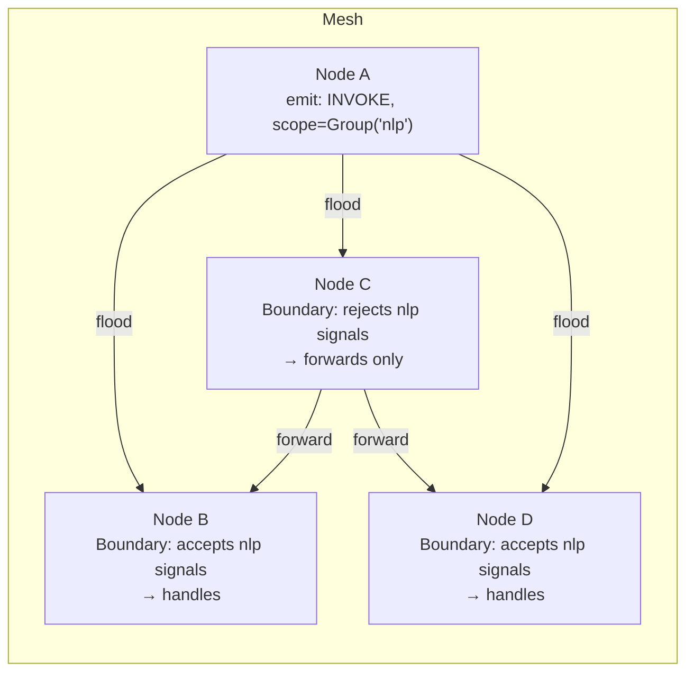

# 03 — Signal Mesh: ephemeral scoped events

## Concept

The KV store ([01-gossip-kv.md](01-gossip-kv.md)) is for durable shared state.
Signals are for things you don't need to persist: notifications, triggers,
fan-out events, real-time coordination pulses. They propagate epidemically
like KV updates, but they are not stored anywhere — they fire and are gone.

Each node holds a `Boundary` — a set of admission rules that decide whether
the node *acts* on an incoming signal. Forwarding is always unconditional
(every node propagates every signal it receives, regardless of its own
boundary), but acting is local. This creates a **pheromone-style** model:
signals diffuse through the entire mesh, and each node independently decides
whether it responds.



**Scopes** control which nodes can act on a signal:

| Scope | Who acts |
|-------|---------|
| `SignalScope::System` | All nodes in the cluster |
| `SignalScope::Group(name)` | Only nodes that have joined the named group |
| `SignalScope::Individual(id)` | Only the specific target node (point-to-point) |
| `SignalScope::Groups(names)` | Union membership — nodes in *any* of the named groups (used by `cross_group_propose`) |

(Locality-aware *routing* is not a scope: use
`capabilities().signal_wired_via_locality(...)`, which resolves a provider
group by filter + locality preference at emission time.)

**Opacity composition.** Any reason a node is temporarily overloaded or
unavailable writes a distinct entry under `sys/load/{self}/...` with
`is_opaque = true`. `is_self_opaque()` returns true if *any* entry is opaque —
so multiple independent subsystems (capability demand, group requirements,
application load) can each mark the node as opaque without interfering.

**Reliable signals.** For cases where you need explicit acknowledgement, the
overlay layer adds `emit_reliable` — a signal with an ACK mechanism backed by
the consensus overlay. Use it sparingly; most event patterns do not need it.

---

## The Example

The coop suite's [`mailbox_llm`](../../examples/coop/src/bin/mailbox_llm.rs)
example exercises this end to end. `kitchen-router` registers a Prompt Skill
(`routing/suggest`, `EchoBackend` — a test backend that returns its input
unchanged); `depot-triage` discovers it via capability resolution and invokes it
over RPC, with the request itself delivered as a durable **mailbox** event. The
invocation path goes through the signal mesh: an Individual-scoped frame to the
provider, whose boundary admits it and routes to the backend.

**Run**

```bash
cargo run -p mycelium-coop-examples --bin mailbox_llm
```

**Expected output** (abridged)

```
[kitchen-router] registered skill routing/suggest (EchoBackend)
[depot-intake] cluster peered; routing/suggest visible to triage
[depot-intake] ← triage replied: [1] echo: Route this donation ...
All assertions passed — 3 donations routed via the mailbox, in order.
```

(For the two-node prompt-skill mechanics on their own — including live template
updates — see [05 · Skills](05-skills.md). The earlier `prompt_skill_demo`
example was retired into this suite; see the
[example portfolio](../../examples/coop/README.md).)

---

## How It Works

Subscribing to signals uses a `Boundary` rule attached to a kind string:

```rust
// register a handler channel, then drain it in a task
let mut rx = agent.mesh().signal_rx(signal_kind::INVOKE);
tokio::spawn(async move {
    while let Some(signal) = rx.recv().await {
        let payload = signal.payload.clone();
        tokio::spawn(async move { handle_invocation(payload).await });
    }
});
```

Emitting floods the signal through the mesh:

```rust
// Scoped to all nodes in group "nlp"
agent.mesh().emit(
    signal_kind::INVOKE,
    SignalScope::Group("nlp".into()),
    Bytes::from(serde_json::to_vec(&request)?),
);

// Point-to-point to a specific node
agent.mesh().emit(
    signal_kind::RESULT,
    SignalScope::Individual(caller_node_id),
    Bytes::from(response_bytes),
);
```

Joining a group makes a node eligible to receive group-scoped signals:

```rust
agent.mesh().join_group("nlp");
```

Blocking signal delivery during a refractory period or maintenance window:

```rust
// suppress() blocks delivery of a kind for the given duration — deterministic, 100% block.
// The node continues to forward signals; only local handler delivery is paused.
agent.mesh().suppress(signal_kind::INVOKE, Duration::from_secs(30));

// Lift early if the window ends sooner than expected
agent.mesh().unsuppress(signal_kind::INVOKE);
```

For proactive peer notification that this node is becoming overloaded, use
`agent.capabilities().manage_opacity()` — opacity is load-state, so it lives
on the capabilities handle, not the mesh. See the
[README opacity section](../../README.md) for the full API and the opacity vs
inhibition distinction.

---

## Dev Notes

**Signal kinds are strings.** `signal_kind::INVOKE`, `signal_kind::RESULT` are
pre-defined constants in `src/signal.rs`. For application-level events define
your own:

```rust
pub const MY_EVENT: &str = "myapp/event";
```

Keep them namespaced (`app/kind`, not just `kind`) to avoid collisions with
library-defined kinds.

**Signals vs KV for coordination.** Use signals when:
- The event is a trigger ("run now", "you have work") not a state change
- Delivery to all relevant nodes within ~100 ms is sufficient
- You do not need to replay missed events to newly-joined nodes
- Fan-out to a group is the natural model

Use KV when:
- The event *is* the state (presence, configuration, work item)
- Newly-joined nodes need to discover the current state
- You need the value to survive a node restart

**`emit_async` vs `emit`.** `emit` is fire-and-forget, synchronous initiation.
`emit_async` awaits until the signal has been accepted into the outbound queue
of all connected peers. Use `emit_async` when you need a bounded delivery
guarantee before proceeding; use `emit` for high-frequency events where
back-pressure is acceptable.

**Opacity and the `emit`/`receive` split.** A node that is opaque still
*forwards* all signals — it just doesn't act on them. This means opacity does
not create holes in the gossip graph. A temporarily overloaded node remains a
routing participant; it just stops doing work.

**Group-scoped signals and routing efficiency.** Group-scoped signals still
flood the whole mesh; it's just that only group members act on them. For very
large clusters where bandwidth matters, prefer the `Locality` scope to
constrain propagation geographically.

→ Next: [04-consensus.md](04-consensus.md) — opt-in strong consistency on top of this substrate.
