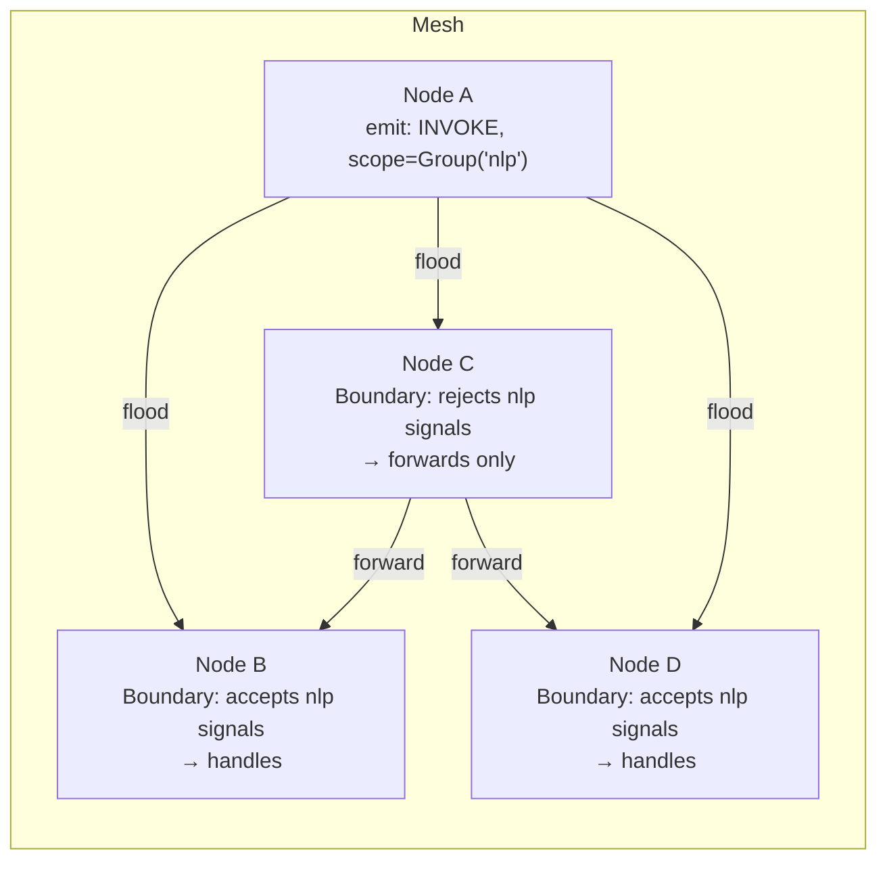

# 03 — Signal Mesh: ephemeral scoped events

## Concept

The KV store ([01-gossip-kv.md](01-gossip-kv.md)) is for durable shared state.
Signals are for things you don't need to persist: notifications, triggers,
fan-out events, real-time coordination pulses. They propagate epidemically
like KV updates, but they are not stored anywhere — they fire and are gone.

Each node holds a `Boundary` — a set of admission rules that decide whether
the node *acts* on an incoming signal. Forwarding is always unconditional
(every node propagates every signal it receives, regardless of its own
boundary), but acting is local. This creates a **pheromone-style** model:
signals diffuse through the entire mesh, and each node independently decides
whether it responds.



**Scopes** control which nodes can act on a signal:

| Scope | Who acts |
|-------|---------|
| `SignalScope::System` | All nodes in the cluster |
| `SignalScope::Group(name)` | Only nodes that have joined the named group |
| `SignalScope::Node(id)` | Only the specific target node (point-to-point) |
| `SignalScope::Locality(region)` | Only nodes in the named region |

**Opacity composition.** Any reason a node is temporarily overloaded or
unavailable writes a distinct entry under `sys/load/{self}/...` with
`is_opaque = true`. `is_self_opaque()` returns true if *any* entry is opaque —
so multiple independent subsystems (capability demand, group requirements,
application load) can each mark the node as opaque without interfering.

**Reliable signals.** For cases where you need explicit acknowledgement, the
overlay layer adds `emit_reliable` — a signal with an ACK mechanism backed by
the consensus overlay. Use it sparingly; most event patterns do not need it.

---

## The Example

`examples/prompt_skill_demo.rs` creates two in-process nodes. Node A registers
a Prompt Skill (`demo/echo`) using `EchoBackend` — a test backend that returns
its input unchanged. Node B discovers the skill via capability resolution and
invokes it. The invocation path goes through the signal mesh: the capability
system emits an `INVOKE` signal scoped to the `llm` group; Node A's boundary
accepts it and routes to the echo backend.

**Prerequisites**

```bash
cargo build --example prompt_skill_demo --features llm
```

**Run**

```bash
cargo run --example prompt_skill_demo --features llm
```

**Expected output**

```
prompt_skill_demo: node_a started on :7900
prompt_skill_demo: node_b started on :7901
prompt_skill_demo: node_a registered demo/echo skill
prompt_skill_demo: node_b discovered demo/echo on node_a
prompt_skill_demo: invoking demo/echo with "Hello, mesh!"
prompt_skill_demo: reply: "Hello, mesh!"
```

---

## How It Works

Subscribing to signals uses a `Boundary` rule attached to a kind string:

```rust
// src/agent/signal_ops.rs — subscribe pattern
agent.subscribe(signal_kind::INVOKE, move |signal: Signal| {
    let payload = signal.payload.clone();
    tokio::spawn(async move { handle_invocation(payload).await });
});
```

Emitting floods the signal through the mesh:

```rust
// Scoped to all nodes in group "nlp"
agent.emit(
    signal_kind::INVOKE,
    SignalScope::Group("nlp".into()),
    Bytes::from(serde_json::to_vec(&request)?),
);

// Point-to-point to a specific node
agent.emit(
    signal_kind::RESULT,
    SignalScope::Node(caller_node_id),
    Bytes::from(response_bytes),
);
```

Joining a group makes a node eligible to receive group-scoped signals:

```rust
agent.join_group("nlp");
```

Setting opacity (marking yourself temporarily unavailable):

```rust
// Write any key under sys/load/{self}/... with is_opaque=true
agent.set_opaque("my-app/overloaded", true);
// Clear it when ready again
agent.set_opaque("my-app/overloaded", false);
```

---

## Dev Notes

**Signal kinds are strings.** `signal_kind::INVOKE`, `signal_kind::RESULT` are
pre-defined constants in `src/signal.rs`. For application-level events define
your own:

```rust
pub const MY_EVENT: &str = "myapp/event";
```

Keep them namespaced (`app/kind`, not just `kind`) to avoid collisions with
library-defined kinds.

**Signals vs KV for coordination.** Use signals when:
- The event is a trigger ("run now", "you have work") not a state change
- Delivery to all relevant nodes within ~100 ms is sufficient
- You do not need to replay missed events to newly-joined nodes
- Fan-out to a group is the natural model

Use KV when:
- The event *is* the state (presence, configuration, work item)
- Newly-joined nodes need to discover the current state
- You need the value to survive a node restart

**`emit_async` vs `emit`.** `emit` is fire-and-forget, synchronous initiation.
`emit_async` awaits until the signal has been accepted into the outbound queue
of all connected peers. Use `emit_async` when you need a bounded delivery
guarantee before proceeding; use `emit` for high-frequency events where
back-pressure is acceptable.

**Opacity and the `emit`/`receive` split.** A node that is opaque still
*forwards* all signals — it just doesn't act on them. This means opacity does
not create holes in the gossip graph. A temporarily overloaded node remains a
routing participant; it just stops doing work.

**Group-scoped signals and routing efficiency.** Group-scoped signals still
flood the whole mesh; it's just that only group members act on them. For very
large clusters where bandwidth matters, prefer the `Locality` scope to
constrain propagation geographically.

→ Next: [04-consensus.md](04-consensus.md) — opt-in strong consistency on top of this substrate.
