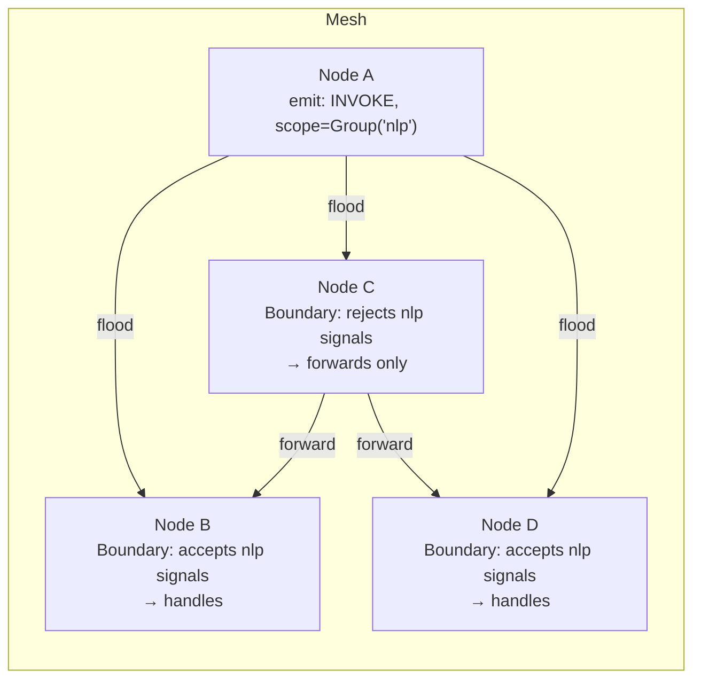

# 03 — Signal Mesh: ephemeral scoped events

## Concept

The KV store ([01-gossip-kv.md](01-gossip-kv.md)) is for durable shared state.
Signals are for things you don't need to persist: notifications, triggers,
fan-out events, real-time coordination pulses. They propagate epidemically
like KV updates, but they are not stored anywhere — they fire and are gone.

Each node holds a `Boundary` — a set of admission rules that decide whether
the node *acts* on an incoming signal. Forwarding is always unconditional
(every node propagates every signal it receives, regardless of its own
boundary), but acting is local. This creates a **pheromone-style** model:
signals diffuse through the entire mesh, and each node independently decides
whether it responds.



**Scopes** control which nodes can act on a signal:

| Scope | Who acts |
|-------|---------|
| `SignalScope::Cluster` | All nodes in the cluster |
| `SignalScope::Group(name)` | Only nodes that have joined the named group |
| `SignalScope::Individual(id)` | Only the specific target node (point-to-point) |
| `SignalScope::Groups(names)` | Union membership — nodes in *any* of the named groups (used by `cross_group_propose`) |

(Locality-aware *routing* is not a scope: use
`capabilities().signal_wired_via_locality(...)`, which resolves a provider
group by filter + locality preference at emission time.)

**Opacity composition.** Any reason a node is temporarily overloaded or
unavailable writes a distinct entry under `sys/load/{self}/...` with
`is_opaque = true`. `is_self_opaque()` returns true if *any* entry is opaque —
so multiple independent subsystems (capability demand, group requirements,
application load) can each mark the node as opaque without interfering.

**Reliable signals.** For cases where you need explicit acknowledgement, the
overlay layer adds `emit_reliable` — a signal with an ACK mechanism backed by
the consensus overlay. Use it sparingly; most event patterns do not need it.

---

## The Example

The coop suite's [`mailbox_llm`](../../examples/coop/src/bin/mailbox_llm.rs)
example exercises this end to end. `kitchen-router` registers a Prompt Skill
(`routing/suggest`, `EchoBackend` — a test backend that returns its input
unchanged); `depot-triage` discovers it via capability resolution and invokes it
over RPC, with the request itself delivered as a durable **mailbox** event. The
invocation path goes through the signal mesh: an Individual-scoped frame to the
provider, whose boundary admits it and routes to the backend.

**Run**

```bash
cargo run -p mycelium-coop-examples --bin mailbox_llm
```

**Expected output** (abridged)

```
[kitchen-router] registered skill routing/suggest (EchoBackend)
[depot-intake] cluster peered; routing/suggest visible to triage
[depot-intake] ← triage replied: [1] echo: Route this donation ...
All assertions passed — 3 donations routed via the mailbox, in order.
```

(For the two-node prompt-skill mechanics on their own — including live template
updates — see [05 · Skills](05-skills.md). The earlier `prompt_skill_demo`
example was retired into this suite; see the
[example portfolio](../../examples/coop/README.md).)

---

## How It Works

Subscribing to signals uses a `Boundary` rule attached to a kind string:

```rust
// register a handler channel, then drain it in a task
let mut rx = agent.mesh().signal_rx(signal_kind::INVOKE);
tokio::spawn(async move {
    while let Some(signal) = rx.recv().await {
        let payload = signal.payload.clone();
        tokio::spawn(async move { handle_invocation(payload).await });
    }
});
```

Emitting floods the signal through the mesh:

```rust
// Scoped to all nodes in group "nlp"
agent.mesh().emit(
    signal_kind::INVOKE,
    SignalScope::Group("nlp".into()),
    Bytes::from(serde_json::to_vec(&request)?),
);

// Point-to-point to a specific node
agent.mesh().emit(
    signal_kind::RESULT,
    SignalScope::Individual(caller_node_id),
    Bytes::from(response_bytes),
);
```

Joining a group makes a node eligible to receive group-scoped signals:

```rust
agent.mesh().join_group("nlp");
```

Blocking signal delivery during a refractory period or maintenance window:

```rust
// suppress() blocks delivery of a kind for the given duration — deterministic, 100% block.
// The node continues to forward signals; only local handler delivery is paused.
agent.mesh().suppress(signal_kind::INVOKE, Duration::from_secs(30));

// Lift early if the window ends sooner than expected
agent.mesh().unsuppress(signal_kind::INVOKE);
```

For proactive peer notification that this node is becoming overloaded, use
`agent.capabilities().manage_opacity()` — opacity is load-state, so it lives
on the capabilities handle, not the mesh. See the
[README opacity section](../../README.md) for the full API and the opacity vs
inhibition distinction.

---

## Dev Notes

**Signal kinds are strings.** `signal_kind::INVOKE`, `signal_kind::RESULT` are
pre-defined constants in `src/signal.rs`. For application-level events define
your own:

```rust
pub const MY_EVENT: &str = "myapp/event";
```

Keep them namespaced (`app/kind`, not just `kind`) to avoid collisions with
library-defined kinds.

**Signals vs KV for coordination.** Use signals when:
- The event is a trigger ("run now", "you have work") not a state change
- Delivery to all relevant nodes within ~100 ms is sufficient
- You do not need to replay missed events to newly-joined nodes
- Fan-out to a group is the natural model

Use KV when:
- The event *is* the state (presence, configuration, work item)
- Newly-joined nodes need to discover the current state
- You need the value to survive a node restart

**`emit_async` vs `emit`.** `emit` is fire-and-forget, synchronous initiation.
`emit_async` awaits until the signal has been accepted into the outbound queue
of all connected peers. Use `emit_async` when you need a bounded delivery
guarantee before proceeding; use `emit` for high-frequency events where
back-pressure is acceptable.

**Opacity and the `emit`/`receive` split.** A node that is opaque still
*forwards* all signals — it just doesn't act on them. This means opacity does
not create holes in the gossip graph. A temporarily overloaded node remains a
routing participant; it just stops doing work.

**Group-scoped signals and routing efficiency.** Group-scoped signals still
flood the whole mesh; it's just that only group members act on them. For very
large clusters where bandwidth matters, prefer the `Locality` scope to
constrain propagation geographically.

→ Next: [04-consensus.md](04-consensus.md) — opt-in strong consistency on top of this substrate.

---

## Reference — the signal mesh in depth

*Moved from the repo README (2026-07-10): the full API surface, mesh observability, the opacity-vs-inhibition treatment, and signals-vs-pheromone-trails.*

Signals are ephemeral events that propagate epidemically to every node in the cluster. Each node
holds a local **boundary** — a set of group memberships — that decides whether it *acts* on an
incoming signal. Forwarding is always unconditional; the boundary only controls local delivery.

```rust
use mycelium::{signal_kind, SignalScope, OpacityHint};
use std::time::Duration;

// ── Group membership ──────────────────────────────────────────────────────
agent.mesh().join_group("nlp");
agent.mesh().leave_group("nlp");
let groups: Vec<Arc<str>> = agent.groups();  // current memberships

// ── Advertise — periodic heartbeat + pheromone trail ─────────────────────
let load_key = format!("load/{}", agent.node_id());
let agent2 = agent.clone();
let _advert = agent.mesh().advertise(
    signal_kind::CONTRACT_AVAILABLE,
    SignalScope::Group("nlp"),
    Duration::from_secs(10),
    move || {
        let state = LoadState { queue_depth: QUEUE.len(), written_at_ms: unix_ms_now() };
        agent2.kv().set(load_key.clone(), encode(&state));  // pheromone trail — persists
        encode(&state)                                  // signal payload — fast delivery
    },
);
// Drop _advert to stop advertising; call agent.kv().delete(&load_key) on graceful shutdown

// ── Receive signals ────────────────────────────────────────────────────────
let mut rx = agent.mesh().signal_rx(signal_kind::INVOKE);
tokio::spawn(async move {
    while let Some(sig) = rx.recv().await {
        // sig.sender, sig.payload, sig.scope, sig.nonce
    }
});
// Channel sizing: the default depth of 256 suits kinds that arrive at a few Hz
// (health probes, contract advertisements). For kinds where N agents all emit
// simultaneously (e.g. INVOKE to a group of N workers), use:
//   agent.mesh().signal_rx_with_capacity(kind, N * expected_burst)
// A full channel logs a warning and drops the signal — there is no retry.

// ── Sender-filtered receive (signal sender authorization) ──────────────────
// Only deliver signals whose sender is in the trusted list. Signals from any
// other node are silently discarded before reaching the channel. Useful for
// LLM-driven agents that process signal payloads as prompts — prevents
// semantic injection from compromised or buggy peers.
// With --features tls, sender identity is backed by an Ed25519 keypair.
let orchestrator: NodeId = "10.0.1.1:7700".parse().unwrap();
let mut rx = agent.mesh().signal_rx_from("task.assign", vec![orchestrator]);

// ── Emit ───────────────────────────────────────────────────────────────────
agent.mesh().emit("invoke", SignalScope::Group("nlp"), payload);       // non-blocking
agent.mesh().emit_async("invoke", SignalScope::Group("nlp"), payload).await; // awaits capacity

// ── One-shot request/response — register BEFORE emitting the request ───────
let reply = agent.mesh().signal_once("invoke.result", Duration::from_secs(5), |s| {
    s.nonce == request_nonce
}).await;  // → Option<Signal>; None on timeout

// ── Scopes ─────────────────────────────────────────────────────────────────
SignalScope::Cluster              // every node acts; shed under load by opacity
SignalScope::Group("name")       // nodes that called join_group("name")
SignalScope::Individual(node_id) // exactly one node; bypasses opacity shedding
```

#### Observing the Mesh

Layer 2 provides several complementary lenses into mesh state. They answer different questions:

```rust
// ── When did I last hear a signal of this kind? ────────────────────────────
// Useful for: circuit-breaker logic, retry decisions, fault detection.
// Returns None if the kind has never been delivered to this node.
let age: Option<Duration> = agent.mesh().last_signal(signal_kind::CONTRACT_AVAILABLE)
    .map(|t| t.elapsed());

// ── Watch — fault detection / supervisor pattern ───────────────────────────
// Calls on_stale() when last_signal(kind) has been silent for longer than threshold.
// Checks every threshold/4 (minimum 100ms). Returns WatchHandle; drop to cancel.
let _watcher = agent.mesh().watch(
    signal_kind::CONTRACT_AVAILABLE,
    Duration::from_secs(30),
    move || {
        tracing::warn!("worker heartbeat stale — triggering respawn");
        respawn_worker();
    },
);

// ── Quorum — threshold activation ─────────────────────────────────────────
// Returns true when at least min_senders *distinct* NodeIds have had a signal
// of kind delivered within window. Synchronous — no background task.
// Use for: consensus-adjacent decisions, majority-activated state changes.
if agent.mesh().quorum(signal_kind::CLUSTER_EVENT, 3, Duration::from_secs(10)) {
    // At least 3 distinct nodes checked in within the last 10 seconds
    start_leader_election();
}

// ── Is this node suppressing a kind? ──────────────────────────────────────
let suppressing: bool = agent.mesh().is_suppressed(signal_kind::INVOKE);

// ── Current fill ratio for a kind's handler channel ───────────────────────
// 0.0 = empty (no load); 1.0 = full (completely saturated, opacity = 100%).
// Corresponds to the probability that the next System/Group signal is shed.
let load: f32 = agent.opacity(signal_kind::INVOKE);  // 0.0..=1.0

// ── Proactive opacity notification governor ────────────────────────────────
// Monitors fill ratio and emits boundary.opaque / boundary.transparent to peers.
// Library governs the threshold (default 0.75, hysteresis 0.20, trend-adjusted).
// Application provides a hint; library clamps and adapts it at runtime.
let _governor = agent.manage_opacity(
    signal_kind::BOUNDARY_OPAQUE,
    SignalScope::Group("nlp"),
    OpacityHint::default(),                  // threshold=0.75, hysteresis=0.20
);

// Optional: application gate — veto an opacity transition.
// Gate is re-consulted every check tick; return false to hold the current state.
// Library overrides all vetoes when fill_ratio == 1.0 (channel completely full).
let has_inflight = Arc::new(AtomicBool::new(false));
let inflight = has_inflight.clone();
let _governor = agent.manage_opacity_gated(
    signal_kind::BOUNDARY_OPAQUE,
    SignalScope::Group("nlp"),
    OpacityHint { threshold: 0.80, hysteresis: 0.25, ..Default::default() },
    move |state| {
        // Veto transition if we have in-flight work, unless fill is above 90%
        state.fill_ratio >= 0.9 || !inflight.load(Ordering::Relaxed)
    },
);
// OpacityState passed to the gate: { fill_ratio, effective_threshold, trend, is_opaque }
```

**What each tool answers:**

| Question | Tool |
|---|---|
| Has a worker been seen recently? | `mesh().last_signal` |
| Has a worker gone silent? (trigger action when silent) | `mesh().watch` |
| Have enough distinct nodes checked in? | `mesh().quorum` |
| Have K nodes checked in (survives restart)? | `kv().quorum_persistent` |
| Is this node actively refusing a kind? | `mesh().is_suppressed` |
| How saturated is this node's intake? | `opacity` |
| Are peers aware this node is overloaded? | `manage_opacity` governor |
| Which groups is this node a member of? | `groups()` |
| How many live workers are in the pool? | `kv().scan_prefix("load/")` |
| Which peers are dropping frames? | `peer_drop_counts()` |

#### Opacity vs Inhibition — Knowing the Difference

These two mechanisms both reduce signal delivery, but they arise from completely different causes
and serve completely different purposes. Confusing them leads to incorrect diagnostics.

---

##### Opacity — passive, automatic, emergent

Opacity is not a feature you call. It is a property the boundary acquires automatically when
handler channels fill under load.

```
fill_ratio  = 1.0 - (channel_remaining / channel_capacity)
admit_prob  = 1.0 - fill_ratio
```

When `fill_ratio = 0.6`, 60% of incoming `System` and `Group` signals are shed at the boundary
before reaching handlers. The node still **forwards every signal** — the network remains fully
connected — it simply stops *reacting* to new arrivals. This is emergent backpressure: no
coordinator involved, no explicit "I am busy" handshake, no barrier.

`Individual` scope always bypasses opacity. There is no routing alternative for a directed reply.

**What opacity tells you**: the node is receiving signals faster than its handlers are draining
them. The boundary is load-shedding automatically.

**`manage_opacity` and `OpacityHint`**: these do not change the opacity shedding itself — that
is entirely automatic. They add a governor task that watches the fill ratio and *tells peers*
via a `boundary.opaque` signal when this node is becoming saturated. The application can suggest
a threshold hint; the library adapts it based on the trend (rising fill → lower threshold, falling
fill → relax). This is about *notification to peers*, not about controlling admission.

```
Opacity shedding: automatic, probabilistic, local
manage_opacity:   proactive peer notification — "I am entering overload"
```

---

##### Inhibition — active, deterministic, application-controlled

`suppress(kind, duration)` is called deliberately by your code. For the duration, **no signals
of that kind are delivered** — 100% blocked, not probabilistic. The node keeps forwarding them
and keeps updating `last_signal` timestamps; only handler delivery is blocked.

```rust
// ── Refractory period after handling ──────────────────────────────────────
// After accepting a work item, block the next invocation for 500ms.
// Without this, all queued invocations pile into the handler concurrently.
let mut invoke_rx = agent.mesh().signal_rx(signal_kind::INVOKE);
tokio::spawn(async move {
    while let Some(sig) = invoke_rx.recv().await {
        agent.mesh().suppress(signal_kind::INVOKE, Duration::from_millis(500));
        handle_invocation(sig).await;
    }
});

// ── Rate limiting ──────────────────────────────────────────────────────────
// Suppress "data.sync" for 5s after processing one — prevents sync storms.
agent.on_signal(signal_kind::DATA_SYNC, move |_sig| {
    agent.mesh().suppress(signal_kind::DATA_SYNC, Duration::from_secs(5));
    trigger_sync();
});

// ── Lift early if needed ───────────────────────────────────────────────────
agent.mesh().unsuppress(signal_kind::INVOKE);

// ── Check state for diagnostics ───────────────────────────────────────────
if agent.mesh().is_suppressed(signal_kind::INVOKE) {
    tracing::debug!("invoke suppressed — in refractory period");
}
```

**What inhibition tells you**: the application has deliberately chosen not to handle a kind right
now. It is a programmatic gate, not a load indicator.

---

##### Side-by-side comparison

| Property | Opacity | Inhibition (`suppress`) |
|---|---|---|
| **Triggered by** | Channel fill (automatic) | Application call (`suppress(kind, duration)`) |
| **Effect** | Probabilistic shedding (fill_ratio %) | 100% block — deterministic |
| **Forwarding** | Unaffected | Unaffected |
| **`last_signal` updated?** | Yes | Yes |
| **Reversible** | Auto — drains as channel empties | Auto after `duration`; or explicit `unsuppress` |
| **`Individual` scope** | Always bypassed | Blocked like any other scope |
| **Use for** | Self-protection under load | Refractory period, rate limiting, idempotency window |
| **Diagnostic question** | "Is this node overloaded?" | "Did this node choose to block X?" |

---

##### Combined scenario: worker under heavy load

```rust
// Worker node — three mechanisms working together:

// 1. Opacity (automatic): as invoke_rx fills, boundary sheds incoming invocations
//    probabilistically. No code needed — just keep the channel sized appropriately.

// 2. Inhibition (active): after accepting one invocation, block the next for 500ms.
//    This prevents pile-up even if the channel is large enough to buffer many.
let mut invoke_rx = agent.mesh().signal_rx_with_capacity(signal_kind::INVOKE, 64);
tokio::spawn(async move {
    while let Some(sig) = invoke_rx.recv().await {
        agent.mesh().suppress(signal_kind::INVOKE, Duration::from_millis(500));
        handle_invocation(sig).await;
    }
});

// 3. manage_opacity (proactive): emit boundary.opaque to peers when fill rises above
//    threshold so they route new work elsewhere before the channel fully saturates.
let _governor = agent.manage_opacity(
    signal_kind::BOUNDARY_OPAQUE,
    SignalScope::Group("nlp"),
    OpacityHint::default(),
);
```

The three mechanisms are complementary, not redundant. Opacity protects the node at the boundary.
Inhibition controls the refractory rhythm inside the handler. The governor informs peers in advance.

---

#### Signals vs Pheromone Trails

Not all signal kinds need a KV trail. With pheromone trails in the store, some signals are
redundant for *discovery* — the trail is the authoritative record. Others are irreplaceable.

| Signal kind | Role | Covered by pheromone? |
|---|---|---|
| `invoke` | Work request — must reach a worker now | No |
| `invoke.result` | Targeted reply — ephemeral by nature | No |
| `invoke.bulk` | Layer 3 bulk transfer ticket | No |
| `boundary.opaque` | Immediate overload notification | No — fast-path complement to the trail |
| `boundary.transparent` | Recovery notification | No — fast-path complement |
| `contract.available` | Worker availability | **Yes** — `load/<node_id>` trail is authoritative |
| `contract.withdrawn` | Worker gone | **Yes** — tombstone / trail evaporation |
| `cluster.event` | Join/leave events | **Yes** — `grp/<name>/<node_id>` entries |

For routing decisions, always read the store (`kv().scan_prefix("load/")`), not signal history. The
store is visible to late joiners and survives missed signals. Signal history (`mesh().last_signal`,
`mesh().quorum`) is the right tool for liveness and fault detection, not routing.

See [ROADMAP.md](../../ROADMAP.md) for architecture, design rationale, and Layer 3/4 plans.

---
