# 04 — Consensus: strong consistency on demand

## Concept

Mycelium's default is eventual consistency: fast, partition-tolerant, no
coordinator. But some operations need ballot-serialized ordering — a counter that must not
tick twice, a lock that must be held by exactly one node, a leader election
that must produce exactly one winner.

Rather than making the whole system pay for consensus, Mycelium provides a
thin **consistency overlay** that builds ballot-serialized operations on top
of the eventual-consistency substrate. You pay for consensus only where you actually
need it — and everything outside the overlay keeps its gossip-speed
performance.

The overlay uses epidemic voting: a proposer broadcasts to the group, each
node votes, and the proposal commits when a quorum of votes accumulate in the
KV store. There is no distinguished leader for the consensus protocol itself
(though `elect_leader` can nominate one for your application logic).

```mermaid
sequenceDiagram
    participant P as Proposer
    participant A as Voter A
    participant B as Voter B
    participant C as Voter C

    P->>A: ConsensusPropose(slot=42, value="x")
    P->>B: ConsensusPropose(slot=42, value="x")
    P->>C: ConsensusPropose(slot=42, value="x")
    A->>A: write ballot/42/A → "accept"
    B->>B: write ballot/42/B → "accept"
    C->>C: write ballot/42/C → "accept"
    Note over A,C: Ballots gossip to all peers
    P->>P: scan ballot/42/* → quorum reached
    P->>A: ConsensusCommit(slot=42)
    P->>B: ConsensusCommit(slot=42)
    P->>C: ConsensusCommit(slot=42)
    Note over A,C: committed/42 written to KV<br/>All nodes see consistent value
```



**Available operations**

| Operation | Handle | Description |
|-----------|--------|-------------|
| `consistent_set(key, value)` | `consensus()` | Ballot-serialized write — committed only after quorum accept; quorum is a majority of current peers |
| `consistent_get(key)` | `consensus()` | Read latest ballot-committed value visible to this node (local, lease-aware) |
| `append(stream, entry)` | `kv()` | Append to an ordered log — entries keyed by HLC, so ordering is causal and cluster-wide unique |
| `scan_log(stream, from, to)` | `kv()` | Range scan the log by HLC window |
| `distributed_lock(name, ttl)` | `consensus()` | Acquire an exclusive lock (returns a `LockGuard`); TTL prevents deadlock |
| `elect_leader(group)` | `consensus()` | Nominate one node as leader for the group |
| `emit_reliable(kind, scope, payload)` | `service()` | Signal with explicit ACK |

---

## The Example

`examples/three_node_demo.rs` includes an `overlay` role that exposes all
consensus operations as HTTP endpoints. The `tests/overlay/` directory
contains Python scripts that exercise consistent_set, distributed_lock, and
elect_leader against a live three-node cluster.

**Prerequisites**

```bash
cargo build --example three_node_demo
```

**Run — 3-node overlay cluster**

```bash
# Terminal 1
MYCELIUM_ROLE=overlay MYCELIUM_PORT=57010 MYCELIUM_HTTP_PORT=8400 \
  MYCELIUM_PEERS="127.0.0.1:57011,127.0.0.1:57012" \
  cargo run --example three_node_demo

# Terminal 2
MYCELIUM_ROLE=overlay MYCELIUM_PORT=57011 MYCELIUM_HTTP_PORT=8401 \
  MYCELIUM_PEERS="127.0.0.1:57010,127.0.0.1:57012" \
  cargo run --example three_node_demo

# Terminal 3
MYCELIUM_ROLE=overlay MYCELIUM_PORT=57012 MYCELIUM_HTTP_PORT=8402 \
  MYCELIUM_PEERS="127.0.0.1:57010,127.0.0.1:57011" \
  cargo run --example three_node_demo
```

**Exercise the overlay**

```bash
# Linearizable write
curl -X POST http://localhost:8400/gateway/overlay/consistent/set \
  -H 'Content-Type: application/json' \
  -d '{"key":"counter","value":"1","group":"overlay"}'

# Read committed value
curl http://localhost:8400/gateway/overlay/consistent/get?key=counter

# Acquire a distributed lock (TTL 10s)
curl -X POST http://localhost:8400/gateway/overlay/lock/acquire \
  -H 'Content-Type: application/json' \
  -d '{"name":"my-lock","ttl_secs":10}'

# Append to a log stream
curl -X POST http://localhost:8400/gateway/overlay/log/append \
  -H 'Content-Type: application/json' \
  -d '{"stream":"events","entry":"hello"}'
```

**What to observe**

- Kill one overlay node and re-run the consistent_set — it still succeeds
  (2-of-3 quorum). Kill two and it blocks (no quorum).
- Watch `ballot/` keys appear in the KV dump (`curl
  http://localhost:8400/gateway/kv/scan?prefix=consensus/`) as votes propagate.

---

## How It Works

From within Rust code, the overlay operations are accessed via the consensus handle:

```rust
// Consistent write via ConsensusHandle
agent.consensus().consistent_set("config/feature-flag", &b"true"[..]).await?;

// Acquire a lock — returns a guard; drop the guard to release
let guard = agent.consensus().distributed_lock("migration-lock", Duration::from_secs(30)).await?;
// ... do the critical section ...
drop(guard);  // or let it expire after 30s

// Elect a leader for a group
let leader_id = agent.consensus().elect_leader("workers").await?;

// Append to an ordered log — synchronous; returns the entry's HLC stamp
let hlc = agent.kv().append("audit-log", entry_bytes);
let entries = agent.kv().scan_log("audit-log", 0, u64::MAX); // [from, to) HLC window
```

Voting blocs are **emergent groups**: a `CapabilityGroupDef` names a filter,
and every node that matches self-joins — `group_propose` then computes its
quorum from the group's current membership. No coordinator registers members:

```rust
// Each node evaluates this for itself; matching nodes join "overlay".
let _grp = agent.capabilities().define_capability_group(
    "overlay",
    CapabilityGroupDef {
        filter: CapFilter::new("role", "overlay"),
        topology_policy: None,    // or Some(GroupTopologyPolicy { .. })
        provides: vec![],
        requires: vec![],
    },
    Duration::from_secs(30),
);

// Propose to the group's quorum (a ConsensusResult, not a Result — match it):
let outcome = agent.consensus()
    .group_propose("overlay", "config/epoch", value, ConsensusConfig::default())
    .await;
```

Topology constraints (e.g. "votes must span ≥ 2 availability zones") are
declared per group in `GossipConfig::topology_policies` — config always wins
over the group definition's own `topology_policy`.

---

## The distributed lock service

`agent.consensus().distributed_lock(name, ttl)` is the raw **try-lock**. Most callers want the
ergonomic layer, `agent.consensus().locks()` — a [`LockService`](../../src/agent/lock_service.rs)
that adds **blocking acquire** and a **scoped critical section**:

```rust
let locks = agent.consensus().locks();

// Blocking: wait up to 10 s for the lock, hold it for at most 30 s.
let guard = locks.lock("shard-7", Duration::from_secs(30), Duration::from_secs(10)).await?;
do_exclusive_work(guard.token);   // stamp resource writes with the fencing token (below)
drop(guard);                       // release (or let the 30 s lease expire)

// Recommended: scoped — release is guaranteed on every exit path (return, `?`, panic).
locks.with_lock("shard-7", Duration::from_secs(30), Duration::from_secs(10), |g| async move {
    do_exclusive_work(g.token);
}).await?;
```

**Runnable:** [`examples/distributed_lock.rs`](../../examples/distributed_lock.rs) — three nodes
contend for one lock and fence a shared resource (`cargo run --example distributed_lock`).

### The two rules that make it correct

1. **It's a *leased* lock.** You hold it for `ttl`, then it auto-expires — the safety net so a
   crashed holder never wedges the cluster. Pick `ttl` comfortably larger than your critical
   section; keep the section short.
2. **Fence the resource with the token.** A leased lock can't promise you *still* hold it at the
   instant you touch the resource (a pause can outlast the lease). `LockGuard::token` is a
   **monotonic fencing token** (the commit's HLC — strictly increasing across successive
   holders). Stamp every write to the protected resource with it and have the resource **reject a
   token lower than the highest it has seen.** Then a stale holder's late write is refused. This
   is the standard leased-lock discipline (Kleppmann).

### Which primitive? (don't reach for a lock when you want something else)

| You want… | Use |
|---|---|
| Exclusive access to a named resource, willing to wait | `locks().lock` / `with_lock` |
| Take-it-now-or-move-on | `locks().try_lock` / `distributed_lock` |
| Elect one leader/owner for a group | `elect_leader` |
| Hand each **work item** to exactly one of many workers | `mycelium-tuple-space` (`take`) — a lock *serialises*, a queue *distributes*; don't build a queue from one lock |
| One active consumer of an ordered log | `subscribe_log_group` |
| Agree a **value** under contention (config, a decision) | `consistent_set` |

Coarse-grained by design — a consensus round per acquire (~1 s to converge) — so it fits leader
election, shard/config ownership, and migrations, **not** high-rate fine-grained locking.

---

## Dev Notes

**Quorum sizing.** Quorum is always a majority — `floor(n/2)+1` — computed
from live membership at proposal time: `cluster_propose`/`consistent_set` count
`peers + self`, `group_propose` counts the emergent group's current members.
For a 3-node cluster that's 2; for 5, it's 3. There is no "any-1" escape
hatch by design: if you can tolerate non-majority confirmation you want
`kv().set_with_min_acks` (durability counting, Layer I), not consensus.

**When to use `consistent_set` vs gossip `set`.**

| Scenario | Use |
|----------|-----|
| Config that must not be applied twice | `consistent_set` |
| Heartbeats, presence, capability ads | `set` (gossip) |
| Work assignment that must not be double-issued | `distributed_lock` + gossip `set` |
| Ordered event log | `append` |
| Counter increments | `append` (derive count from sequence) or `consistent_set` with read-modify-write |

**`append` vs `consistent_set` for sequencing.** `append` is cheaper for
ordered-log use cases because it doesn't require a read-modify-write cycle.
Each call gets a monotonically increasing sequence number. Use `append` for
audit logs, event sourcing, and task queues. Use `consistent_set` for config
that has a well-defined key.

**`distributed_lock` TTL + fencing.** The `ttl` is the lease — a safety net for crashes, not a
renewal mechanism — so set it *longer* than your operation (5 s work → 10–15 s ttl). Because a
lease can still lapse under a pause, correctness comes from the **fencing token** (`LockGuard::token`,
a monotonic HLC): stamp resource writes with it and reject stale tokens. Prefer the
[lock service](#the-distributed-lock-service) (`agent.consensus().locks()`) for blocking acquire +
a scoped `with_lock` that guarantees release.

**Hard topology.** `TopologyEnforcement::Hard` (in a group's
`GroupTopologyPolicy`) rejects a quorum whose votes don't satisfy the
declared locality spread — e.g. `spread_min_distinct: 2` at `spread_depth:
Some(1)` demands voters from at least two availability zones. Use it when
correctness depends on failure-domain diversity (compliance, split-brain
resistance). The operator can relax a live group with a
`sys/topology-override/{group}` KV entry as an escape hatch.

**Consensus and partition tolerance.** The overlay is CP (consistent,
partition-tolerant) within the quorum group — it blocks, not fails, when
quorum is unavailable. Gossip KV is AP — it continues under partitions.
Design your system so only the operations that truly need it use the overlay;
the rest uses gossip.

→ Next: [05-skills.md](05-skills.md) — LLM agents as first-class mesh citizens.

---

## Reference — Layer III protocol & API

*Moved from the repo README (2026-07-10).*

Lightweight epidemic two-phase agreement built directly on top of the signal mesh — no extra
wire format, no separate consensus port. All consensus messages ride existing `Signal` frames.

#### Protocol sketch

```
Propose → (votes from group members) → Commit → KV committed/{slot}
```

Committed values are written to `consensus/committed/{slot}` and anti-entropy-synced to
late joiners automatically via the existing KV mechanism.

#### API

```rust
use mycelium::{ConsensusConfig, ConsensusResult};
use bytes::Bytes;

// Every node that should vote calls this once.
let _listener = agent.start_consensus_listener();

// Propose within a group — blocks until quorum or timeout.
let cfg = ConsensusConfig { quorum_size: 0, ..ConsensusConfig::default() };
match agent.group_propose("workers", "coordinator", Bytes::from("node-7"), cfg).await {
    ConsensusResult::Committed { slot, value, ballot } => {
        println!("committed: {} = {:?} @ ballot {}", slot, value, ballot);
    }
    ConsensusResult::Timeout { ballots_tried, votes_last_ballot, quorum_required, .. } => {
        println!("no quorum after {} ballots; last ballot got {}/{} votes",
                 ballots_tried, votes_last_ballot, quorum_required);
    }
    ConsensusResult::Superseded { slot, ballot } => {
        // Another node reached quorum first; read the committed value.
        let v = agent.consensus_get(&slot).unwrap();
        println!("superseded at ballot {}: {:?}", ballot, v);
    }
}

// System-wide proposal (all known peers vote).
let _ = agent.cluster_propose("global/epoch", Bytes::from("42"), ConsensusConfig::default()).await;

// Subscribe to a slot — fires whenever the slot is committed.
let mut rx = agent.consensus_rx("coordinator");

// Quorum trust slices (SCP §3.1 — optional, stored for future slice-aware extensions).
agent.declare_trust("workers", &[peer_a, peer_b]);
let slices = agent.group_trust("workers");
```

#### Key design decisions

| Decision | Rationale |
|---|---|
| Ballot numbering (SCP §6.2) | Monotonic counter at `consensus/ballot/{slot}`; higher ballot supersedes stale commits |
| Group-scoped votes | All members hear all votes → any member reaching quorum can commit; proposer crash does not stall the slot |
| Proposer self-votes | Proposer always counts as one voter; no listener required for single-node quorum |
| LWW commit idempotency | Two simultaneous commits of the same value are safe; higher-ballot commit wins via LWW timestamp |
| No ordering log | Each slot is an independent KV entry (CASPaxos-style); no WAL required |
| Signing | With `tls` feature: all consensus payloads are Ed25519-signed; forged ballots are dropped. Without: trusted-domain only; Byzantine fault tolerance is out of scope |

`quorum_size = 0` uses `floor(N/2) + 1` (simple majority). `max_peers` cap and
`phase1_timeout` are tunable via `ConsensusConfig`.

---

## Reference — the opt-in consistency & ordering overlay

*Moved from the repo README (2026-07-10): `consistent_set`/`consistent_get`, the distributed lock, leader election, the durable log + consumer groups, reliable delivery.*

Mycelium's thesis is **consistency as a service, not a foundation** — the epidemic substrate
is always fast; stronger guarantees are opt-in per operation. The overlay layer surfaces these
as first-class APIs without touching the gossip core.

#### Consensus KV (`consistent_set` / `consistent_get`)

Runs a ballot-voting round before writing. Concurrent writes to the same key are totally
ordered by ballot number; the highest-ballot value is the authoritative committed entry.

`consistent_get` is a **local read** — it returns the latest committed value that has
anti-entropy-propagated to this node, which may lag by up to one gossip round. This is
suitable for leader election and distributed locks where HLC-based fencing tokens protect
against lower-ballot writers; it is not a substitute for linearizable reads.

```rust
// Any node can write — concurrent writers are ordered by ballot number
agent.consensus().consistent_set("config/endpoint", b"https://api.v2/").await?;
let val = agent.consensus().consistent_get("config/endpoint"); // local read, eventually consistent
```

#### Distributed Lock (`distributed_lock`)

Consensus-backed named lock. The returned `LockGuard` releases (tombstones the lock key)
on drop. The `token` field is a monotonic fencing token drawn from the commit's HLC (not the
ballot, which can regress under gossip lag — see the fencing-token discipline above).

```rust
let guard = agent.distributed_lock("job-42", Duration::from_secs(30)).await?;
println!("fencing token: {}", guard.token);
// exclusive work here
drop(guard); // or guard.release()
```

#### Leader Election (`elect_leader`)

One-shot election per group. If this node loses it reads the committed winner and returns
that `NodeId` — so all nodes converge on the same answer.

```rust
let leader = agent.elect_leader("shard-0").await?;
if leader == *agent.node_id() {
    // I won — start serving shard-0
}
```

#### Ordered Durable Log (`append` / `scan_log` / `subscribe_log`)

HLC-keyed entries written to the gossip KV under `log/{stream}/{hlc:016x}`. Lexicographic
key order equals causal time order.

```rust
// Producer
let cursor = agent.kv().append("events", b"order-placed");

// Consumer — one-shot scan
let entries = agent.kv().scan_log("events", 0, u64::MAX);

// Live subscriber — mpsc channel, new entries arrive on each gossip tick
let mut rx = agent.kv().subscribe_log("events", 0);
while let Some(entry) = rx.recv().await {
    println!("{} {:?}", entry.hlc, entry.value);
}

// Trim old entries
agent.kv().compact_log("events", checkpoint_hlc);
```

#### Consumer Groups (`subscribe_log_group`)

At most one consumer per group advances at a time. The offset (`clog/{stream}/{group}/offset`)
is persisted in the gossip KV so any node can take over if the current holder fails.

```rust
let mut rx = agent.kv().subscribe_log_group("events", "workers").await;
while let Some(entry) = rx.recv().await {
    process(&entry);
    // offset committed before next entry is delivered
}
```

#### Reliable Delivery (`emit_reliable`)

Send a payload to a specific node and wait for an explicit application-level ACK (the
receiver calls `rpc_respond`). Returns `AckResult::Acknowledged` or `AckResult::Timeout`.

```rust
let ack = agent.emit_reliable(target, "task.assign", payload, Duration::from_secs(5)).await;
```
