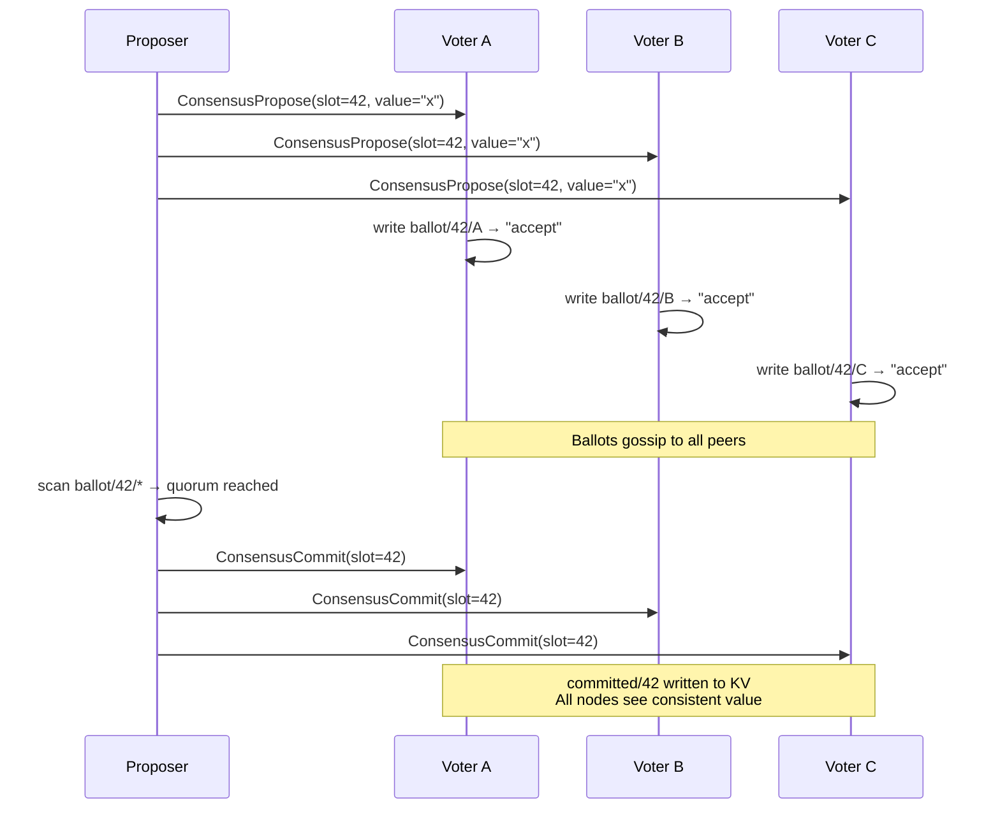

# 04 — Consensus: strong consistency on demand

## Concept

Mycelium's default is eventual consistency: fast, partition-tolerant, no
coordinator. But some operations genuinely need linearizability — a counter
that must not tick twice, a lock that must be held by exactly one node, a
leader election that must produce exactly one winner.

Rather than making the whole system pay for consensus, Mycelium provides a
thin **consistency overlay** that builds linearizable operations on top of the
eventual-consistency substrate. You pay for consensus only where you actually
need it — and everything outside the overlay keeps its gossip-speed
performance.

The overlay uses epidemic voting: a proposer broadcasts to the group, each
node votes, and the proposal commits when a quorum of votes accumulate in the
KV store. There is no distinguished leader for the consensus protocol itself
(though `elect_leader` can nominate one for your application logic).



**Available operations**

| Operation | Description |
|-----------|-------------|
| `consistent_set(key, value, quorum)` | Linearizable KV write — committed only after quorum accept |
| `consistent_get(key)` | Read committed value (not gossip-lagged) |
| `append(stream, entry)` | Append to an ordered log — monotonic sequence numbers |
| `scan_log(stream, from, to)` | Range scan the log |
| `distributed_lock(name, ttl)` | Acquire an exclusive lock; TTL prevents deadlock |
| `elect_leader(group)` | Nominate one node as leader for the group |
| `emit_reliable(kind, scope, payload)` | Signal with explicit ACK |

---

## The Example

`examples/three_node_demo.rs` includes an `overlay` role that exposes all
consensus operations as HTTP endpoints. The `tests/overlay/` directory
contains Python scripts that exercise consistent_set, distributed_lock, and
elect_leader against a live three-node cluster.

**Prerequisites**

```bash
cargo build --example three_node_demo
```

**Run — 3-node overlay cluster**

```bash
# Terminal 1
MYCELIUM_ROLE=overlay MYCELIUM_PORT=57010 MYCELIUM_HTTP_PORT=8400 \
  MYCELIUM_PEERS="127.0.0.1:57011,127.0.0.1:57012" \
  cargo run --example three_node_demo

# Terminal 2
MYCELIUM_ROLE=overlay MYCELIUM_PORT=57011 MYCELIUM_HTTP_PORT=8401 \
  MYCELIUM_PEERS="127.0.0.1:57010,127.0.0.1:57012" \
  cargo run --example three_node_demo

# Terminal 3
MYCELIUM_ROLE=overlay MYCELIUM_PORT=57012 MYCELIUM_HTTP_PORT=8402 \
  MYCELIUM_PEERS="127.0.0.1:57010,127.0.0.1:57011" \
  cargo run --example three_node_demo
```

**Exercise the overlay**

```bash
# Linearizable write
curl -X POST http://localhost:8400/gateway/overlay/consistent/set \
  -H 'Content-Type: application/json' \
  -d '{"key":"counter","value":"1","group":"overlay"}'

# Read committed value
curl http://localhost:8400/gateway/overlay/consistent/get?key=counter

# Acquire a distributed lock (TTL 10s)
curl -X POST http://localhost:8400/gateway/overlay/lock/acquire \
  -H 'Content-Type: application/json' \
  -d '{"name":"my-lock","ttl_secs":10}'

# Append to a log stream
curl -X POST http://localhost:8400/gateway/overlay/log/append \
  -H 'Content-Type: application/json' \
  -d '{"stream":"events","entry":"hello"}'
```

**What to observe**

- Kill one overlay node and re-run the consistent_set — it still succeeds
  (2-of-3 quorum). Kill two and it blocks (no quorum).
- Watch `ballot/` keys appear in the KV dump (`curl
  http://localhost:8400/gateway/kv/scan?prefix=consensus/`) as votes propagate.

---

## How It Works

From within Rust code, the overlay operations are accessed via the consensus handle:

```rust
// Consistent write via ConsensusHandle
agent.consensus().consistent_set("config/feature-flag", b"true").await?;

// Acquire a lock — returns a guard; drop the guard to release
let guard = agent.consensus().distributed_lock("migration-lock", Duration::from_secs(30)).await?;
// ... do the critical section ...
drop(guard);  // or let it expire after 30s

// Elect a leader for a group
let leader_id = agent.elect_leader("workers").await?;

// Append to an ordered log
let seq = agent.kv().append("audit-log", entry_bytes).await?;
let entries = agent.kv().scan_log("audit-log", 0, 100).await?;
```

Group definitions for consensus quorum:

```rust
// src/consensus.rs — define a quorum group
let group = ConsensusGroup {
    name:      "overlay".into(),
    quorum:    QuorumPolicy::Majority,  // >50%
    topology:  TopologyPolicy::Soft,    // allow any member count
};
agent.register_consensus_group(group);
```

---

## Dev Notes

**Quorum sizing.** The default `QuorumPolicy::Majority` requires `floor(n/2)+1`
votes from the group. For a 3-node cluster that's 2; for a 5-node cluster it's 3.
Smaller quorums (e.g. `QuorumPolicy::Any(1)`) give better availability but
weaker consistency guarantees.

**When to use `consistent_set` vs gossip `set`.**

| Scenario | Use |
|----------|-----|
| Config that must not be applied twice | `consistent_set` |
| Heartbeats, presence, capability ads | `set` (gossip) |
| Work assignment that must not be double-issued | `distributed_lock` + gossip `set` |
| Ordered event log | `append` |
| Counter increments | `append` (derive count from sequence) or `consistent_set` with read-modify-write |

**`append` vs `consistent_set` for sequencing.** `append` is cheaper for
ordered-log use cases because it doesn't require a read-modify-write cycle.
Each call gets a monotonically increasing sequence number. Use `append` for
audit logs, event sourcing, and task queues. Use `consistent_set` for config
that has a well-defined key.

**`distributed_lock` TTL.** Always set a TTL shorter than your operation's
expected completion time. The TTL is a safety net for crashes — it is not a
lease renewal mechanism. If your operation takes up to 5 s, set TTL to 10–15 s.

**Hard topology.** `TopologyPolicy::Hard` rejects votes from nodes not in a
known-good set. Use it when you need strict membership control (compliance,
security boundaries). The operator can override with a `sys/topology-override/`
KV entry as an escape hatch.

**Consensus and partition tolerance.** The overlay is CP (consistent,
partition-tolerant) within the quorum group — it blocks, not fails, when
quorum is unavailable. Gossip KV is AP — it continues under partitions.
Design your system so only the operations that truly need it use the overlay;
the rest uses gossip.

→ Next: [05-skills.md](05-skills.md) — LLM agents as first-class mesh citizens.
