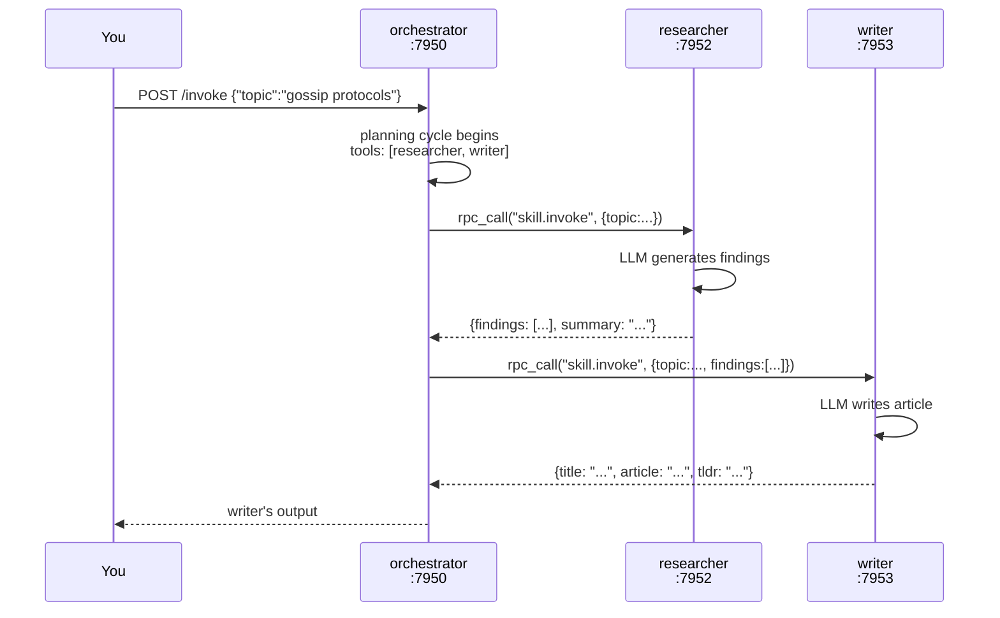

# 05 — Skills: LLM agents as mesh citizens

## Concept

A **Skill** is an LLM agent that lives permanently in the mesh as its own
node. It is not a function you call from a single host — it is a process with
a network identity, a capability advertisement, and a prompt. You define it
entirely in a TOML manifest. No code required.

The critical difference from an MCP tool ([06-tool-discovery.md](06-tool-discovery.md)):

| | MCP Tool | Skill |
|---|---|---|
| What it is | A function registered on a node | An LLM agent *node* |
| Written in | Rust / any language | TOML manifest — no code |
| Calls an LLM | Optionally | Always |
| Can call other skills | No | Yes — composition |
| Discovered via | `tools/` KV prefix | Capability system (`ns/name`) |
| Use when | API call, lookup, compute | Reasoning step, agent role |

Skills can call other skills. The orchestrating skill lists its sub-skills in
`tools = [...]`; SkillRunner resolves those names against live capability
advertisements at inference time and dispatches via mesh RPC. No node knows
the address of any other — each resolves its collaborators through the gossip
layer at call time.



Because the orchestrator resolves `llm/researcher` from the mesh at call time,
starting a second researcher node causes the orchestrator to automatically
load-balance across both — with no configuration change.

---

## The Example

Three SkillRunner processes collaborate to research a topic and write a polished
article. See `examples/community/` for the full setup.

**Prerequisites**

```bash
cargo build --bin skillrunner
ollama pull llama3.2   # or set skill.llm.endpoint to any OpenAI-compatible URL
```

**Run**

```bash
cd examples/community
./demo.sh
```

`demo.sh` starts the cluster, waits for convergence, invokes the pipeline, then
adds a second researcher live to show automatic load-balancing.

Or manually:

```bash
cd examples/community
./start.sh
sleep 3
./invoke.sh "gossip protocols"           # default: technical style
./invoke.sh "Rust ownership" casual      # casual tone
./stop.sh
```

**Expected output**

```
[orchestrator] started on :7950
[researcher]   started on :7952
[writer]       started on :7953
[orchestrator] resolved llm/researcher → 127.0.0.1:7952
[orchestrator] resolved llm/writer     → 127.0.0.1:7953
...
{
  "title": "Gossip Protocols: The Epidemic Engine of Distributed Systems",
  "tldr":  "Gossip protocols achieve O(log N) convergence ...",
  "article": "..."
}
```

---

## How It Works

A skill manifest has four sections:

```toml
# examples/community/researcher.skill.toml

[node]
bind_address    = "127.0.0.1"
bind_port       = 7952
bootstrap_peers = ["127.0.0.1:7950"]  # join the orchestrator's mesh

[capability]
ns   = "llm"
name = "researcher"
# ↑ Advertised under cap/{node_id}/llm/researcher in the KV store

[capability.input]
type     = "object"
required = ["topic"]
[capability.input.properties]
topic      = { type = "string" }

[skill]
prompt = """
You are a research assistant. Given a topic, identify 5 key facts...
Return JSON: {"findings": [...], "summary": "..."}
"""
tools = []   # researcher calls no sub-skills

[skill.llm]
endpoint    = "http://localhost:11434/v1"
model       = "llama3.2"
max_tokens  = 1024
temperature = 0.3
```

SkillRunner (`src/bin/skillrunner/`) starts a `GossipAgent`, advertises the
capability, and listens for `skill.invoke` RPC calls. On each call it passes
the input to the LLM along with any resolved tool schemas, runs the multi-turn
tool-calling loop (`src/bin/skillrunner/llm.rs`), and returns the result.

Tool resolution (`src/bin/skillrunner/runner.rs:resolve_tools`) scans
`skills/{ns}/{name}/{node_id}/input` keys in the KV store to build the
`ToolSchema` list for the LLM. The LM-visible name is the bare `name` (without
namespace) because OpenAI function names cannot contain `/`.

---

## Dev Notes

**Prompt design for small models.** llama3.2 (3B) has limited multi-step
function-calling reliability. Proven patterns:
- Keep the prompt ≤ 150 words
- List tools by bare name: "Call `researcher` with `{\"topic\": \"...\"}` then call `writer`"
- Set `temperature = 0.1` for coordination skills (deterministic routing)
- Use `max_tokens = 512` for orchestrators (they coordinate, not generate)
- Use larger models (llama3.1:8b, llama3.2:3b-instruct-q8_0) if reliability matters

**Access control.** To allow only the orchestrator to call researcher:

```toml
[capability.policy]
authorized_callers = ["orchestrator"]
max_concurrent = 4
```

SkillRunner enforces this before invoking the LLM — unauthorised callers
receive an error without consuming quota.

**Scaling — add a second researcher.**

```bash
cp researcher.skill.toml researcher2.skill.toml
# Edit researcher2.skill.toml: bind_port = 7954
../../target/debug/skillrunner --skill researcher2.skill.toml &
```

Within one gossip convergence interval (~5 s), the orchestrator sees two
providers for `llm/researcher` and distributes calls across both.

**Model selection per skill.** Different skills can use different models and
endpoints. Set `[skill.llm.endpoint]` to an OpenAI or Anthropic URL in any
skill. The orchestrator and sub-skills need not use the same backend.

**"Orchestrator" vs coordinator.** The orchestrator skill is an application-layer
agent that routes a task — not an infrastructure coordinator. It advertises
`llm/orchestrator` on the mesh like any other node, holds no cluster state, and
can be scaled horizontally (run two orchestrator instances and callers
automatically distribute across both via `resolve_capability`). If it dies,
no other node's operation is affected. Mycelium's "no coordinator" principle
applies to the *substrate* — no Raft leader, no registry daemon that every node
depends on. Application agents that decide call order are a separate concern.

**OTel tracing.** Build with `--features otel` and add `[skill.otel]` to any
manifest for Jaeger/Grafana trace spans per invocation.

**Audit trail.** After every invocation, `src/bin/skillrunner/audit.rs` writes
a record to `audit/{hlc}/{node_id}` in the KV store. Every node in the cluster
has this record within seconds. Scan it with:

```bash
curl http://localhost:9050/mgmt   # dashboard shows audit records
# or from Rust:
agent.kv().scan_prefix("audit/")
```

## Live prompt-template updates (no restart)

A Prompt Skill's template lives in the gossip KV store under
`prompts/{ns}/{name}`, **not** baked into the serving node. The dispatch loop
reads the template fresh from KV on *every* invocation — so updating it takes
effect on the next call, cluster-wide, with no restart and no redeploy:

```rust
// On any node — the write gossips to every serving node.
agent.llm().update_prompt("demo", "echo", PromptTemplate {
    system: "Updated assistant.".into(),
    user_template: "v2: {{input}}".into(),
    max_tokens: 64,
    temperature: 0.0,
    metadata: HashMap::new(),
})?;

// Any node reads the current template from its KV snapshot — no RPC:
let tpl = agent.llm().get_prompt("demo", "echo");   // Option<PromptTemplate>
let all = agent.llm().list_prompts();               // Vec<(ns, name)>
agent.llm().delete_prompt("demo", "echo");          // retract it
```

Because the template is *configuration* in KV (not a heartbeat), it does **not**
evaporate — it persists until overwritten or deleted, while the *capability*
advertisement is the heartbeat that evaporates when the node dies. This is the
durable-state-vs-presence separation the [concepts chapter](00-concepts.md)
draws: tune prompts live in production without touching the serving binary.

→ Next: [06-tool-discovery.md](06-tool-discovery.md) — the MCP-style alternative where tools are functions, not agents.

---

## Reference — SkillRunner

*Moved from the repo README (2026-07-10): how a skill works, the minimal manifest, composition, calling from any node. Full manual: [`docs/reference/skillrunner.html`](../reference/skillrunner.html).*

`skillrunner` is a standalone binary that turns a `.skill.toml` manifest into
a live LLM agent node on the mesh. No Rust required. Write a manifest, point it
at any OpenAI-compatible LLM server, and the node self-advertises its capability,
handles invocations via RPC, and writes a signed audit trail — all automatically.

```sh
cargo build --bin skillrunner
./target/debug/skillrunner --skill examples/skills/hello.skill.toml
```

#### How a skill works

When a skill node starts:
1. It joins the mesh and **advertises its capability** (`ns`/`name`) into the gossip KV store
2. Any caller that wants `llm/chat` does `resolve("llm", "chat")` — the mesh returns the node's address
3. The caller sends an RPC with the input JSON; the skill runs its LLM prompt with that input and returns the result
4. An audit record (signed with the node's Ed25519 key, HLC-timestamped) is written to the mesh

No service registry. No coordinator for discovery or routing. The mesh *is* the registry.

> **Scope of "no coordinator":** The gossip KV layer and signal mesh are fully
> coordinator-free. The opt-in consistency overlay (`consistent_set`, `distributed_lock`,
> `elect_leader`) uses epidemic Paxos and requires a live majority — those specific
> operations have a proposer and will stall under partition. `bootstrap_peers` acts as a
> soft coordinator for initial cluster discovery; keep 2–3 long-lived seed nodes for
> reliable join behaviour.

#### Minimal skill manifest

```toml
[node]
bind_port       = 7947
bootstrap_peers = ["127.0.0.1:7946"]   # address of any existing mesh node

[capability]
ns          = "llm"
name        = "chat"
description = "Responds to any message"

[capability.input]
type = "object"
required = ["message"]
[capability.input.properties]
message = { type = "string", description = "The user's message" }

[capability.output]
type = "object"
[capability.output.properties]
reply = { type = "string" }

[skill]
prompt = "You are a helpful assistant. Return JSON: {\"reply\": \"<response>\"}."
tools  = []

[skill.llm]
endpoint = "http://localhost:11434/v1"   # Ollama or any OpenAI-compatible endpoint
model    = "llama3.2"
```

#### Skill composition — skills calling skills

A skill can declare other skills as `tools`. The orchestrator below calls a
researcher and a writer without knowing their addresses:

```toml
[skill]
prompt = "Coordinate llm/researcher and llm/writer to produce an article on the topic."
tools  = ["llm/researcher", "llm/writer"]   # resolved at inference time via gossip
```

At inference time SkillRunner resolves `llm/researcher` against live capability
advertisements in the KV store, dispatches the sub-invocation through the mesh,
and injects the result back into the LLM context. Start a second researcher node
and the orchestrator automatically load-balances across both.

This is the composition story — see [`examples/community/`](../../examples/community/)
for a full 3-skill walkthrough with live monitoring instructions.

#### Calling a skill from any node

**Rust:**
```rust
let (node_id, _) = agent.resolve(&CapFilter::new("llm", "chat"))[0];
let payload = serde_json::to_vec(&json!({"message": "Hello!"}))?;
let result = agent.rpc_call(node_id, "skill.invoke", payload, Duration::from_secs(30)).await?;
```

**Python (`mycelium-py`):**
```python
from mycelium import MyceliumAgent
import json

agent = MyceliumAgent("127.0.0.1", 8300)
providers = agent.resolve_capability("llm", "chat")
result = agent.rpc_call(providers[0].node_id, "skill.invoke",
                        json.dumps({"message": "Hello!"}).encode())
```

#### Ready-to-run examples

| Example | What it shows |
|---|---|
| [`examples/skills/hello.skill.toml`](../../examples/skills/hello.skill.toml) | Minimal single-skill smoke test |
| [`examples/skills/summarizer.skill.toml`](../../examples/skills/summarizer.skill.toml) | Structured JSON output with input schema |
| [`examples/community/`](../../examples/community/) | 3-skill composition: orchestrator → researcher → writer |
| [`examples/a2a_langchain/`](../../examples/a2a_langchain/) | LangChain + AutoGen auto-discovering skills via A2A |

See [`docs/reference/skillrunner.html`](../reference/skillrunner.html) for the full manifest
reference, A2A auto-discovery, OTEL integration, concurrency controls, and the audit trail format.

---

---

## Reference — prompt skills (LLM-backed capabilities via the KV substrate)

*Moved from the repo README (2026-07-10).*

The `llm` feature turns any `GossipAgent` into a host for LLM-backed skills. Prompt templates
are stored in the gossip KV store (`prompts/{ns}/{name}`) and replicated cluster-wide — any
other node can call the skill without knowing which node hosts the model.

```toml
mycelium = { version = "…", features = ["llm"] }
```

#### Registering a skill

```rust
use mycelium::{GossipAgent, PromptTemplate, OpenAiBackend};

let backend = OpenAiBackend::new(
    "http://localhost:11434/v1",   // any OpenAI-compatible endpoint
    "",                             // API key (empty for Ollama)
    "llama3.2",                    // model baked in at construction
);

let template = PromptTemplate {
    system: "You are a helpful assistant. Reply concisely.".into(),
    user_template: "{{input}}".into(),
    max_tokens: 512,
    temperature: 0.7,
    metadata: Default::default(),
};

// Advertises cap `llm/chat` on the mesh; template stored in KV with TTL=1 week.
let _handle = agent.register_prompt_skill("llm", "chat", template, backend).await?;
// Drop _handle to retract the capability and stop the dispatch loop.
```

#### Calling from Rust

```rust
let output = agent
    .call_prompt_skill("llm", "chat", "Hello!", Default::default(), Duration::from_secs(30))
    .await?;
println!("{output}");
```

#### HTTP gateway

```sh
# List all templates visible to this node
curl http://localhost:8300/gateway/prompts

# Read a specific template
curl http://localhost:8300/gateway/prompts/llm/chat

# Write / update a template
curl -X PUT http://localhost:8300/gateway/prompts/llm/chat \
     -H 'Content-Type: application/json' \
     -d '{"system":"You are a helpful assistant.","user_template":"{{input}}","max_tokens":512,"temperature":0.7}'

# Invoke (blocking)
curl -X POST http://localhost:8300/gateway/llm/call \
     -H 'Content-Type: application/json' \
     -d '{"ns":"llm","name":"chat","input":"What is 2+2?"}'

# Invoke (SSE stream — v1 emits a single `done` event)
curl -N http://localhost:8300/gateway/llm/stream \
     -H 'Content-Type: application/json' \
     -d '{"ns":"llm","name":"chat","input":"Hello!"}'
```

#### Python (`mycelium-py`)

```python
from mycelium.prompt_skill import PromptSkillClient, PromptTemplate

client = PromptSkillClient("http://localhost:8300")

template = PromptTemplate(
    system="You are a helpful assistant.",
    user_template="{{input}}",
    max_tokens=512,
    temperature=0.7,
)
client.register("llm", "chat", template)

result = client.call("llm", "chat", "What is 2+2?")
print(result.output)          # "4" or similar
print(result.model_used)      # "llama3.2"
print(result.tokens_used)     # 12
```

#### Template variables

In `user_template`, `{{input}}` is always replaced with the caller's input string.
`{{node_id}}` and `{{skill_name}}` are injected automatically. Additional key-value
pairs can be passed in the `context` map and referenced as `{{key}}`.

#### Model placement

The `model` field is **not** in `PromptTemplate` — model availability is node-local knowledge
that the template author cannot predict. Each hosting node bakes the model into its `LlmBackend`
at construction. The `LlmResult.model_used` field reports what was actually used, so callers
have full observability without requiring central coordination.

---
