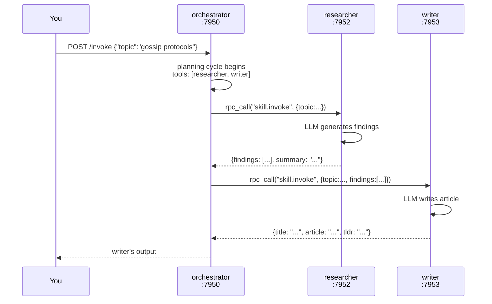

# 05 — Skills: LLM agents as mesh citizens

## Concept

A **Skill** is an LLM agent that lives permanently in the mesh as its own
node. It is not a function you call from a single host — it is a process with
a network identity, a capability advertisement, and a prompt. You define it
entirely in a TOML manifest. No code required.

The critical difference from an MCP tool ([06-tool-discovery.md](06-tool-discovery.md)):

| | MCP Tool | Skill |
|---|---|---|
| What it is | A function registered on a node | An LLM agent *node* |
| Written in | Rust / any language | TOML manifest — no code |
| Calls an LLM | Optionally | Always |
| Can call other skills | No | Yes — composition |
| Discovered via | `tools/` KV prefix | Capability system (`ns/name`) |
| Use when | API call, lookup, compute | Reasoning step, agent role |

Skills can call other skills. The orchestrating skill lists its sub-skills in
`tools = [...]`; SkillRunner resolves those names against live capability
advertisements at inference time and dispatches via mesh RPC. No node knows
the address of any other — each resolves its collaborators through the gossip
layer at call time.



Because the orchestrator resolves `llm/researcher` from the mesh at call time,
starting a second researcher node causes the orchestrator to automatically
load-balance across both — with no configuration change.

---

## The Example

Three SkillRunner processes collaborate to research a topic and write a polished
article. See `examples/community/` for the full setup.

**Prerequisites**

```bash
cargo build --bin skillrunner
ollama pull llama3.2   # or set skill.llm.endpoint to any OpenAI-compatible URL
```

**Run**

```bash
cd examples/community
./demo.sh
```

`demo.sh` starts the cluster, waits for convergence, invokes the pipeline, then
adds a second researcher live to show automatic load-balancing.

Or manually:

```bash
cd examples/community
./start.sh
sleep 3
./invoke.sh "gossip protocols"           # default: technical style
./invoke.sh "Rust ownership" casual      # casual tone
./stop.sh
```

**Expected output**

```
[orchestrator] started on :7950
[researcher]   started on :7952
[writer]       started on :7953
[orchestrator] resolved llm/researcher → 127.0.0.1:7952
[orchestrator] resolved llm/writer     → 127.0.0.1:7953
...
{
  "title": "Gossip Protocols: The Epidemic Engine of Distributed Systems",
  "tldr":  "Gossip protocols achieve O(log N) convergence ...",
  "article": "..."
}
```

---

## How It Works

A skill manifest has four sections:

```toml
# examples/community/researcher.skill.toml

[node]
bind_address    = "127.0.0.1"
bind_port       = 7952
bootstrap_peers = ["127.0.0.1:7950"]  # join the orchestrator's mesh

[capability]
ns   = "llm"
name = "researcher"
# ↑ Advertised under cap/{node_id}/llm/researcher in the KV store

[capability.input]
type     = "object"
required = ["topic"]
[capability.input.properties]
topic      = { type = "string" }

[skill]
prompt = """
You are a research assistant. Given a topic, identify 5 key facts...
Return JSON: {"findings": [...], "summary": "..."}
"""
tools = []   # researcher calls no sub-skills

[skill.llm]
endpoint    = "http://localhost:11434/v1"
model       = "llama3.2"
max_tokens  = 1024
temperature = 0.3
```

SkillRunner (`src/bin/skillrunner/`) starts a `GossipAgent`, advertises the
capability, and listens for `skill.invoke` RPC calls. On each call it passes
the input to the LLM along with any resolved tool schemas, runs the multi-turn
tool-calling loop (`src/bin/skillrunner/llm.rs`), and returns the result.

Tool resolution (`src/bin/skillrunner/runner.rs:resolve_tools`) scans
`skills/{ns}/{name}/{node_id}/input` keys in the KV store to build the
`ToolSchema` list for the LLM. The LM-visible name is the bare `name` (without
namespace) because OpenAI function names cannot contain `/`.

---

## Dev Notes

**Prompt design for small models.** llama3.2 (3B) has limited multi-step
function-calling reliability. Proven patterns:
- Keep the prompt ≤ 150 words
- List tools by bare name: "Call `researcher` with `{\"topic\": \"...\"}` then call `writer`"
- Set `temperature = 0.1` for coordination skills (deterministic routing)
- Use `max_tokens = 512` for orchestrators (they coordinate, not generate)
- Use larger models (llama3.1:8b, llama3.2:3b-instruct-q8_0) if reliability matters

**Access control.** To allow only the orchestrator to call researcher:

```toml
[capability.policy]
authorized_callers = ["orchestrator"]
max_concurrent = 4
```

SkillRunner enforces this before invoking the LLM — unauthorised callers
receive an error without consuming quota.

**Scaling — add a second researcher.**

```bash
cp researcher.skill.toml researcher2.skill.toml
# Edit researcher2.skill.toml: bind_port = 7954
../../target/debug/skillrunner --skill researcher2.skill.toml &
```

Within one gossip convergence interval (~5 s), the orchestrator sees two
providers for `llm/researcher` and distributes calls across both.

**Model selection per skill.** Different skills can use different models and
endpoints. Set `[skill.llm.endpoint]` to an OpenAI or Anthropic URL in any
skill. The orchestrator and sub-skills need not use the same backend.

**"Orchestrator" vs coordinator.** The orchestrator skill is an application-layer
agent that routes a task — not an infrastructure coordinator. It advertises
`llm/orchestrator` on the mesh like any other node, holds no cluster state, and
can be scaled horizontally (run two orchestrator instances and callers
automatically distribute across both via `resolve_capability`). If it dies,
no other node's operation is affected. Mycelium's "no coordinator" principle
applies to the *substrate* — no Raft leader, no registry daemon that every node
depends on. Application agents that decide call order are a separate concern.

**OTel tracing.** Build with `--features otel` and add `[skill.otel]` to any
manifest for Jaeger/Grafana trace spans per invocation.

**Audit trail.** After every invocation, `src/bin/skillrunner/audit.rs` writes
a record to `audit/{hlc}/{node_id}` in the KV store. Every node in the cluster
has this record within seconds. Scan it with:

```bash
curl http://localhost:9050/mgmt   # dashboard shows audit records
# or from Rust:
agent.scan_prefix("audit/")
```

→ Next: [06-tool-discovery.md](06-tool-discovery.md) — the MCP-style alternative where tools are functions, not agents.
