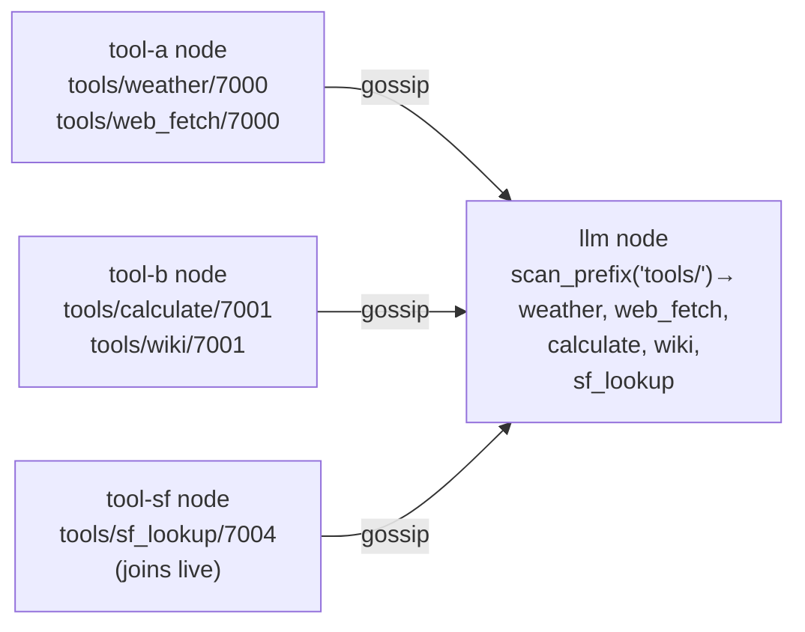

# 06 — MCP Tool Discovery: the LLM finds tools at call time

## Concept

The chat demo inverts the usual MCP model. Rather than the LLM having a static
list of tools, it queries the gossip KV store at the start of each planning
cycle to see what tools are currently available. Start a new tool node and the
LLM discovers it on the next message — no restart, no config file change, no
coordinator.

Tools are registered under `tools/{name}/{node_id}` in the KV store. Any node
that writes this key (with a JSON Schema as the value) becomes discoverable.
The planner calls `discover_tools()` which is just `scan_prefix("tools/")` —
a local read from the gossip-replicated store.



This pattern is useful when:
- Tools are maintained by different teams or processes
- Tool availability varies (some tools only run on certain hardware)
- You want to add tool capabilities to a running system without redeploying

**Verifier as pipeline guard.** The chat demo includes a `verifier` node
(powered by a separate LLM, default `llama3.1:8b`) that intercepts draft
answers after tool use. It decomposes the draft into atomic claims and removes
any not grounded in the tool results. The verifier runs automatically in the
planning cycle — it is deliberately filtered from the LLM's visible tool list
so the LLM cannot call it directly.

---

## The Example

`examples/three_node_demo.rs` is a single binary with 7 roles. `demo.sh`
starts a base cluster (tool-a, tool-b, llm, mgmt, verifier), then adds
tool-sf and tool-book live to show dynamic discovery.

**Prerequisites**

```bash
cargo build --example three_node_demo
ollama serve            # in a separate terminal
ollama pull llama3.2
ollama pull llama3.1:8b  # verifier (optional; falls back to llama3.2)
```

**Run — automated demo**

```bash
cd examples/chat
./demo.sh
```

**Run — manual cluster**

```bash
cd examples/chat
./start.sh
# Open: http://localhost:8080
```

**What to try in the chat UI**

```
"what's the weather in Tokyo?"          → routes to weather (tool-a)
"what is 330 times 1024?"               → routes to calculate (tool-b)
"how does Dan Simmons fit into 1990s SF?" → routes to sf_lookup (tool-sf)
"what happens in Hyperion?"             → routes to book_plot (tool-book)
```

The `GET /mesh` endpoint shows the current tool list and model:

```bash
curl http://localhost:8080/mesh
# {"tools":[{"name":"weather","description":"..."},...],"model":"llama3.2"}
```

**Mesh dashboard**: http://localhost:8090

---

## How It Works

**Registering a tool** uses a helper in `three_node_demo.rs`:

```rust
// examples/three_node_demo.rs — register helper
fn register(
    agent:    &Arc<GossipAgent>,
    name:     &str,
    desc:     &str,
    schema:   Value,          // JSON Schema for parameters
    handler:  Arc<dyn Fn(Value) -> BoxFuture<'static, Result<Value, String>> + Send + Sync>,
) -> CapabilityReg {
    // writes tools/{name}/{node_id} → schema bytes
    // returns handle — drop to deregister
}
```

**Discovering tools** at planning time:

```rust
// three_node_demo.rs:discover_tools
fn discover_tools(agent: &GossipAgent) -> Vec<(String, Value)> {
    agent.kv().scan_prefix("tools/")
        .into_iter()
        .filter_map(|(key, val)| {
            let name = key.split('/').nth(1)?.to_string();
            let schema = serde_json::from_slice(&val).ok()?;
            Some((name, schema))
        })
        .collect()
}
```

**Planning cycle** (`three_node_demo.rs:planning_cycle`):
1. Discover current tools from KV
2. Build message history
3. Send to Ollama with tool schemas
4. Parse `tool_calls` from response; dispatch each to the right node via RPC
5. After final answer: if verifier is on mesh and tool evidence exists, call
   `verify_answer` automatically
6. Emit verified answer to SSE stream

**Verifier integration** — the verifier node:
1. Advertises `role/verifier` capability
2. Registers `verify_answer` tool (with a description discouraging direct LLM use)
3. `planning_cycle` filters it from the LLM's visible tool list
4. After `LlmStep::Answer(draft)`, the cycle calls it if evidence is non-empty:

```rust
// three_node_demo.rs:planning_cycle
if !tool_evidence.is_empty() {
    if let Some((verifier_id, _)) = agent.capabilities().resolve(&CapFilter::new("role","verifier"))
                                         .into_iter().next() {
        // call verify_answer — graceful fallback if absent or timeout
    }
}
```

---

## Dev Notes

**Adding a new tool node live.** Write a handler function and register it:

```rust
async fn my_tool(args: Value) -> Result<Value, String> {
    let query = args["query"].as_str().unwrap_or("");
    // ... do the work ...
    Ok(json!({"result": "..."}))
}

let _handle = register(
    &agent, "my_tool",
    "Describe what my_tool does for the LLM planner",
    json!({"type":"object","properties":{"query":{"type":"string"}},"required":["query"]}),
    Arc::new(|args| Box::pin(my_tool(args))),
);
```

Start the node; the LLM discovers it on the next planning cycle. Drop
`_handle` or stop the node to remove it.

**Tool description quality.** The LLM routes based on tool descriptions.
Write descriptions as "Use this when the user asks about X" rather than
technical descriptions of what the code does. The verifier's description
deliberately begins "INTERNAL PIPELINE GUARD — do NOT call this directly"
to prevent the LLM from invoking it.

**OLLAMA_MODEL and VERIFIER_MODEL.** The main LLM model is `OLLAMA_MODEL`
(default `llama3.2`). The verifier uses `VERIFIER_MODEL` (default `llama3.1:8b`).
Set these independently:

```bash
OLLAMA_MODEL=llama3.2 VERIFIER_MODEL=llama3.1:8b ./start.sh
```

**RPC timeout for slow backends.** Tool handlers called via RPC default to a
60-second timeout. If your tool calls a slow external API or runs heavy
computation, increase this in the `rpc_call` invocation in `planning_cycle`.

## Bridging an external MCP server

Everything above registers *your* tools for the mesh to discover. The **client** side is the
mirror image: pull a **real external MCP server's** tools (a filesystem server, a GitHub server, …)
into the same `tools/` namespace, so the LLM discovers and calls them by the *identical* mechanism —
it never learns the tool lives outside the mesh.

```rust
// feature = "gateway"
let bridge = agent.mcp().connect_mcp_server("http://localhost:9000/mcp").await?;
// each of the server's tools now appears under tools/{name}/{node_id};
// the planner discovers them next cycle, exactly like a local tool.
```

`connect_mcp_server`:
1. handshakes (`initialize`) and enumerates the server's tools (`tools/list`);
2. writes each tool's schema under `tools/{name}/{node_id}` — the **same KV namespace** this
   chapter's discovery uses, so bridged tools are indistinguishable from local ones to the planner;
3. subscribes to `mcp.invoke` and proxies matching calls out to the server over HTTP (`tools/call`).

Drop the returned `McpClientHandle` to tombstone every bridged entry and stop the proxy task.

**Egress is gated.** The bridge is the "twin reaches an external tool server" boundary, so it passes
through the node-local egress allowlist (`GossipConfig::egress`). A URL the policy doesn't permit is
refused with `McpError::Transport("egress denied by policy: …")` **before any outbound request** —
see [crown-jewel · outbound egress](../operations/crown-jewel.md#2-outbound-egress-allowlist). The
default (empty) allowlist permits all; lock it down in production.

> **Two directions — don't conflate them.** `register_mcp_tool` publishes *your* Skill **as** an MCP
> tool for an outside LLM to call (server role); `connect_mcp_server` pulls an *outside* server's
> tools **into** your mesh (client role). This section is the latter.

**Multi-turn tool calling.** The planning cycle loops until the LLM emits a
final answer (no more tool calls). A `max_turns` limit prevents infinite loops.
The SSE stream emits `Thinking`, `ToolCall`, `ToolResult`, and `Assistant`
events so the browser UI can render intermediate steps live.

→ Next: [07-pipelines.md](07-pipelines.md) — fluid worker pools for multi-stage data pipelines.
