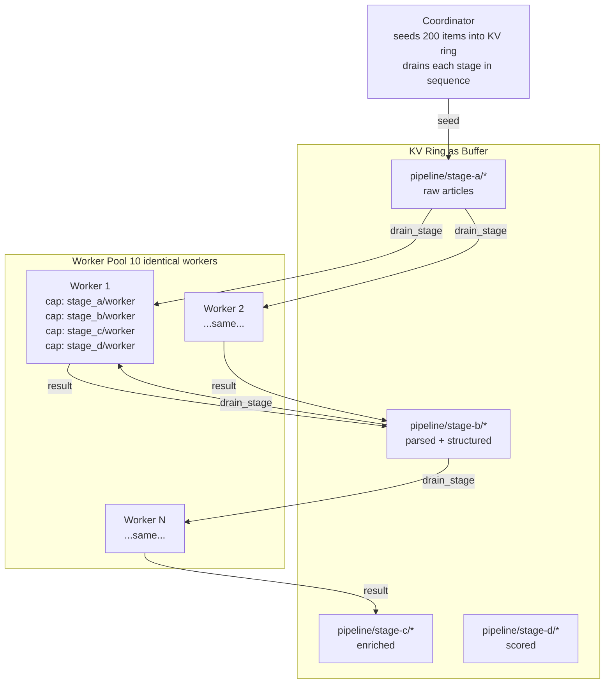

# 07 — Fluid Pipelines: Agentic Flow Networks

## Concept

Traditional pipeline architectures assign workers statically: stage-A workers
handle parsing, stage-B workers handle enrichment, and so on. This works until
one stage becomes a bottleneck — then you either over-provision the slow stage
or re-architect.

The **fluid pool** pattern inverts this. A fixed pool of identical workers
advertises capability for *all* stages. The coordinator resolves the right
workers for each stage at dispatch time. Workers "flow" to where demand is:
if stage C is slow, more workers naturally accumulate there because the
coordinator keeps routing to whoever is free.



The KV ring is the distributed buffer between stages. A worker claims an item
by writing a claim key with a short TTL; if it crashes before finishing, the
claim expires and another worker picks up the item. No dead-letter queue, no
manual requeue — TTL-native cleanup handles it.

**Why one gossip substrate for both buffer and scheduling.** The same gossip
layer that replicates pipeline items also propagates capability advertisements.
The coordinator resolves workers from the capability ring and reads items from
the KV ring in the same operation — no separate queue infrastructure, no
separate service registry.

---

## The Example

`examples/fluid_pipeline/` runs 10 identical Python workers and a coordinator
in Docker. Four pipeline stages process 200 synthetic news articles:

| Stage | Operation | Simulated latency |
|-------|-----------|-------------------|
| A — Parse | Extract title, body, source | ~50 ms |
| B — Enrich | Add tags, entities, reading time | ~100 ms |
| C — Score | Compute composite quality score | configurable (default 0.2 s) |
| D — Aggregate | Write final record to PostgreSQL | ~20 ms |

**Prerequisites**

```bash
docker compose version  # Docker Compose v2
```

**Run**

```bash
cd examples/fluid_pipeline
docker compose up --build --scale worker=10
```

**Expected output (coordinator log)**

```
coordinator: seeded 200 articles into pipeline/stage-a/
coordinator: draining stage-a → 10 workers available
coordinator: stage-a complete (200/200) in 1.2s
coordinator: draining stage-b → 10 workers available
coordinator: stage-b complete (200/200) in 2.4s
coordinator: draining stage-c → 10 workers available  [bottleneck if STAGE_C_SLEEP > 0]
coordinator: stage-c complete (200/200) in 4.1s
coordinator: draining stage-d → 10 workers available
coordinator: pipeline complete — 200 articles in PostgreSQL
```

**Simulate a bottleneck**

```bash
STAGE_C_SLEEP=1.0 docker compose up --scale worker=10
```

Watch workers accumulate at stage C — all 10 are kept busy. Scale up mid-run:

```bash
docker compose up --scale worker=15 --no-recreate
```

New workers are discovered via capability gossip within ~5 s; the coordinator
starts routing to them immediately.

**Query results**

```bash
docker exec afn-postgres psql -U pipeline -d pipeline \
  -c "SELECT id, composite_score FROM articles ORDER BY composite_score DESC LIMIT 5;"
```

---

## How It Works

**Coordinator** (`examples/fluid_pipeline/coordinator/coordinator.py`):

```python
# Seed items into the KV ring
for article in articles:
    agent.set(f"pipeline/stage-a/{article['id']}", json.dumps(article).encode())

# Drain a stage: list unclaimed items, resolve workers, claim, dispatch
all_keys    = agent.keys(prefix=f"pipeline/{stage_in}/")
claimed_ids = {k.split("/")[-1] for k in agent.keys(prefix="pipeline/claiming/")}
providers   = agent.resolve_capability(cap_ns, "worker")   # (ns, name)
# ...pick a worker, then claim before dispatching:
agent.set(f"pipeline/claiming/{item_id}", worker_id.encode())
result = agent.rpc_call(worker_id, method, payload, timeout_secs=90)
agent.delete(f"pipeline/claiming/{item_id}")  # released on success AND failure
```

**Worker** (`examples/fluid_pipeline/worker/worker.py`). RPC serving is an
async iterator, not a callback registration — the SSE stream delivers the
next request only after `rpc_respond()` completes the previous one:

```python
# Advertise one capability per stage on startup
for ns in ["stage_a", "stage_b", "stage_c", "stage_d"]:
    agent.advertise_capability(ns, "worker", interval_secs=15)

# Handle RPC calls
async for req in agent.rpc_serve(method):
    item = json.loads(req.payload)
    out  = await STAGE_HANDLERS[stage](item)
    agent.rpc_respond(req, json.dumps({"status": "ok", "id": item["id"]}).encode())
```

**Claim keys are advisory, not TTL'd.** The KV store never time-evicts live
keys — there is no `ttl_secs` on `set`. A claim under `pipeline/claiming/{id}`
prevents double-dispatch while an RPC is in flight, and the *coordinator*
deletes it on completion or failure; a crashed worker's claim is cleared when
the coordinator's RPC times out. (If you need claims that survive a crashed
*coordinator*, that's exactly the problem the `mycelium-tuple-space` companion
crate's WAL-backed `take`/`ack` solves — see its crate docs.)

> **The demo's default is now the pull pattern.** Everything above describes
> the coordinator-dispatch architecture, which `examples/fluid_pipeline/`
> retains behind `PIPELINE_MODE=push` as the comparison baseline. The default
> mode replaces all of it — claims, drain loops, dispatch — with tuple-space
> stages: workers `take()` when ready and `complete()` into the next stage.
>
> One precision worth internalizing about that space: **stages do not filter
> tuples.** Classic Linda retrieves by template matching over a flat bag;
> Mycelium's space is lane-addressed — named per-stage FIFO lanes, opaque
> payloads, and an item's pipeline position is the lane it sits in.
> `take("stage-b")` pops (or parks on) the `stage-b` lane; nothing is ever
> matched against content. The trade buys O(1) claims, per-lane
> depth/backpressure counters (the fluid workers' pressure signal), and a
> one-record WAL stage transition; content-style routing is recovered by
> encoding the dimension in the lane name (`stage-b.high`). See the
> `mycelium-tuple-space` crate docs, "Stage lanes, not associative matching."

---

## Dev Notes

**Extending to N stages.** Add a new stage by:
1. Adding a new handler function in `worker/stages/`
2. Adding the stage capability advertisement in the worker startup
3. Adding a `drain_stage` call in the coordinator's pipeline loop

No other changes. The gossip layer handles worker discovery for the new stage
automatically.

**Real LLM integration.** Replace a simulated stage handler with an LLM call:

```python
async def stage_c_score(item):
    prompt = f"Score this article for quality on 0–10: {item['body'][:500]}"
    score = await llm_client.complete(prompt)
    return {**item, "quality_score": float(score)}
```

The worker's advertised capability still reads `stage_c/worker` — the
coordinator doesn't know or care that stage C now calls an LLM.

**Work item TTL sizing.** Set item TTLs long enough that slow stages don't
lose items before processing. A 5-minute TTL is generous for most pipelines.
Claim TTLs should be 2–3× the expected processing time for the stage.

**PostgreSQL vs KV for final output.** Stage D writes to PostgreSQL for
queryable results. For simpler pipelines, write final items back to the KV
store under `pipeline/results/{id}` and scan them with `scan_prefix`. The KV
approach needs no external database for moderate item counts.

**Backpressure.** The coordinator dispatches to whoever it resolves first. For
explicit back-pressure, have workers write a load entry to `sys/load/{self}/`
when their queue depth exceeds a threshold — the coordinator then skips opaque
nodes in its resolve results.

→ Next: [08-a2a-interop.md](08-a2a-interop.md) — LangChain and AutoGen agents discovering Mycelium skills.
