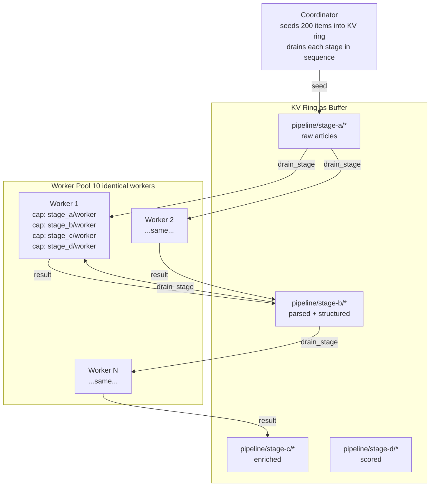

# 07 — Fluid Pipelines: Agentic Flow Networks

## Concept

Traditional pipeline architectures assign workers statically: stage-A workers
handle parsing, stage-B workers handle enrichment, and so on. This works until
one stage becomes a bottleneck — then you either over-provision the slow stage
or re-architect.

The **fluid pool** pattern inverts this. A fixed pool of identical workers
advertises capability for *all* stages. The coordinator resolves the right
workers for each stage at dispatch time. Workers "flow" to where demand is:
if stage C is slow, more workers naturally accumulate there because the
coordinator keeps routing to whoever is free.



The KV ring is the distributed buffer between stages. A worker claims an item
by writing a claim key with a short TTL; if it crashes before finishing, the
claim expires and another worker picks up the item. No dead-letter queue, no
manual requeue — TTL-native cleanup handles it.

**Why one gossip substrate for both buffer and scheduling.** The same gossip
layer that replicates pipeline items also propagates capability advertisements.
The coordinator resolves workers from the capability ring and reads items from
the KV ring in the same operation — no separate queue infrastructure, no
separate service registry.

---

## The Example

`examples/fluid_pipeline/` runs 10 identical Python workers and a coordinator
in Docker. Four pipeline stages process 200 synthetic news articles:

| Stage | Operation | Simulated latency |
|-------|-----------|-------------------|
| A — Parse | Extract title, body, source | ~50 ms |
| B — Enrich | Add tags, entities, reading time | ~100 ms |
| C — Score | Compute composite quality score | configurable (default 0.2 s) |
| D — Aggregate | Write final record to PostgreSQL | ~20 ms |

**Prerequisites**

```bash
docker compose version  # Docker Compose v2
```

**Run**

```bash
cd examples/fluid_pipeline
docker compose up --build --scale worker=10
```

**Expected output (coordinator log)**

```
coordinator: seeded 200 articles into pipeline/stage-a/
coordinator: draining stage-a → 10 workers available
coordinator: stage-a complete (200/200) in 1.2s
coordinator: draining stage-b → 10 workers available
coordinator: stage-b complete (200/200) in 2.4s
coordinator: draining stage-c → 10 workers available  [bottleneck if STAGE_C_SLEEP > 0]
coordinator: stage-c complete (200/200) in 4.1s
coordinator: draining stage-d → 10 workers available
coordinator: pipeline complete — 200 articles in PostgreSQL
```

**Simulate a bottleneck**

```bash
STAGE_C_SLEEP=1.0 docker compose up --scale worker=10
```

Watch workers accumulate at stage C — all 10 are kept busy. Scale up mid-run:

```bash
docker compose up --scale worker=15 --no-recreate
```

New workers are discovered via capability gossip within ~5 s; the coordinator
starts routing to them immediately.

**Query results**

```bash
docker exec afn-postgres psql -U pipeline -d pipeline \
  -c "SELECT id, composite_score FROM articles ORDER BY composite_score DESC LIMIT 5;"
```

---

## How It Works

**Coordinator** (`examples/fluid_pipeline/coordinator/coordinator.py`):

```python
# Seed items into the KV ring
for article in articles:
    key = f"pipeline/stage-a/{article['id']}"
    agent.set(key, json.dumps(article).encode(), ttl_secs=300)

# Drain a stage: resolve workers, dispatch, collect results
async def drain_stage(stage_in, stage_out, capability):
    items = agent.scan_prefix(stage_in)
    for key, value in items:
        workers = agent.resolve_capability(capability)
        worker = pick_least_loaded(workers)
        result = await agent.rpc_call(worker.node_id, "process", value, timeout=30)
        out_key = key.replace(stage_in, stage_out)
        agent.set(out_key, result)
        agent.delete(key)  # remove from input stage
```

**Worker** (`examples/fluid_pipeline/worker/worker.py`):

```python
# Advertise capability for all stages on startup
for stage in ["stage_a", "stage_b", "stage_c", "stage_d"]:
    agent.advertise_capability(f"{stage}/worker", ttl_secs=30)

# Handle RPC calls
agent.rpc_serve("process", handle_process)

async def handle_process(request):
    stage = detect_stage(request)     # from item schema
    handler = STAGE_HANDLERS[stage]
    return await handler(request)
```

**TTL-native work claiming.** Before processing an item, a worker writes a
claim key with a short TTL. If the worker crashes, the claim expires and the
item is requeued on the next drain pass:

```python
claim_key = f"claim/{item_id}"
agent.set(claim_key, worker_id.encode(), ttl_secs=15)
result = await process(item)
agent.delete(claim_key)   # release claim on success
```

---

## Dev Notes

**Extending to N stages.** Add a new stage by:
1. Adding a new handler function in `worker/stages/`
2. Adding the stage capability advertisement in the worker startup
3. Adding a `drain_stage` call in the coordinator's pipeline loop

No other changes. The gossip layer handles worker discovery for the new stage
automatically.

**Real LLM integration.** Replace a simulated stage handler with an LLM call:

```python
async def stage_c_score(item):
    prompt = f"Score this article for quality on 0–10: {item['body'][:500]}"
    score = await llm_client.complete(prompt)
    return {**item, "quality_score": float(score)}
```

The worker's advertised capability still reads `stage_c/worker` — the
coordinator doesn't know or care that stage C now calls an LLM.

**Work item TTL sizing.** Set item TTLs long enough that slow stages don't
lose items before processing. A 5-minute TTL is generous for most pipelines.
Claim TTLs should be 2–3× the expected processing time for the stage.

**PostgreSQL vs KV for final output.** Stage D writes to PostgreSQL for
queryable results. For simpler pipelines, write final items back to the KV
store under `pipeline/results/{id}` and scan them with `scan_prefix`. The KV
approach needs no external database for moderate item counts.

**Backpressure.** The coordinator dispatches to whoever it resolves first. For
explicit back-pressure, have workers write a load entry to `sys/load/{self}/`
when their queue depth exceeds a threshold — the coordinator then skips opaque
nodes in its resolve results.

→ Next: [08-a2a-interop.md](08-a2a-interop.md) — LangChain and AutoGen agents discovering Mycelium skills.
