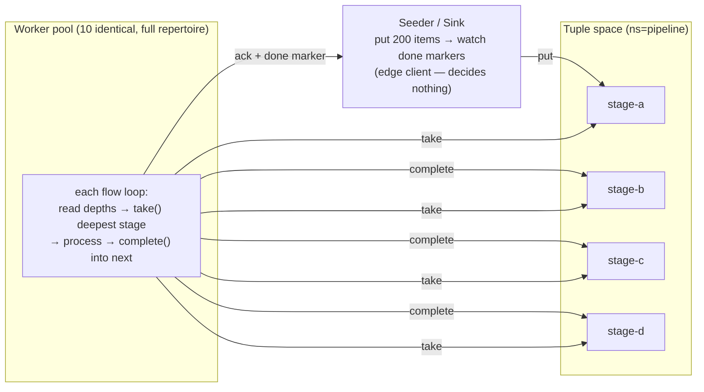

# 07 — Fluid Pipelines: Agentic Flow Networks

## Concept

Traditional pipeline architectures assign workers statically: stage-A workers
handle parsing, stage-B workers handle enrichment, and so on. This works until
one stage becomes a bottleneck — then you either over-provision the slow stage
or re-architect.

The **fluid pool** pattern inverts this. A fixed pool of identical workers
carries the full stage repertoire, and workers "flow" to where demand is: if
stage C is slow, the pool masses on stage C. No static assignment, no
rebalancing job, no configuration change.

The canonical realisation is **pull-based**: the pipeline `A>B>C>D` exists as
tuple-space stages — *data topology, not node topology*. A worker is "at
stage B" only for the duration of one `take()` → process → `complete()`
cycle. Nobody dispatches; nobody predicts who is free. Readiness is announced
by the claim itself.



Three properties make this the canonical form:

- **Readiness is self-announcing.** A worker `take()`s when it is actually
  free, so the staleness/misroute failure mode of push dispatch — a
  coordinator routing on a model of worker state that is stale by at least
  one propagation delay — has no variable to inhabit.
- **Fluidity is self-selection against pressure.** Each flow loop reads the
  per-stage depths and takes from the deepest stage it can serve. The pool
  automatically masses on the bottleneck; nobody tells workers to move.
- **Stage transitions are atomic.** `complete()` acks the input item and puts
  the output in one WAL record — a crash cannot half-replay a hop. Items
  taken but never acked re-queue automatically after the in-flight deadline
  (at-least-once delivery; keep stage handlers idempotent).

**Why one gossip substrate underneath.** The tuple space is a companion crate
built entirely on Mycelium's public API: its primary is discovered by
capability advertisement, its failure is detected by the same TTL evaporation
as any pheromone, and a mirror promotes itself through the same emergent
election as every other role. Work distribution composes from the substrate's
existing primitives — no queue infrastructure, no registry, no coordinator.

## Stages are lanes, not patterns

One precision worth internalizing before reading any code: **stages do not
filter tuples.** Classic Linda retrieves by template matching over a flat bag
(`in(("stage-b", ?id, ?data))`); Mycelium's space is lane-addressed — named
per-stage FIFO lanes, opaque payloads, and an item's pipeline position is
*the lane it sits in*. `take("stage-b")` pops (or parks on) the `stage-b`
lane; nothing is ever matched against content. A B-worker never searches for
A's output — the upstream `complete()` moved the item into B's lane
atomically.

The trade buys O(1) claims, per-lane depth/backpressure counters (which *are*
the fluid workers' pressure signal), and the one-record WAL stage transition.
Content-style routing is recovered by encoding the dimension in the lane name
(`stage-b.high`, `stage-b.tenant-42`). See the `mycelium-tuple-space` crate
docs, "Stage lanes, not associative matching", for the full boundary analysis.

---

## The Example

`examples/fluid_pipeline/` runs 10 identical Python workers plus a seeder in
Docker. Four pipeline stages process 200 synthetic news articles:

| Stage | Operation | Simulated latency |
|-------|-----------|-------------------|
| A — Parse | Extract title, body, source | ~50 ms |
| B — Enrich | Add tags, entities, reading time | ~100 ms |
| C — Score | Compute composite quality score | configurable (`STAGE_C_SLEEP`, default 0.3 s) |
| D — Aggregate | Write final record to PostgreSQL | ~20 ms |

**Prerequisites**

```bash
docker compose version  # Docker Compose v2
```

**Run**

```bash
cd examples/fluid_pipeline
docker compose up --build --scale worker=10                    # pull (default)
PIPELINE_MODE=push docker compose up --build --scale worker=10 # baseline (below)
```

**Expected output (seeder log, pull mode)**

```
[seeder] seeding 200 articles into tuple stage-a (ns=pipeline)
[seeder] seed complete — workers are already draining (no dispatch step exists)
[seeder]   pressure: stage-a=142(+8 inflight)  stage-b=31(+6 inflight)  stage-c=9(+4 inflight)  stage-d=0(+0 inflight)   done=0/200
[seeder]   pressure: stage-a=0(+0 inflight)  stage-b=12(+8 inflight)  stage-c=88(+10 inflight)  stage-d=21(+6 inflight)   done=61/200
[seeder] === pipeline complete: 200/200 articles in 41.3s (4.8 items/s) ===
```

**Watch the pressure front migrate**

```bash
STAGE_C_SLEEP=1.0 docker compose up --scale worker=10
```

The `pressure:` lines show the depth front moving A→B→C→D. With stage C
skewed, watch its depth accumulate while a–b drain, then the pool's inflight
count concentrate on stage-c — no one told the workers to move.

**Scale up mid-run**

```bash
docker compose up --scale worker=15 --no-recreate
```

New workers join the gossip mesh and start taking within seconds. In pull
mode there is nothing to tell about them — they just start pulling.

**Query results**

```bash
docker exec afn-postgres psql -U pipeline -d pipeline \
  -c "SELECT id, composite_score FROM articles ORDER BY composite_score DESC LIMIT 5;"
```

---

## How It Works

**Worker** (`examples/fluid_pipeline/worker/worker.py`) — each worker runs
`WORKER_CONCURRENCY` flow loops over the `mycelium.tuple.TupleSpace` client:

```python
from mycelium.tuple import TupleSpace

PIPELINE = {                      # stage → (handler, next stage | None)
    "stage-a": (parse_article,     "stage-b"),
    "stage-b": (enrich_article,    "stage-c"),
    "stage-c": (score_article,     "stage-d"),
    "stage-d": (aggregate_article, None),
}

ts = TupleSpace("127.0.0.1", MYCELIUM_PORT, ns="pipeline")

while True:
    depths = await ts.depth()                      # {stage: {depth, waiters, inflight}}
    target = deepest_stage(depths) or "stage-a"    # self-selection against pressure

    try:
        item_id, payload = await ts.take(target, timeout_secs=5)
    except TimeoutError:
        continue                                   # nothing queued — re-read pressure

    handler, next_stage = PIPELINE[target]
    result = handler(json.loads(payload))

    if next_stage is not None:
        await ts.complete(item_id, next_stage, json.dumps(result).encode())
    else:
        await ts.ack(item_id)                      # terminal stage
        agent.set(f"pipeline/done/{result['id']}", json.dumps(result).encode())
```

On a handler exception the worker simply does **not** ack: the in-flight
deadline re-queues the item automatically. There is no requeue code to write.

**Seeder / sink** (`examples/fluid_pipeline/coordinator/coordinator.py`) — an
edge client, not a coordinator. It makes no distribution decisions:

```python
for article in articles:
    await ts.put("stage-a", json.dumps(article).encode(), backpressure="block")

while len(agent.keys(prefix="pipeline/done/")) < len(articles):
    log_pressure(await ts.depth())                 # narrate the front A→B→C→D
    await asyncio.sleep(0.25)
```

**Tuple space hosting** — the seeder's sidecar Mycelium node runs with
`MYCELIUM_TUPLE_ROLE=primary` for namespace `pipeline`; worker nodes run as
`client`, and their local gateway routes tuple ops to the primary via RPC.
For primary failover — a secondary mirror promoting when the primary's
capability evaporates — see integration scenario 13 and the
`mycelium-tuple-space` crate docs.

---

## The push baseline (`PIPELINE_MODE=push`)

The original architecture is retained, runnable, and worth understanding —
it is the *contrast case* for the pattern above, and the project's Paper 1
names it directly: the coordinator trap. A coordinator seeds the KV ring,
resolves free workers from the capability ring, and dispatches every item
through its own decision loop:

```python
# Coordinator: list unclaimed items, resolve workers, claim, dispatch
all_keys    = agent.keys(prefix=f"pipeline/{stage_in}/")
claimed_ids = {k.split("/")[-1] for k in agent.keys(prefix="pipeline/claiming/")}
providers   = agent.resolve_capability(cap_ns, "worker")
agent.set(f"pipeline/claiming/{item_id}", worker_id.encode())     # claim
result = agent.rpc_call(worker_id, method, payload, timeout_secs=90)
agent.delete(f"pipeline/claiming/{item_id}")

# Worker: advertise per-stage capabilities, serve RPCs
for ns in ["stage_a", "stage_b", "stage_c", "stage_d"]:
    agent.advertise_capability(ns, "worker", interval_secs=15)
async for req in agent.rpc_serve(method):
    ...
```

It works — the CI smoke drives 24/24 items through it on every push — but
every distribution decision routes through one process holding a model of
worker state that is stale by construction. The KV-ring buffer also gossips
every item to every node (O(N) per item vs the tuple space's O(1)
point-to-point), and claim hygiene is manual: claims are advisory KV keys the
*coordinator* must delete on completion, failure, and timeout. The pull mode
replaces all of it — claims, drain loops, dispatch — with `take()`/
`complete()`.

Run both modes under the same `STAGE_C_SLEEP` skew and compare wall-clock,
retries, and log volume — same stages, same workers, same data; the only
variable is who decides. The push→pull refinement essay is
[`flow_networks.html`](../../examples/fluid_pipeline/flow_networks.html).

| Property | Pull (canonical) | Push (baseline) |
|----------|------------------|-----------------|
| Who decides | Each worker, by taking when ready | Coordinator, predicting who is free |
| Buffer | Tuple-space lanes (single-copy, WAL-durable) | KV ring (replicated to every node) |
| Stage transition | One atomic `complete()` record | KV write + delete + claim cleanup |
| Crash recovery | In-flight deadline re-queues automatically | Claim keys + coordinator retry |
| Failure surface | Tuple primary (secondary promotes on evaporation) | The coordinator itself |

---

## Dev Notes

**Extending to N stages.** Add a handler in `worker/stages/` and one entry to
the `PIPELINE` dict in `worker.py` (and `STAGES` in `coordinator.py` if you
also run push mode). The tuple space creates lanes on first use — no other
changes.

**Real LLM integration.** Replace a simulated stage handler with an LLM call:

```python
async def score_article(item):
    prompt = f"Score this article for quality on 0–10: {item['body'][:500]}"
    score = await llm_client.complete(prompt)
    return {**item, "quality_score": float(score)}
```

Nothing else changes — workers still take from the same lane. `STAGE_C_SLEEP`
exists precisely to stand in for this latency.

**In-flight deadline sizing.** Items taken but not acked re-queue after the
tuple space's `worker_timeout_secs` (default 300 s). Size it 2–3× the slowest
stage's expected duration: too short re-queues live work (duplicate
processing — harmless if handlers are idempotent, wasteful otherwise); too
long delays recovery of items from crashed workers.

**Backpressure.** `put()` returns HTTP 503 / `TupleBackpressureError` when a
lane's depth crosses `high_watermark` (default 500). The seeder uses
`backpressure="block"` (exponential backoff); workers never need it —
`take()` on an empty lane just parks. The per-lane `depth()` counters are
both the backpressure signal and the fluidity signal: one mechanism.

**PostgreSQL vs KV for final output.** Stage D writes to PostgreSQL for
queryable results. For simpler pipelines, write final items to the KV store
under `pipeline/done/{id}` (the demo already writes these as completion
markers) and scan them with `scan_prefix` — no external database needed for
moderate item counts.

**CI harness.** `examples/fluid_pipeline/ci_smoke.sh` runs *both* modes
end-to-end without Docker (3 local nodes, 24 items, fresh cluster per mode)
and is wired into CI as the `afn-smoke` job — the reference for running the
pipeline as plain processes.

→ Next: [08-a2a-interop.md](08-a2a-interop.md) — LangChain and AutoGen agents discovering Mycelium skills.
