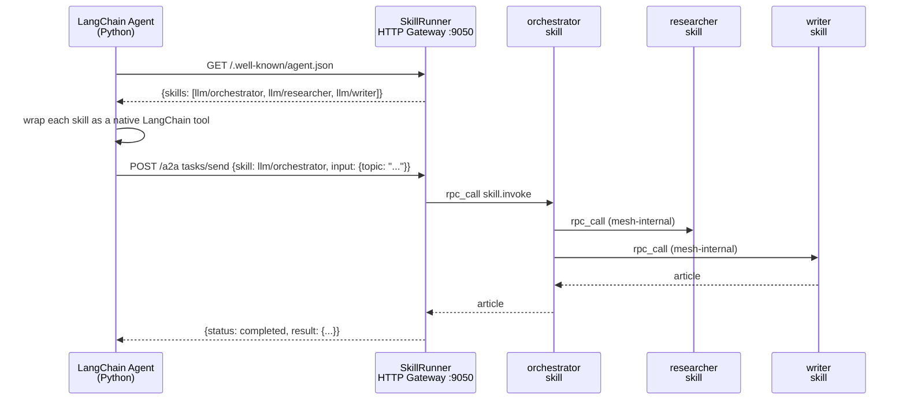

# 08 — A2A Interop: LangChain and AutoGen on the mesh

## Concept

The A2A (Agent-to-Agent) protocol is a simple HTTP standard for agent
discovery: a well-known endpoint (`/.well-known/agent.json`) describes what
an agent can do, and a task endpoint (`/a2a`) accepts work. Mycelium
implements both sides of this protocol via `--features a2a`, which means any
framework that speaks A2A — LangChain, AutoGen, or a hand-rolled client — can
discover and call Mycelium skills without knowing anything about gossip,
capabilities, or the mesh topology.



From the Python agent's perspective it made one tool call and got back a
finished article. The mesh-internal routing — orchestrator calling researcher
calling writer — is completely invisible. Mycelium is the routing layer;
the Python agent is just a consumer.

This pattern is useful for:
- Giving existing LangChain/AutoGen workflows access to Mycelium skills
  without rewriting them in Rust
- Letting the mesh absorb the complexity of multi-skill pipelines while
  exposing a simple A2A interface to orchestrators
- Mixing Mycelium skills with non-Mycelium agents in a single workflow

---

## The Example

`examples/a2a_langchain/` provides two agents: a LangChain ReAct agent and an
AutoGen v0.4 agent. Both connect to a running community skills cluster,
auto-discover available skills, and use them to answer a question.

**Prerequisites**

```bash
# Build SkillRunner with A2A support
cargo build --bin skillrunner --features a2a

# Start the community skills cluster
cd examples/community && ./start.sh && cd -

# Install Python dependencies
cd examples/a2a_langchain
pip install -r requirements.txt
```

Set your LLM API key (for the Python agent's own LLM — not the skills):

```bash
export OPENAI_API_KEY=sk-...        # to use gpt-4o-mini
# or set OLLAMA_BASE_URL for local Ollama
```

**Run — LangChain agent**

```bash
cd examples/a2a_langchain
python langchain_agent.py
```

**Run — AutoGen agent**

```bash
python autogen_agent.py
```

**Expected output**

```
Discovering skills at http://localhost:9050...
Found 3 skills: llm/orchestrator, llm/researcher, llm/writer
Wrapping as LangChain tools...

> What are the key properties of gossip protocols?

[LangChain] Selecting tool: llm/orchestrator
[Mycelium]  orchestrator → researcher → writer
[LangChain] Tool result: {"title": "Gossip Protocols...", "article": "..."}

Final answer: Gossip protocols achieve eventual consistency via epidemic
propagation. Key properties include...
```

---

## How It Works

**`/.well-known/agent.json`** is served by the SkillRunner HTTP gateway when
built with `--features a2a`. It lists all skills currently advertising on the
mesh (scanned from the capability KV entries at request time):

```json
{
  "skills": [
    {
      "id":          "llm/orchestrator",
      "name":        "orchestrator",
      "description": "Coordinates research and writing to produce articles",
      "input_schema": { "type": "object", "properties": { "topic": {"type": "string"} } }
    }
  ]
}
```

**`/a2a tasks/send`** accepts a task, resolves the target skill from the mesh,
and dispatches via RPC. The HTTP response waits for the RPC result:

```python
# langchain_agent.py — simplified
response = requests.post(
    "http://localhost:9050/a2a",
    json={"skill": "llm/orchestrator", "input": {"topic": "gossip protocols"}}
)
result = response.json()["result"]
```

**LangChain tool wrapping** (`langchain_agent.py`):

```python
from langchain.tools import StructuredTool

def make_tool(skill):
    def call(**kwargs):
        resp = requests.post(gateway + "/a2a",
                             json={"skill": skill["id"], "input": kwargs})
        return resp.json().get("result", resp.json())
    return StructuredTool.from_function(
        func=call,
        name=skill["name"],
        description=skill["description"],
        args_schema=build_schema(skill["input_schema"]),
    )

tools = [make_tool(s) for s in discover_skills(gateway)]
```

---

## Dev Notes

**Build flag required.** A2A routes are compiled in only with `--features a2a`:

```bash
cargo build --bin skillrunner --features a2a
```

Without the flag the gateway starts but `/a2a` and `/.well-known/agent.json`
return 404.

**Gateway port.** The A2A gateway uses the `http_port` in the skill TOML.
The orchestrator's default is 9050 (`http_port = 9050` in
`orchestrator.skill.toml`). Any skill node can serve A2A — point clients at
whichever gateway has `http_port` set.

**Which skill to expose.** You typically expose the orchestrating skill
(the outermost node) via A2A, not the sub-skills. Clients call the
orchestrator; the mesh handles internal routing transparently.

**Timeout management.** The A2A task endpoint waits for the full RPC chain.
For a 3-skill pipeline on CPU inference this can take 60–90 s. Set
`requests.post(..., timeout=120)` in Python clients accordingly.

**OpenAI vs Ollama for the Python agent.** The Python agent uses its own LLM
for reasoning about which tool to call. Set `OPENAI_API_KEY` for gpt-4o-mini,
or set `OLLAMA_BASE_URL=http://localhost:11434/v1` and `OLLAMA_MODEL=llama3.2`
for local inference. The Mycelium skills use their own separate LLM config.

**Extending to custom clients.** Any HTTP client that can `GET
/.well-known/agent.json` and `POST /a2a tasks/send` can use Mycelium skills.
The protocol is intentionally minimal — a JSON description and a task endpoint.
No SDK required.

**AutoGen v0.4 specifics.** `autogen_agent.py` uses the `FunctionTool` API.
AutoGen's tool interface requires `name` to be a valid Python identifier — the
agent strips `/` from skill ids when registering tool names.
