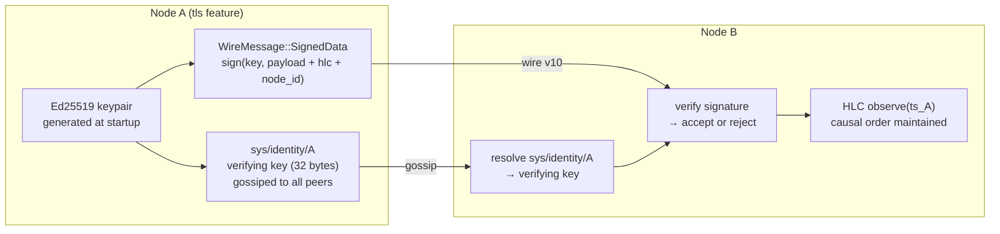

# 09 — Security: mTLS, Ed25519, signed KV, and the audit trail

## Concept

Mycelium's security model has three layers that compose independently:

1. **Transport security** — mTLS on every gossip TCP connection (`--features tls`)
2. **Node identity** — Ed25519 keypair per node; public key gossiped to the mesh
3. **Data integrity** — Ed25519-signed KV writes at the wire level (v10+)

Together these properties form something that most distributed systems lack: a
cryptographically verifiable, causally-ordered audit trail that is replicated to
every node by the gossip substrate itself. No separate logging service. No
central log aggregator. The mesh is the audit store.



**Why HLC ordering matters for security.** Wall-clock LWW (last-write-wins)
is vulnerable to clock-skew attacks: a node with a fast clock can overwrite
any key by setting its wall clock slightly ahead. Mycelium's HLC prevents
this: any write after observing a remote value has a strictly greater logical
timestamp, regardless of wall-clock drift. Tampering with a historical entry
requires producing a causally-consistent chain from genesis — computationally
infeasible without the original signing key.

**Audit trail.** Every SkillRunner invocation writes an audit record. Under the
`compliance` feature this is a signed, hash-chained record at
`sys/audit/{node}/{seq}` (see *The audit trail in practice* below); without it,
a plain time-keyed record at `audit/{ts}/{node}`. The `compliance` record is:
- HLC-timestamped (causally ordered)
- Ed25519-signed by the invoking node
- Hash-chained to its predecessor in that node's stream (tamper-evident)
- Replicated to every mesh node via gossip within seconds

This means audit records are distributed, tamper-evident, and available on
any node without querying a central service — directly relevant to HIPAA
§164.312(b) (Audit Controls) and SOC 2 CC7.2 (anomaly detection).

---

## Enabling transport security

The `tls` feature is opt-in and compiles completely away without it:

```toml
# Cargo.toml
mycelium = { version = "0.1", features = ["tls"] }
```

```bash
cargo build --lib --features tls
```

With `tls` enabled, configure TLS in `GossipConfig`:

```rust
use mycelium::{GossipConfig, TlsConfig};

let mut cfg = GossipConfig::default();
cfg.tls = Some(TlsConfig::default());
// TlsConfig::default() generates an ephemeral Ed25519 keypair.
// To persist the identity across restarts, provide a key path:
cfg.tls = Some(TlsConfig {
    key_path:  Some(PathBuf::from("/etc/mycelium/node.key")),
    cert_path: Some(PathBuf::from("/etc/mycelium/node.crt")),
    ..Default::default()
});
```

All gossip TCP connections between nodes now require mutual TLS. A node
without a valid certificate cannot join the mesh.

---

## Node identity

At startup, a TLS-enabled node writes its Ed25519 verifying key to:

```
sys/identity/{node_id}   →   32-byte verifying key
```

This key gossips to every peer within seconds. Any node can look up any
other node's verifying key without a PKI or certificate authority.

```rust
// Resolve another node's public key
let key_bytes = agent.kv().get(&format!("sys/identity/{}", target_node_id));
```

The same keypair signs consensus proposals (`SignedConsensusMsg` in
`src/consensus.rs`), ensuring that a consensus vote cannot be forged by a
node that doesn't hold the private key.

---

## Wire-level KV signing (v10)

Wire version 10 (current) adds `WireMessage::SignedData`. When a node writes
a KV entry with `set_signed()`, the wire message includes:

```
SignedData {
    hlc:       u64,        // HLC tick at time of write
    node_id:   String,     // writer's node identity
    key:       String,
    value:     Bytes,
    signature: [u8; 64],   // Ed25519 over (hlc || node_id || key || value)
}
```

Receiving nodes verify the signature against the writer's public key from
`sys/identity/`. An invalid signature is rejected silently — the entry is
never applied to the local KV store.

Without the `tls` feature, `WireMessage::SignedData` is never emitted and
the verification path compiles away. Behaviour without `tls` is identical to
pre-v10.

---

## Role-based access control (`compliance` feature)

The `compliance` feature (`= ["gateway", "tls"]`) adds RBAC on top of the node
identity. Four pieces, all obeying Mycelium's *detection-not-prevention*
posture — access control is enforced where a resource is **served**, never by
teaching the gossip store a higher-layer rule.

**1. Signed node roles.** A node advertises its roles and a data-classification
clearance as an Ed25519-signed claim:

```rust
// node A, started with cfg.tls = Some(..)
agent.advertise_roles(["admin".into(), "orchestrator".into()], /* clearance L3 */ 3)?;
```

This writes a `SignedRoleClaim` to `sys/role/A`. Any other node reads it back
**verified**:

```rust
match agent.roles_of(&node_a) {
    Some(claim) if claim.has_role("admin") && claim.clearance_at_least(3) => { /* trust */ }
    _ => { /* forged, unsigned, or absent — treat as no roles */ }
}
```

`roles_of` returns `Some` only when the claim's signature checks out against
`A`'s identity key as learned from `sys/identity/` — never the raw (forgeable)
KV bytes. A peer that writes arbitrary bytes to `sys/role/A` cannot mint a role;
the entry simply reads back as `None`.

**2. Provider-side capability authorization.** A capability declares an
`authorized_callers` allowlist; the provider enforces it when it serves:

```rust
// inside a provider's rpc_rx serve loop
if !agent.caller_authorized(req.sender(), &authorized_callers) {
    // deny — req.sender() is signature-verified at the connection layer under tls
}
```

Empty allowlist = open; otherwise the verified sender is admitted if it is listed
by NodeId or holds a listed role. SkillRunner wires this in automatically from
the `[policy] authorized_callers` field of a `.skill.toml`.

**3. OAuth2 scope gateway ACLs.** Map bearer tokens to `resource:verb` scopes;
each `/gateway/**` route requires one (deny-by-default → `admin`):

```rust
cfg.gateway_scoped_tokens = vec![
    GatewayToken { token: "rw".into(),  scopes: vec!["kv:read".into(), "kv:write".into()] },
    GatewayToken { token: "ro".into(),  scopes: vec!["kv:read".into()] },
];
```

`POST /gateway/kv` with the `ro` token → `403 {"required_scope":"kv:write"}`;
with `rw` → admitted. The legacy `gateway_auth_token` maps to `["*"]`. The public
edge (`/health`, `/ready`, `/stats`, `/metrics`, descriptor) is never scope-gated.

**4. The `sys/` namespace tripwire** (core — on without `compliance`). A remote
write naming *this* node in a self-owned `sys/` prefix (`identity`, `load`,
`role`, `tuple`) is flagged: `warn!` + `GET /stats` → `sys_namespace_violations`.
Detection only — the write still applies per LWW.

→ Operator config, the scope vocabulary, and a verification checklist:
[`docs/operations/rbac.md`](../operations/rbac.md).

---

## The audit trail in practice (WS2)

The shape of the audit trail depends on whether the `compliance` feature is on:

| Build | Trail | Key | Signed | Hash-chained |
|---|---|---|:-:|:-:|
| **default** (no `compliance`) | plain, time-keyed | `audit/{ts_unix_nanos}/{node}` | ✗ | ✗ |
| **`compliance`** | tamper-evident | `sys/audit/{node}/{seq:016x}` | ✓ (Ed25519) | ✓ (per-node SHA-256 chain) |

Without `compliance` there is no identity key to sign with, so the plain trail
is the best available. With `compliance`, every SkillRunner invocation is sealed
into the node's signed, hash-chained stream.

### The hash chain is per-node — and that is deliberate

A single global chain across all nodes would need a sequencer to order writes —
a coordinator, which the substrate's first principle forbids. So each node keeps
its **own** chain: record `seq` is monotonic per node, and each record's
`prev_hash` is the SHA-256 `content_hash` of its predecessor in the same
stream. The cluster-wide trail is the **union of independently verifiable
streams**. Removing, reordering, or editing any record in a stream breaks
verification of that stream from the next record on.

```rust
// Seal an event (compliance feature). Returns the record's content hash —
// the stable, citable identifier.
let h = agent.audit(
    AuditAction::Invoke,
    caller.to_string(),          // the verified principal (req.sender() under tls)
    format!("{ns}/{name}"),      // the resource
    AuditOutcome::Success,
    Some(detail_json),
)?;
```

### Verifying chain integrity

Verification checks every record's signature *and* the `prev_hash` linkage *and*
sequence contiguity — not just timestamps:

```rust
// Programmatic: verify a node's whole stream against its identity key.
match agent.audit_verify(&node) {
    Ok(())  => { /* intact from genesis */ }
    Err(e)  => { /* e names the first bad seq: BadSignature / BrokenLink / … */ }
}

// Or verify a slice you already hold:
let chain = agent.audit_stream(&node);          // decoded, seq-ordered
verify_stream_from_genesis(&chain, &node, &verifying_key)?;
```

Or over HTTP — `GET /gateway/audit` (scope `audit:read`) returns each stream with
`verified`, the chain-tip `head_hash`, and a `content_hash` per record:

```bash
curl -H 'Authorization: Bearer <audit-token>' \
     'http://NODE:PORT/gateway/audit?node=127.0.0.1:8080&limit=50'
# → { "streams": [ { "node": "...", "verified": true, "head_hash": "…",
#                    "records": [ { "seq":0, "principal":"…", "content_hash":"…" }, … ] } ] }
```

The per-record `content_hash` is the stable, citable identifier the v2 M16
self-attestation layer references.

→ Operator querying, evidence verification, and retention:
[`docs/operations/audit.md`](../operations/audit.md).

---

## Compliance positioning

| Control | Framework | Mycelium mechanism |
|---------|-----------|-------------------|
| Audit Controls | HIPAA §164.312(b) | Skill invocations sealed into a signed, hash-chained per-node trail (`compliance`); HLC-ordered and replicated to all nodes |
| Transmission Security | HIPAA §164.312(e) | mTLS on all gossip TCP connections (`--features tls`) |
| Integrity | HIPAA §164.312(c)(1) | Hash-chained, Ed25519-signed audit records verifiable via `audit_verify` / `GET /gateway/audit` (`compliance`); gossip-replicated to all nodes |
| Authentication | HIPAA §164.312(d) | Ed25519 node identity at `sys/identity/{node}` |
| Anomaly Detection | SOC 2 CC7.2 | Audit trail queryable from any node; no central log aggregator |
| Change Management | SOC 2 CC6.6 | Capability advertisements version-tagged by HLC; consensus commits signed |

This is a design-level mapping. Independent audit against HIPAA or SOC 2
requires an accredited assessor — the table shows which Mycelium properties
are relevant to each control.

---

## Dev Notes

**`tls` feature scope.** mTLS protects the gossip transport between nodes.
It does not encrypt the HTTP management gateway or SkillRunner HTTP endpoints.
For production deployments, put the HTTP gateway behind a TLS-terminating
reverse proxy (nginx, Caddy).

**Key persistence.** `TlsConfig::default()` generates a fresh keypair on
every restart. This means `sys/identity/{node}` changes on every restart,
breaking audit trail continuity. For production use, persist the keypair to
disk and reload it:

```rust
cfg.tls = Some(TlsConfig {
    key_path: Some(PathBuf::from("/var/lib/mycelium/node.key")),
    ..Default::default()
});
```

**Rolling upgrade window.** Wire v10 is backward-compatible with v9 peers
via the rolling upgrade window (`PREV_WIRE_VERSION = 9` in `src/framing.rs`).
A v9 node that receives a `SignedData` message simply drops it — it doesn't
crash or corrupt its state.

**Audit TTL.** SkillRunner audit records use the default KV TTL (24 h for
cross-node visibility). For regulatory retention (e.g. 7-year HIPAA
requirement), configure a WAL-backed audit sink or hook the audit records
into an external SIEM via a scan loop.

→ Next: [10-language-bridges.md](10-language-bridges.md) — calling Mycelium from Python and TypeScript.
