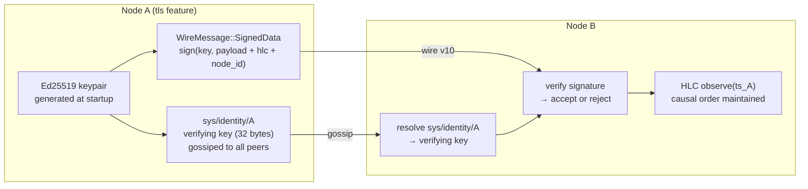

# 09 — Security: mTLS, Ed25519, signed KV, and the audit trail

## Concept

Mycelium's security model has three layers that compose independently:

1. **Transport security** — mTLS on every gossip TCP connection (`--features tls`)
2. **Node identity** — Ed25519 keypair per node; public key gossiped to the mesh
3. **Data integrity** — Ed25519-signed KV writes at the wire level (v10+)

Together these properties form something that most distributed systems lack: a
cryptographically verifiable, causally-ordered audit trail that is replicated to
every node by the gossip substrate itself. No separate logging service. No
central log aggregator. The mesh is the audit store.



**Why HLC ordering matters for security.** Wall-clock LWW (last-write-wins)
is vulnerable to clock-skew attacks: a node with a fast clock can overwrite
any key by setting its wall clock slightly ahead. Mycelium's HLC prevents
this: any write after observing a remote value has a strictly greater logical
timestamp, regardless of wall-clock drift. Tampering with a historical entry
requires producing a causally-consistent chain from genesis — computationally
infeasible without the original signing key.

**Audit trail.** Every SkillRunner invocation writes a record to
`audit/{hlc_hex}/{node_id}` in the KV store. Each record is:
- HLC-timestamped (causally ordered)
- Ed25519-signed by the invoking node
- Replicated to every mesh node via gossip within seconds

This means audit records are distributed, tamper-evident, and available on
any node without querying a central service — directly relevant to HIPAA
§164.312(b) (Audit Controls) and SOC 2 CC7.2 (anomaly detection).

---

## Enabling transport security

The `tls` feature is opt-in and compiles completely away without it:

```toml
# Cargo.toml
mycelium = { version = "0.1", features = ["tls"] }
```

```bash
cargo build --lib --features tls
```

With `tls` enabled, configure TLS in `GossipConfig`:

```rust
use mycelium::{GossipConfig, TlsConfig};

let mut cfg = GossipConfig::default();
cfg.tls = Some(TlsConfig::default());
// TlsConfig::default() generates an ephemeral Ed25519 keypair.
// To persist the identity across restarts, provide a key path:
cfg.tls = Some(TlsConfig {
    key_path:  Some(PathBuf::from("/etc/mycelium/node.key")),
    cert_path: Some(PathBuf::from("/etc/mycelium/node.crt")),
    ..Default::default()
});
```

All gossip TCP connections between nodes now require mutual TLS. A node
without a valid certificate cannot join the mesh.

---

## Node identity

At startup, a TLS-enabled node writes its Ed25519 verifying key to:

```
sys/identity/{node_id}   →   32-byte verifying key
```

This key gossips to every peer within seconds. Any node can look up any
other node's verifying key without a PKI or certificate authority.

```rust
// Resolve another node's public key
let key_bytes = agent.get(&format!("sys/identity/{}", target_node_id));
```

The same keypair signs consensus proposals (`SignedConsensusMsg` in
`src/consensus.rs`), ensuring that a consensus vote cannot be forged by a
node that doesn't hold the private key.

---

## Wire-level KV signing (v10)

Wire version 10 (current) adds `WireMessage::SignedData`. When a node writes
a KV entry with `set_signed()`, the wire message includes:

```
SignedData {
    hlc:       u64,        // HLC tick at time of write
    node_id:   String,     // writer's node identity
    key:       String,
    value:     Bytes,
    signature: [u8; 64],   // Ed25519 over (hlc || node_id || key || value)
}
```

Receiving nodes verify the signature against the writer's public key from
`sys/identity/`. An invalid signature is rejected silently — the entry is
never applied to the local KV store.

Without the `tls` feature, `WireMessage::SignedData` is never emitted and
the verification path compiles away. Behaviour without `tls` is identical to
pre-v10.

---

## The audit trail in practice

### SkillRunner audit records

`src/bin/skillrunner/audit.rs` writes a record after every skill invocation:

```rust
// audit/{hlc:016x}/{node_id}
AuditRecord {
    skill_ns:    "llm",
    skill_name:  "orchestrator",
    caller:      "127.0.0.1:57001",
    nonce:       u64,
    success:     true,
    duration_ms: 4200,
    tool_calls:  ["researcher", "writer"],
}
```

Records are signed and HLC-ordered. Query them from any node:

```bash
# Live dashboard
http://localhost:9050/mgmt   # shows audit trail

# From Rust
let records = agent.scan_prefix("audit/");
```

### Verifying chain integrity

Because each entry carries an HLC timestamp and the HLC is monotonically
increasing per node, you can verify that no entries were inserted out of
order or back-dated:

```rust
let mut prev_hlc = 0u64;
for (key, val) in agent.scan_prefix("audit/") {
    let hlc = u64::from_str_radix(key.split('/').nth(1).unwrap(), 16).unwrap();
    assert!(hlc > prev_hlc, "audit chain broken at {key}");
    prev_hlc = hlc;
    // Also verify Ed25519 signature using sys/identity/{node} key
}
```

---

## Compliance positioning

| Control | Framework | Mycelium mechanism |
|---------|-----------|-------------------|
| Audit Controls | HIPAA §164.312(b) | All KV writes, RPC calls, and skill invocations are HLC-ordered and optionally Ed25519-signed; replicated to all nodes |
| Transmission Security | HIPAA §164.312(e) | mTLS on all gossip TCP connections (`--features tls`) |
| Integrity | HIPAA §164.312(c)(1) | Hash-chained, signed audit records; gossip replication to all nodes |
| Authentication | HIPAA §164.312(d) | Ed25519 node identity at `sys/identity/{node}` |
| Anomaly Detection | SOC 2 CC7.2 | Audit trail queryable from any node; no central log aggregator |
| Change Management | SOC 2 CC6.6 | Capability advertisements version-tagged by HLC; consensus commits signed |

This is a design-level mapping. Independent audit against HIPAA or SOC 2
requires an accredited assessor — the table shows which Mycelium properties
are relevant to each control.

---

## Dev Notes

**`tls` feature scope.** mTLS protects the gossip transport between nodes.
It does not encrypt the HTTP management gateway or SkillRunner HTTP endpoints.
For production deployments, put the HTTP gateway behind a TLS-terminating
reverse proxy (nginx, Caddy).

**Key persistence.** `TlsConfig::default()` generates a fresh keypair on
every restart. This means `sys/identity/{node}` changes on every restart,
breaking audit trail continuity. For production use, persist the keypair to
disk and reload it:

```rust
cfg.tls = Some(TlsConfig {
    key_path: Some(PathBuf::from("/var/lib/mycelium/node.key")),
    ..Default::default()
});
```

**Rolling upgrade window.** Wire v10 is backward-compatible with v9 peers
via the rolling upgrade window (`PREV_WIRE_VERSION = 9` in `src/framing.rs`).
A v9 node that receives a `SignedData` message simply drops it — it doesn't
crash or corrupt its state.

**Audit TTL.** SkillRunner audit records use the default KV TTL (24 h for
cross-node visibility). For regulatory retention (e.g. 7-year HIPAA
requirement), configure a WAL-backed audit sink or hook the audit records
into an external SIEM via a scan loop.

→ Next: [10-language-bridges.md](10-language-bridges.md) — calling Mycelium from Python and TypeScript.
