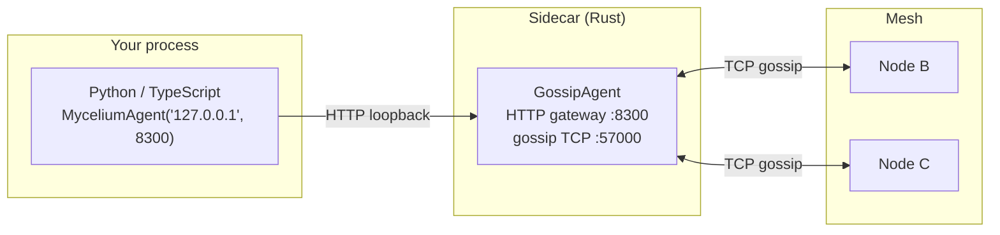

# 10 — Language Bridges: Python and TypeScript

## Concept

Mycelium is a Rust library, but most AI/ML work happens in Python, and much
of the tooling ecosystem is JavaScript/TypeScript. The language bridges solve
this with a **sidecar pattern**: a Rust `GossipAgent` runs as a thin sidecar
process alongside your Python or TypeScript code, exposing the full Mycelium
API over a local HTTP gateway. Your non-Rust code talks to the sidecar over
loopback (~1 ms overhead) and gets access to every primitive: KV, signals,
capabilities, RPC, consensus, mailboxes.



No PyO3 FFI, no native extension, no version matrix. The sidecar is a
standalone binary (`three_node_demo` in the demo binary or a dedicated
`GossipAgent` in your application). The Python/TypeScript client is a thin
HTTP wrapper — under 500 lines in both cases.

This pattern is used in production in `examples/fluid_pipeline/`: 10 Python
workers each connect to their own Mycelium sidecar, advertise capabilities,
and serve RPC calls — all from pure Python.

---

## Python bridge (`mycelium-py`)

### Install

```bash
cd mycelium-py
pip install -e ".[dev]"
# or from PyPI once published:
pip install mycelium-py
```

### Connect

The sidecar must already be running with `MYCELIUM_HTTP_PORT` set (or
`http_port` in a skill TOML). Point the Python agent at its HTTP port:

```python
from mycelium import MyceliumAgent

agent = MyceliumAgent("127.0.0.1", 8300)
```

### Full API

```python
# ── Capabilities ──────────────────────────────────────────────────────────────
handle = agent.advertise_capability("compute", "gpu",
    interval_secs=30, attributes={"model": "A100", "vram_gb": 80})
providers = agent.resolve_capability("compute", "gpu")
# providers: list of {node_id, attributes, ...} dicts
# `handle` keeps the advertisement alive — drop()/context-manage it to retract

# ── KV store ──────────────────────────────────────────────────────────────────
# Note: no TTL parameter — the store never time-evicts live keys. Liveness
# semantics come from capability evaporation, not from KV expiry.
agent.set("pipeline/job/42", b'{"status": "pending"}')
val   = agent.get("pipeline/job/42")        # bytes | None
items = agent.scan_prefix("pipeline/job/")  # dict[str, bytes]
agent.delete("pipeline/job/42")

# ── RPC ───────────────────────────────────────────────────────────────────────
result = agent.rpc_call(target_node_id, "process", payload_bytes, timeout_secs=30)

async for req in agent.rpc_serve("process"):
    data = json.loads(req.payload)
    response = do_work(data)
    agent.rpc_respond(req, json.dumps(response).encode())

# ── Signals ───────────────────────────────────────────────────────────────────
agent.emit("task.ready", b"payload", scope="cluster")
agent.emit("task.ready", b"payload", scope="group:workers")   # scope is a string
agent.emit("task.ready", b"payload", scope="node:127.0.0.1:7000")

async for sig in agent.on_signal("task.ready"):
    print(sig.sender, sig.payload)

# ── Mailbox (reliable delivery) ───────────────────────────────────────────────
agent.deliver_event(target_node_id, "task.result", b"done")
async for event in agent.mailbox("task.result"):
    print(event.payload)

# ── Consensus overlay ─────────────────────────────────────────────────────────
agent.consistent_set("config/flag", b"true")   # quorum = majority of peers
val = agent.consistent_get("config/flag")

with agent.distributed_lock("migration-lock", ttl_secs=30) as guard:
    print("fencing token:", guard.token)
    # ... critical section; released on exit (or after TTL on crash) ...

leader  = agent.elect_leader("workers")
hlc     = agent.append("events", b"entry")                  # returns HLC stamp
entries = agent.scan_log("events", from_hlc=0)              # [from_hlc, to_hlc)

# ── A2A / Prompt Skills ───────────────────────────────────────────────────────
from mycelium import A2aClient, PromptSkillClient

a2a    = A2aClient("http://localhost:9050")
skills = a2a.fetch_card()   # list discovered skills
result = a2a.send("llm/orchestrator", {"topic": "gossip protocols"}, timeout_secs=120)

ps = PromptSkillClient("http://localhost:8300")
reply = ps.call("demo/summarizer", {"text": "..."})
```

See [`mycelium-py/README.md`](../../mycelium-py/README.md) for the full API
reference including async variants and error handling.

---

## TypeScript bridge (`mycelium-ts`)

### Install

```bash
cd mycelium-ts
npm install && npm run build
# or from npm once published:
npm install mycelium-ts
```

### Full API

```typescript
import { MyceliumAgent } from "mycelium-ts";

const agent = new MyceliumAgent("127.0.0.1", 8300);

// ── Capabilities ──────────────────────────────────────────────────────────────
const handle = await agent.advertiseCapability("compute", "gpu", {
    intervalSecs: 30,
    attributes: { model: "A100", vram_gb: 80 },
});
const providers = await agent.resolveCapability("compute", "gpu");

// ── KV store ──────────────────────────────────────────────────────────────────
// No TTL option — the store never time-evicts live keys.
await agent.set("pipeline/job/42", Buffer.from('{"status":"pending"}'));
const val   = await agent.get("pipeline/job/42");      // Buffer | null
const items = await agent.scanPrefix("pipeline/job/"); // Record<string, Buffer>
await agent.delete("pipeline/job/42");

// ── RPC ───────────────────────────────────────────────────────────────────────
const reply = await agent.rpcCall(targetNodeId, "process", payload, { timeoutSecs: 30 });

for await (const req of agent.rpcServe("process")) {
    const result = doWork(req.payload);
    await agent.rpcRespond(req, Buffer.from(JSON.stringify(result)));
}

// ── Signals ───────────────────────────────────────────────────────────────────
await agent.emit("task.ready", Buffer.from("payload"), { scope: "system" });
await agent.emit("task.ready", Buffer.from("payload"), { scope: "group:workers" });
for await (const sig of agent.onSignal("task.ready")) {
    console.log(sig.sender, sig.payload.toString());
    break;
}

// ── Consensus overlay ─────────────────────────────────────────────────────────
await agent.consistentSet("config/flag", Buffer.from("true")); // quorum = peer majority
const flagVal = await agent.consistentGet("config/flag");
const guard   = await agent.distributedLock("migration-lock", { ttlSecs: 30 });
// ... critical section (guard.token is the fencing token) ...
await guard.release();
const leader  = await agent.electLeader("workers");
const hlc     = await agent.append("events", Buffer.from("entry")); // bigint HLC
const entries = await agent.scanLog("events", { fromHlc: 0n });

// ── A2A / Prompt Skills ───────────────────────────────────────────────────────
import { A2aClient, PromptSkillClient } from "mycelium-ts";

const a2a    = new A2aClient("http://localhost:9050");
const skills = await a2a.fetchCard();
const result = await a2a.send("llm/orchestrator", { topic: "gossip protocols" }, { timeoutSecs: 120 });

const ps    = new PromptSkillClient("http://localhost:8300");
const reply = await ps.call("demo/summarizer", { text: "..." });

// ── Clean up ──────────────────────────────────────────────────────────────────
await handle.drop();
```

**Requires Node.js ≥ 18.** See [`mycelium-ts/README.md`](../../mycelium-ts/README.md)
for the full reference including SSE streaming and error types.

---

## The sidecar in practice — fluid pipeline

`examples/fluid_pipeline/` is the reference implementation of language bridge
usage at scale. Each Python worker:

1. Starts with `MYCELIUM_PEERS` pointing at the coordinator's gossip port
2. Runs a Mycelium sidecar (embedded in the Docker image)
3. Connects via `MyceliumAgent("127.0.0.1", 8300)`
4. Advertises four capabilities (`advertise_capability("stage_a", "worker")`
   through `("stage_d", "worker")`, each on a 15 s interval)
5. Serves RPC calls via `async for req in agent.rpc_serve(method)`

The coordinator resolves workers via `agent.resolve_capability("stage_a",
"worker")`, dispatches via `agent.rpc_call(...)`, and writes results to the
KV ring — all from Python. The Mycelium substrate handles gossip,
anti-entropy, and capability evaporation transparently.

---

## Dev Notes

**Starting the sidecar.** In `fluid_pipeline`, the sidecar is started as part
of the Docker image entrypoint. For standalone use, run any Mycelium binary
with `MYCELIUM_HTTP_PORT` set and point the SDK at that port. The
`three_node_demo` binary's `node` role is the simplest sidecar — just a
`GossipAgent` with an HTTP gateway and no application logic.

**Port mapping.** The HTTP gateway port is what the SDK connects to. The
gossip TCP port is what mesh peers connect to. Keep them separate:
`MYCELIUM_HTTP_PORT=8300` (SDK) and `MYCELIUM_PORT=57000` (mesh).

**Async patterns.** Both SDKs are async-first. Python uses `asyncio`
(`async for req in agent.rpc_serve(...)`); TypeScript uses `for await`.
For synchronous Python scripts, use `asyncio.run()` or the sync wrappers
where provided.

**When to use the language bridge vs Rust directly.** Use the language bridge
when:
- Your team writes primarily in Python/TypeScript
- You're integrating Mycelium into an existing ML pipeline or web service
- You want to avoid a Rust compilation step in your deployment

Use Rust directly when:
- You need maximum throughput (no HTTP hop, no serialization)
- You're embedding Mycelium inside a larger Rust service
- You need `--features tls` (mTLS is only available in the Rust binary, not
  via the HTTP gateway)

**SDK method count.** `mycelium-py` and `mycelium-ts` each mirror 28+ methods
from the Rust API. Both are maintained in sync with the Rust library and
tested in the integration scenario suite.
