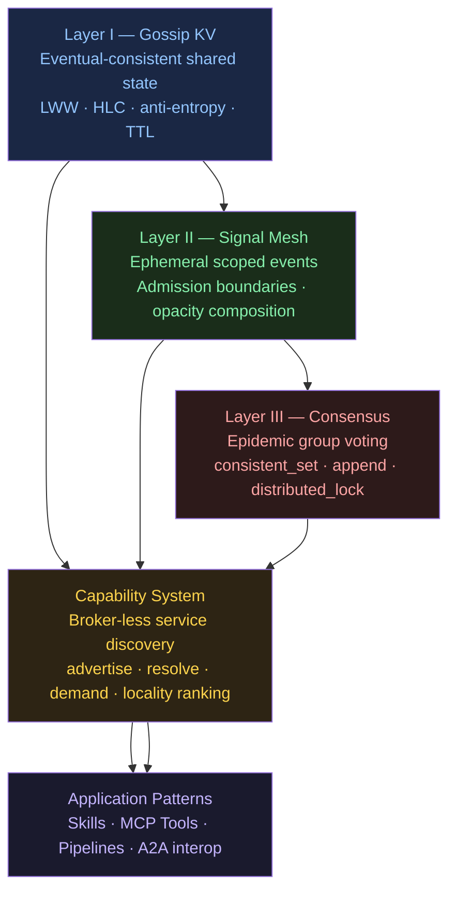

# Mycelium — Developer Guide

Mycelium is a broker-less embedded Rust library. You embed it directly in your
process — there is no daemon, no sidecar, no coordinator to run. Each node is
simultaneously a participant in the mesh and a full peer. The mesh is the
registry, the bus, and the scheduler all at once.

The library is built in three layers, each complete and useful on its own:



**Layer I** gives every node an eventually-consistent view of the cluster's
key-value state — no Zookeeper, no etcd, no Redis. Any node can write; every
node converges. HLC timestamps preserve causal ordering under clock skew.

**Layer II** adds ephemeral events that propagate epidemically. Each node
declares a `Boundary` — its admission rules — so signals flow where they're
relevant and nowhere else.

**Layer III** adds strong consistency on top of the eventual-consistency
substrate. `consistent_set`, `append`, `distributed_lock`, and `elect_leader`
are opt-in overlays, not the default. Pay for consistency only where you need it.

**The capability system** is the connective tissue: nodes advertise what they
provide (`ns/name` pairs with structured attributes), and any node can resolve
providers at call time — with locality ranking, demand pressure, and emergent
group formation — without knowing addresses in advance.

Four application patterns build on this substrate:

| Pattern | What it does | Guide chapter |
|---------|-------------|---------------|
| Skills | LLM agents as mesh nodes; TOML manifests; skill→skill composition | [05-skills.md](05-skills.md) |
| MCP Tool Discovery | LLM discovers tools dynamically from the KV store; zero-restart addition | [06-tool-discovery.md](06-tool-discovery.md) |
| Fluid Pipelines | Fixed worker pool flows through pipeline stages; KV ring as buffer | [07-pipelines.md](07-pipelines.md) |
| A2A Interop | LangChain / AutoGen agents discover Mycelium skills via `/.well-known/agent.json` | [08-a2a-interop.md](08-a2a-interop.md) |

---

## Chapters

| # | Concept | Runnable example | Time |
|---|---------|-----------------|------|
| [01](01-gossip-kv.md) | Gossip KV — shared state without a broker | `cargo run --example conway` | 30 s |
| [02](02-capabilities.md) | Capability discovery — find nodes by what they do | `cargo run --example llm_agent` | 1 min |
| [03](03-signals.md) | Signal mesh — ephemeral scoped events | `cargo run --example prompt_skill_demo` | 30 s |
| [04](04-consensus.md) | Consensus overlay — strong consistency on demand | overlay scenarios in `three_node_demo` | 2 min |
| [05](05-skills.md) | Skills — LLM agents on the mesh | `cd examples/community && ./demo.sh` | 5 min |
| [06](06-tool-discovery.md) | MCP tool discovery — LLM finds tools dynamically | `./examples/chat/demo.sh` | 5 min |
| [07](07-pipelines.md) | Fluid pipelines — Agentic Flow Networks | `docker compose up --scale worker=10` | 3 min |
| [08](08-a2a-interop.md) | A2A interop — LangChain / AutoGen integration | `python langchain_agent.py` | 3 min |

Read chapters 01–04 to build the mental model. Jump to 05–08 for the application
pattern that matches your use case.

---

## Quick orientation

```rust
// Every node is a GossipAgent — embed one in any Rust process
let agent = Arc::new(GossipAgent::new(node_id, config));
agent.start().await?;

// Layer I — shared state
agent.set("my/key", Bytes::from("value"));
let val = agent.get("my/key");

// Layer II — events
agent.subscribe(signal_kind::INVOKE, |sig| { /* handle */ });
agent.emit(signal_kind::INVOKE, SignalScope::Group("nlp".into()), payload);

// Layer III — strong consistency (opt-in)
agent.consistent_set("seq/counter", b"1", quorum).await?;

// Capability system — discovery
let cap = agent.advertise_capability(Capability::new("llm", "inference"), Duration::from_secs(60));
let providers = agent.resolve(&CapFilter::new("llm", "inference"));
```

See the [main README](../../README.md) for the full API surface and
[ROADMAP.md](../../ROADMAP.md) for the architecture rationale.
