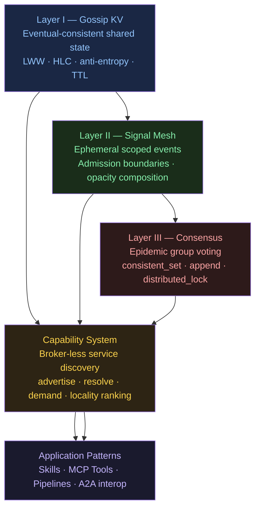

# Mycelium — Developer Guide

> **New here? Read the [FAQ](faq.md) first** — "is this for me?", which primitive
> to use, which example to run, and why-not-X — then come back for the depth below.
>
> **Building a use case *on* Mycelium?** See [Building on Mycelium](building-on-mycelium.md)
> — the integrator contract (dependency, public-API-only rule, reserved KV prefixes,
> invariants, and a copyable `CLAUDE.md` snippet).

Mycelium is a broker-less embedded Rust library. You embed it directly in your
process — there is no daemon, no sidecar, no coordinator to run. Each node is
simultaneously a participant in the mesh and a full peer. The mesh is the
registry, the bus, and the scheduler all at once.

## Design philosophy

Most distributed systems treat consistency as the default and availability as
the thing you sacrifice during a partition. Mycelium inverts this. Eventual
consistency is the default substrate — fast, partition-tolerant, no coordinator
required. Strong consistency is an opt-in overlay you reach for only where your
application actually needs it. You pay for guarantees only where they matter.

This is what [ROADMAP.md](../../ROADMAP.md) calls **The Structural Inversion**:

> _"Rather than building eventual consistency on top of consensus, build
> consensus on top of eventual consistency. The gossip substrate is always
> available; the consistency overlay is available when you need it."_

The second principle is biological. Signals propagate like hormones in a
circulatory system — epidemically, without routing tables, without a
dispatcher. Each node holds a `Boundary` (its receptor set) that decides
whether it *acts* on a signal; forwarding is always unconditional. Opacity,
load-shedding, and demand pressure all emerge from the same mechanism: nodes
write to their own `sys/load/` prefix, and anything scanning that prefix sees
a consistent picture without any coordination. See
[docs/philosophy.md](../philosophy.md) for the full argument.

The third principle is substrate unity: every higher-layer feature — capability
advertisements, consensus ballots, audit records, tool registrations — is
stored as a key in the gossip KV store. There is one substrate, not a stack of
separate systems. This means any node can inspect any layer's state, and the
anti-entropy mechanism that heals KV partitions also heals capability routing
and consensus voting.

---

## Layers

The library is built in three layers, each complete and useful on its own:



**Layer I** gives every node an eventually-consistent view of the cluster's
key-value state — no Zookeeper, no etcd, no Redis. Any node can write; every
node converges. HLC timestamps preserve causal ordering under clock skew.

**Layer II** adds ephemeral events that propagate epidemically. Each node
declares a `Boundary` — its admission rules — so signals flow where they're
relevant and nowhere else.

**Layer III** adds strong consistency on top of the eventual-consistency
substrate. `consistent_set`, `append`, `distributed_lock`, and `elect_leader`
are opt-in overlays, not the default. Pay for consistency only where you need it.

**The capability system** is the connective tissue: nodes advertise what they
provide (`ns/name` pairs with structured attributes), and any node can resolve
providers at call time — with locality ranking, demand pressure, and emergent
group formation — without knowing addresses in advance.

> **Note on layer numbering.** This guide uses three layers (I, II, III) for
> clarity. [ROADMAP.md](../../ROADMAP.md) describes five numbered layers (1–5)
> plus the opt-in overlay and capability subsystem as distinct sections.
> Layers 3–5 in ROADMAP correspond to the application patterns in chapters
> 05–08 here. Both descriptions are correct; the guide simplifies for
> newcomers.

Five application patterns build on this substrate:

| Pattern | What it does | Guide chapter |
|---------|-------------|---------------|
| Skills | LLM agents as mesh nodes; TOML manifests; skill→skill composition | [05-skills.md](05-skills.md) |
| MCP Tool Discovery | LLM discovers tools dynamically from the KV store; zero-restart addition | [06-tool-discovery.md](06-tool-discovery.md) |
| Fluid Pipelines | Fixed worker pool flows to the deepest tuple-space stage (pull, canonical); coordinator-dispatch baseline retained as `PIPELINE_MODE=push` | [07-pipelines.md](07-pipelines.md) |
| A2A Interop | LangChain / AutoGen agents discover Mycelium skills via `/.well-known/agent.json` | [08-a2a-interop.md](08-a2a-interop.md) |
| TupleSpace (companion crate) | Pull-based pipeline buffer: workers `take()` when ready, WAL durability, primary/secondary failover driven by capability evaporation. Built entirely on the public API — see the [`mycelium-tuple-space/`](../../mycelium-tuple-space/) crate docs; integration scenario 13 is the runnable reference | [07-pipelines.md](07-pipelines.md) (lanes + How It Works) |
| Blackboard (companion crate) | Shared working memory: many agents `read` facts non-destructively (`rd`), a finite fact is `claim`ed by exactly one by *content* predicate (`in`) — competitive, exactly-once, with primary/secondary failover. The content-routed sibling of the tuple space, on the public API — see the [`mycelium-blackboard/`](../../mycelium-blackboard/) crate docs + the `microgrid` example | [00-concepts.md](00-concepts.md) ("tuple space vs. blackboard") |

---

## Example portfolio

**The canonical index lives at [`examples/README.md`](../../examples/README.md)** — every
example with what-it-demonstrates and the run command, plus the shared setup. Two entries that
live outside `examples/` and are easy to miss:

| Example | What it's for |
|---|---|
| [`mycelium-blackboard/examples/microgrid`](../../mycelium-blackboard/examples/microgrid.rs) | the blackboard **`rd`/`in`** split — shared reads, competitive exactly-once claims (a finite-resource co-op) |
| overlay scenarios (`tests/overlay/`) | task auction / leader election / shared log against a real 3-node cluster (`make test-overlay`) |

## Chapters

> **In a hurry?** The [Cookbook](cookbook.md) answers "how do I…?" task by task
> (embed, advertise a capability, build a skill, call across nodes, federate,
> ship an artifact, scale), each pointing at a runnable demo. Operators: see
> [docs/operations/](../operations/).

| # | Concept | Runnable example | Time |
|---|---------|-----------------|------|
| [00](00-concepts.md) | **Concepts & vocabulary** — Capability vs Skill vs A2A/MCP/AgentFacts; native model vs edge standards. **Read first.** | — | 5 min |
| [01](01-gossip-kv.md) | Gossip KV — shared state without a broker | `cargo run --example conway` | 30 s |
| [02](02-capabilities.md) | Capability discovery — find nodes by what they do | `cargo run --example hello_capability` | 30 s |
| [03](03-signals.md) | Signal mesh — ephemeral scoped events | `cargo run -p mycelium-coop-examples --bin mailbox_llm` | 30 s |
| [04](04-consensus.md) | Consensus overlay — strong consistency on demand | overlay scenarios in `three_node_demo` | 2 min |
| [05](05-skills.md) | Skills — LLM agents on the mesh | `cd examples/community && ./demo.sh` | 5 min |
| [06](06-tool-discovery.md) | MCP tool discovery — LLM finds tools dynamically | `./examples/chat/demo.sh` | 5 min |
| [07](07-pipelines.md) | Fluid pipelines — Agentic Flow Networks | `docker compose up --scale worker=10` | 3 min |
| [08](08-a2a-interop.md) | A2A interop — LangChain / AutoGen integration | `python langchain_agent.py` | 3 min |
| [09](09-security.md) | Security & compliance — mTLS, Ed25519, signed KV, RBAC + OAuth2 gateway ACLs, OIDC SSO, tamper-evident audit, data-at-rest/egress, hot key rotation | `--features tls` / `compliance` | — |
| [10](10-language-bridges.md) | Language bridges — Python and TypeScript SDKs | `pip install mycelium-py` | 5 min |
| [11](11-semantic-coordination.md) | Semantic coordination — schema versioning, payload schemas, sender auth | `cargo run --example semantic_coordination` | 5 min |
| [12](12-schema-lifecycle.md) | Schema lifecycle — publish, conflict detection, CI gate, versioning | `agent.schemas().publish_schema(...)` | 10 min |
| [13](13-cluster-topology.md) | Cluster topology — seeds, partial mesh, sizing, partition recovery | — | 10 min |
| [14](14-patterns-and-pitfalls.md) | **Patterns & pitfalls** — the right way vs the anti-pattern, grounded in the coop examples (with the *why*) | the [coop suite](../../examples/coop/) | 10 min |
| [15](15-reasoning-and-langgraph.md) | **Reasoning & LangGraph** — LangGraph *on* Mycelium: routed inference, fleet traces, the checkpointer, and the deploy/reheal flagship (a model that follows its thread across node death) | the [`examples/langgraph/`](../../examples/langgraph/) ladder | 15 min |
| [16](16-guardrails.md) | **Guardrails** — structural, coordinator-free guardrails: *what an agent may do*, the three strength tiers (hard-prevention / self-imposed / transition), the policy API, and proving a guardrail fired from the tamper-evident chain | `cargo run -p mycelium-guardrails --features compliance --example guardrail_wedge` | 12 min |
| [17](17-federation.md) | **Federation** — cross-domain discovery with self-certified AgentFacts: serve and pull the edge document, verify a peer domain without a shared CA, and the multi-author domain board | `cargo run -p mycelium-coop-examples --bin federation_facts` | 10 min |
| [Artifacts & deploy](../operations/artifacts.md#solutiondev--authoring--publishing-an-artifact) | **Deploying & installing artifacts** — publish to the gossip catalogue, then a node **discovers → pulls the bytes over the mesh → verifies provenance → installs** (surviving the publisher's death). Dev walkthrough + full API live in operations (no separate chapter) | `cargo run -p mycelium-coop-examples --features wasm --bin catalog` | 10 min |
| [Error handling](error-handling.md) | Error type taxonomy, recoverability, propagation strategy | — | — |

Read chapters 01–04 to build the mental model. Jump to 05–08 for the application
pattern that matches your use case. Chapter 09 covers the security and compliance
story; chapter 10 covers using Mycelium from Python or TypeScript.

---

## Quick orientation

```rust
// Every node is a GossipAgent — embed one in any Rust process
let agent = Arc::new(GossipAgent::new(node_id, config));
agent.start().await?;

// Layer I — shared state
agent.kv().set("my/key", Bytes::from("value"));
let val = agent.kv().get("my/key");

// Layer II — events
agent.mesh().signal_rx(signal_kind::INVOKE);  // returns mpsc::Receiver<Signal>
agent.mesh().emit(signal_kind::INVOKE, SignalScope::Group("nlp".into()), payload);

// Layer III — strong consistency (opt-in)
agent.consensus().consistent_set("seq/counter", b"1").await?;

// Capability system — discovery
let cap = agent.capabilities().advertise_capability(Capability::new("llm", "inference"), Duration::from_secs(60));
let providers = agent.capabilities().resolve(&CapFilter::new("llm", "inference"));
```

See the [main README](../../README.md) for the full API surface and
[ROADMAP.md](../../ROADMAP.md) for the architecture rationale and design
decisions.

---

## Glossary

### Groups — two distinct concepts

The word "group" appears in two unrelated APIs. They are independent mechanisms:

| | Signal groups | Capability groups |
|---|---|---|
| **API** | `agent.mesh().join_group(name)` | `agent.capabilities().define_capability_group(name, def, interval)` |
| **Controls** | **Routing** — `SignalScope::Group(name)` delivers only to members | **Discovery** — nodes self-join when their capabilities match the group's filter |
| **Membership** | Explicit: you call `join_group` / `leave_group` | Emergent: each node independently evaluates the `CapabilityGroupDef` filter against its own capabilities |
| **KV namespace** | `grp/{group}/{node}` | `cap-group/{group}` (definition) + `gcap/{group}/...` (projected capabilities) |
| **Use case** | Scoping a signal to a runtime-defined subset of nodes | Making a set of nodes with matching capabilities visible as a wiring target |

A node can be a member of both a signal group and a capability group with the same name — they are stored and evaluated independently.
