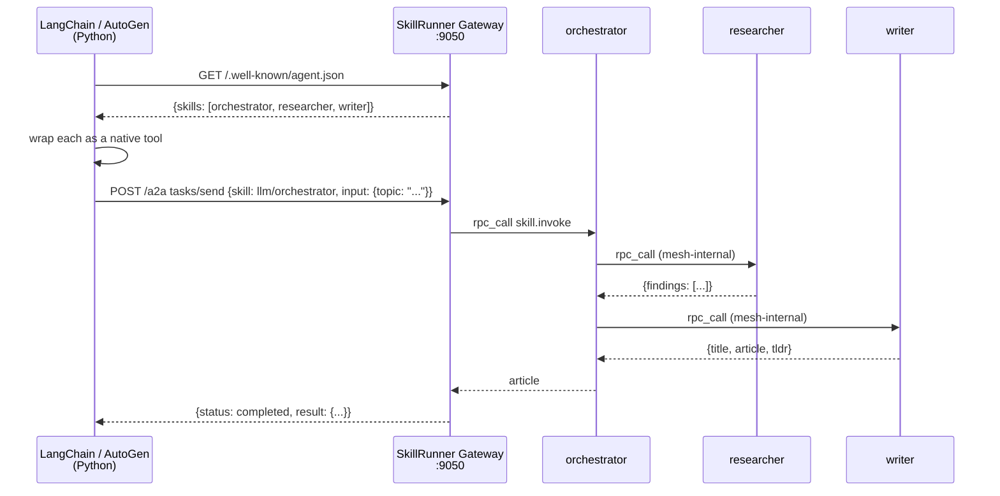

# Mycelium × LangChain / AutoGen — A2A auto-discovery

## Concept

The A2A (Agent-to-Agent) protocol lets any framework discover what an agent
cluster can do via a standard HTTP endpoint (`/.well-known/agent.json`), then
call skills via a task endpoint (`/a2a`). Mycelium implements both sides when
built with `--features a2a`.

From the Python agent's perspective: it calls one tool and gets back a
finished result. The mesh-internal routing — orchestrator calling researcher
calling writer — is completely invisible. Neither agent has any hardcoded
knowledge of what skills exist or where they run.



Discovery is live: add or remove SkillRunner nodes and the next
`/.well-known/agent.json` call reflects the change — no code changes, no
restart of the Python agent.

---

## Prerequisites

| Requirement | Notes |
|---|---|
| Rust toolchain | `cargo build --bin skillrunner --features a2a` |
| Python ≥ 3.11 | |
| Ollama (recommended) | `ollama pull llama3.2` — free, no API key |
| OpenAI key (optional) | Set `OPENAI_API_KEY` to use `gpt-4o-mini` instead |

---

## Quick start

### 1 — Build SkillRunner with A2A support

```bash
cargo build --bin skillrunner --features a2a
```

### 2 — Start the 3-skill community cluster

```bash
cd examples/community
./start.sh
```

Three SkillRunner processes start on ports 7950–7953. The orchestrator
exposes an HTTP gateway on port **9050** with A2A routes enabled.

### 3 — Install Python dependencies

```bash
pip install -r examples/a2a_langchain/requirements.txt
```

### 4 — Run the LangChain agent

```bash
# Ollama (default)
python examples/a2a_langchain/langchain_agent.py

# OpenAI
OPENAI_API_KEY=sk-... python examples/a2a_langchain/langchain_agent.py

# Custom query
QUERY="Explain Byzantine fault tolerance in one paragraph" \
    python examples/a2a_langchain/langchain_agent.py
```

### 5 — Run the AutoGen agent

```bash
python examples/a2a_langchain/autogen_agent.py
```

---

## What you'll see

```
Connecting to Mycelium at http://localhost:9050 ...

  Connected to: Mycelium cluster
  Discovered 3 skill(s):
    · llm/orchestrator  Coordinates research and writing to produce articles
    · llm/researcher    Researches a topic and returns structured findings
    · llm/writer        Writes a polished article from research findings

Query: Write a short technical article about gossip protocols.

> Entering new AgentExecutor chain...
  Thought: I should use llm_orchestrator to write the article.
  Action: llm_orchestrator
  Action Input: {"topic": "gossip protocols and eventual consistency"}
  Observation: {"title": "...", "article": "...", "tldr": "..."}
  Final Answer: ...
```

---

## How it works

`A2aClient.fetch_card()` does a single `GET /.well-known/agent.json`.
The response lists every capability currently advertised on the mesh — scanned
from the KV store at request time, so it is always current.

Each skill becomes a Python callable wrapped as a framework tool:

```python
def tool_fn(message: str) -> str:
    return client.send(skill_id, message, timeout_secs=120.0)
```

`client.send()` posts `tasks/send` JSON-RPC to `/a2a`. Mycelium resolves
the skill to a live node, calls it via nonce RPC, and returns the result.
If multiple nodes advertise the same skill, Mycelium picks one automatically.

---

## Dev Notes

**`--features a2a` is required.** Without it the gateway starts but `/a2a`
and `/.well-known/agent.json` return 404.

**Timeout.** A 3-skill pipeline on CPU inference takes 60–90 s. Set
`timeout_secs=120` in `client.send()` and configure your HTTP client's
socket timeout accordingly.

**Pointing at a different cluster.** Any SkillRunner node with `http_port`
configured and `--features a2a` compiled in works as a gateway:

```bash
MYCELIUM_URL=http://my-node:8300 python langchain_agent.py
```

**Adding a skill live.** Write a `.skill.toml` and run:

```bash
./target/debug/skillrunner --skill my_skill.toml
```

It appears in `/.well-known/agent.json` within one gossip interval (~10 s).
The Python agent discovers it on the next `fetch_card()` call.

**AutoGen tool naming.** AutoGen requires `name` to be a valid Python
identifier. `autogen_agent.py` strips `/` from skill ids when registering
(`llm/orchestrator` → `llm_orchestrator`).

→ Full concept guide: [`docs/guide/08-a2a-interop.md`](../../docs/guide/08-a2a-interop.md)
