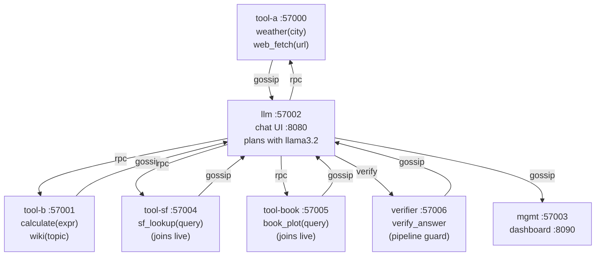

# MCP Tool Discovery — Interactive Chat Demo

## Concept

This demo shows what "the mesh is the registry" means in practice. Seven nodes
start up: four tool providers, one LLM planner, one management dashboard, and
one claims verifier. The LLM discovers available tools by scanning the gossip
KV store at the start of every planning cycle — not from a config file. Start
a new tool node mid-session and the LLM sees it on the next message. No
restart. No config change. No coordinator.



All seven roles live in a single binary (`three_node_demo`), selected by the
`MYCELIUM_ROLE` environment variable. Tools register under
`tools/{name}/{node_id}` in the KV store; the planner's `discover_tools()`
is `scan_prefix("tools/")` — a local read, no network hop.

The **verifier** is a claims-checking pipeline guard (Microsoft Research-style).
After the LLM produces a draft answer from tool results, the verifier
decomposes it into atomic factual claims, checks each against the tool
evidence, and removes any not grounded in the results. It is filtered from
the LLM's visible tool list — the LLM cannot call it directly.

---

## Prerequisites

```bash
cargo build --example three_node_demo
ollama serve            # in a separate terminal
ollama pull llama3.2
ollama pull llama3.1:8b  # verifier model (optional; falls back to llama3.2)
```

Any OpenAI-compatible endpoint works — set `OLLAMA_BASE_URL` and
`OLLAMA_MODEL` to use a different backend.

---

## Run — automated demo

```bash
cd examples/chat
./demo.sh
```

`demo.sh`:
1. Starts the base cluster (tool-a, tool-b, llm, mgmt, verifier)
2. Waits for the LLM node to be ready
3. Prints the initial tool list
4. Starts tool-sf live — LLM discovers it without restart
5. Starts tool-book live — same
6. Prints the final tool list

Open http://localhost:8080 while it runs to try the tools interactively.

## Run — manual cluster

```bash
cd examples/chat
./start.sh
# Open: http://localhost:8080  (chat UI)
# Open: http://localhost:8090  (mesh dashboard)
./stop.sh
```

---

## What to try

```
"what's the weather in Tokyo?"              → tool-a: weather
"what is 330 times 1024?"                   → tool-b: calculate
"how does Dan Simmons fit into 1990s SF?"   → tool-sf: sf_lookup
"what happens in Hyperion?"                 → tool-book: book_plot
"fetch https://example.com"                 → tool-a: web_fetch
```

Check what tools the LLM currently sees:

```bash
curl -s http://localhost:8080/mesh | python3 -m json.tool
```

---

## Dev Notes

**Adding a new tool node live.** Add a handler function in
`examples/three_node_demo.rs`, register it with the `register()` helper, and
add a new role branch in `main()`. Start the node; the LLM discovers it on the
next planning cycle.

The `register()` helper writes `tools/{name}/{node_id}` to the KV store and
returns a `CapabilityReg`. Dropping the handle deregisters the tool:

```rust
let _handle = register(
    &agent, "my_lookup",
    "Look up X when the user asks about X",
    json!({"type":"object","properties":{"query":{"type":"string"}},"required":["query"]}),
    Arc::new(|args| Box::pin(my_lookup_fn(args))),
);
```

**Verifier tuning.** The verifier model is set via `VERIFIER_MODEL` (default
`llama3.1:8b`). Larger models produce more accurate claim decomposition.
To disable verification, start without the verifier role in the peer list or
unset `VERIFIER_MODEL`.

**Planning cycle.** The multi-turn loop in `planning_cycle()` runs until
the LLM emits a final answer (finish reason `stop` with no pending tool
calls). Each tool call is dispatched via `rpc_call` to the node that
registered it. The SSE stream at `GET /stream` emits `Thinking`, `ToolCall`,
`ToolResult`, and `Assistant` events so the browser UI shows intermediate
steps.

**Model and endpoint.** Set before running `start.sh`:

```bash
OLLAMA_BASE_URL=http://localhost:11434/v1 \
OLLAMA_MODEL=llama3.2 \
VERIFIER_MODEL=llama3.1:8b \
  ./start.sh
```

→ For the skills equivalent (LLM agents calling other LLM agents), see
  [`examples/community/`](../community/) and [`docs/guide/05-skills.md`](../../docs/guide/05-skills.md).

→ For the full guide: [`docs/guide/06-tool-discovery.md`](../../docs/guide/06-tool-discovery.md)
