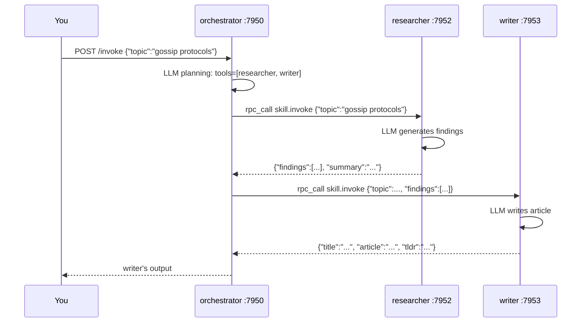

# Skills — LLM Agents as Mesh Citizens

## Concept

A **Skill** is an LLM agent that lives permanently in the mesh as its own
node. It has a network identity, a capability advertisement, and a prompt.
You define it entirely in a TOML manifest — no code required.

The key difference from an MCP tool: a Skill can call other Skills. The
orchestrator lists sub-skills in its `tools = [...]` array; SkillRunner
resolves those names against live capability advertisements in the KV store
at inference time and dispatches via mesh RPC. No node knows the address of
any other — each resolves its collaborators through the gossip layer.



Because the orchestrator resolves `llm/researcher` from the mesh at call
time, starting a second researcher causes automatic load-balancing — no
configuration change.

---

## Prerequisites

```bash
cargo build --bin skillrunner
ollama pull llama3.2   # or set skill.llm.endpoint to any OpenAI-compatible URL
```

---

## Run

### End-to-end demo (recommended)

```bash
cd examples/community
./demo.sh
```

`demo.sh` starts the cluster, waits for gossip convergence, invokes the
pipeline with a sample topic, then adds a **second researcher live** to show
automatic load-balancing — all in one terminal. Open
http://localhost:9050/mgmt in a browser while it runs to watch mesh state.

### Manual

```bash
cd examples/community
./start.sh           # orchestrator :7950, researcher :7952, writer :7953
sleep 3              # wait for gossip to converge

./invoke.sh "gossip protocols"                    # technical style
./invoke.sh "Rust ownership" casual               # casual tone
./invoke.sh "large language models" executive 8  # executive, 8 findings

./stop.sh
```

---

## What to observe

Follow logs across all nodes in a second terminal:

```bash
tail -f examples/community/logs/orchestrator.log \
        examples/community/logs/researcher.log \
        examples/community/logs/writer.log
```

You'll see the full causal chain as it happens:

```
[orchestrator] Received invoke: topic="gossip protocols"
[orchestrator] → tool_call: researcher  {"topic": "gossip protocols", "max_points": 5}
[researcher]   Received invoke
[researcher]   LLM generating findings...
[researcher]   → reply: {"findings": [...], "summary": "..."}
[orchestrator] ← tool_result: researcher  (5 findings)
[orchestrator] → tool_call: writer  {"topic": ..., "findings": [...]}
[writer]       Received invoke
[writer]       LLM generating article...
[writer]       → reply: {"title": "...", "article": "...", "tldr": "..."}
[orchestrator] ← tool_result: writer
[orchestrator] → final reply to caller
```

Each arrow is a real RPC call through the Mycelium gossip layer.

---

## How It Works

Each `.skill.toml` has four sections: `[node]` (gossip config), `[capability]`
(what the skill advertises), `[skill]` (prompt + tools), `[skill.llm]`
(model config).

The orchestrator's tools list uses `ns/name` format:

```toml
# orchestrator.skill.toml
[skill]
tools = ["llm/researcher", "llm/writer"]
```

SkillRunner (`src/bin/skillrunner/runner.rs:resolve_tools`) scans
`skills/llm/researcher/*/input` keys in the KV store to build the tool schema
list. The LM-visible name is the bare name (`researcher`, not `llm/researcher`)
because OpenAI function names cannot contain `/`.

When the LLM calls `researcher`, SkillRunner scans the KV for the `llm`
namespace, resolves the live node, and dispatches via `rpc_call`.

---

## Skill reference

| Skill | Port | Prompt focus | max_tokens |
|-------|------|-------------|------------|
| `orchestrator` | 7950 | Coordinates — delegates all LLM work | 512 |
| `researcher` | 7952 | Extract N key facts, return JSON | 1024 |
| `writer` | 7953 | Title, article body, TL;DR | 2048 |
| `verifier` | 7955 | Claims-checking pipeline guard | 2048 |

The orchestrator's low token budget is intentional: it coordinates cheaply
and leaves the substantive LLM work to specialist skills.

---

## Management dashboard

The orchestrator exposes a live mesh dashboard at http://localhost:9050/mgmt.
It shows every skill advertising on the mesh, provider count, and the recent
invocation audit trail — all from the local KV store, auto-refreshing every
4 s.

---

## Scaling — add a second researcher

```bash
cp researcher.skill.toml researcher2.skill.toml
# Edit: bind_port = 7954
../../target/debug/skillrunner --skill researcher2.skill.toml &
```

Within one gossip interval (~5 s) the orchestrator sees two providers for
`llm/researcher` and load-balances across both automatically.

---

## Audit trail

Every invocation writes a signed audit record to the KV store:

```bash
# Visible on the dashboard, or from Rust:
agent.scan_prefix("audit/")
```

Records are HLC-ordered, Ed25519-signed by the invoking node, and replicated
to every node in the cluster via gossip.

---

## Dev Notes

**Access control.** To restrict who can call a skill:

```toml
[capability.policy]
authorized_callers = ["orchestrator"]
max_concurrent = 4
```

SkillRunner enforces this before invoking the LLM.

**Model selection.** Each skill can use a different model and endpoint. Set
`[skill.llm.endpoint]` to any OpenAI-compatible URL.

**OTel tracing.** Build with `--features otel` and add `[skill.otel]` to any
manifest for Jaeger/Grafana spans per invocation.

**Prompt tips for llama3.2 (3B).** Keep the orchestrator prompt under 150 words.
Reference tools by bare name. Set `temperature = 0.1` for deterministic routing.
For better reliability use `llama3.1:8b` as the orchestrator model.

---

## Sample output

[`sample-output/gossip-protocols.md`](sample-output/gossip-protocols.md) and
[`sample-output/rust-ownership.md`](sample-output/rust-ownership.md) show
real pipeline output including per-step traces and final articles.

---

## Next steps

- **A2A integration** — [`examples/a2a_langchain/`](../a2a_langchain/): LangChain
  and AutoGen agents auto-discover these skills via `/.well-known/agent.json`
- **MCP tool discovery** — [`examples/chat/`](../chat/): the simpler
  alternative where tools are functions, not LLM agents
- **Full guide** — [`docs/guide/05-skills.md`](../../docs/guide/05-skills.md)
- **Skill manifest reference** — [`docs/skillrunner.html`](../../docs/skillrunner.html)
