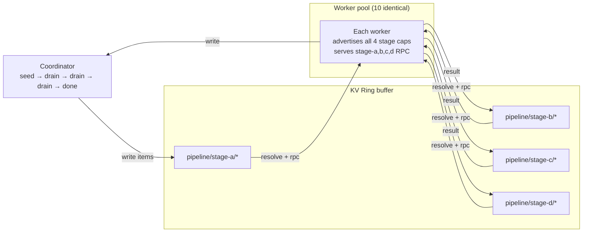

# Agentic Flow Networks — Fluid Pipeline Demo

## Concept

Traditional pipeline architectures assign workers statically to stages. This
is simple until one stage becomes a bottleneck — then you either
over-provision or re-architect.

The **fluid pool** pattern uses a fixed pool of identical workers that
advertise capability for *all* stages. The coordinator resolves the right
workers at dispatch time. Workers "flow" to where demand is: if stage C is
slow, the coordinator simply keeps routing to the workers who finish earliest.
No static assignment, no rebalancing job, no configuration change.

The Mycelium gossip layer provides both the buffer (KV ring) and the scheduler
(capability ring) — one substrate, no separate queue infrastructure.



**Key properties:**

| Property | Mechanism |
|----------|-----------|
| Fluid allocation | Workers handle all stages; coordinator routes to whoever is free |
| Topology emergence | Workers appear in `resolve_capability()` as soon as they join |
| TTL-native cleanup | Crashed workers' capability ads and work claims expire automatically |
| Substrate unity | KV ring = buffer; capability ring = scheduler; one gossip layer |

---

## Prerequisites

```bash
docker compose version   # Docker Compose v2
```

---

## Run

```bash
cd examples/fluid_pipeline
docker compose up --build --scale worker=10
```

**Expected coordinator output:**

```
coordinator: seeded 200 articles into pipeline/stage-a/
coordinator: draining stage-a  [workers: 10]
coordinator: stage-a complete (200/200) in 1.2s
coordinator: draining stage-b  [workers: 10]
coordinator: stage-b complete (200/200) in 2.4s
coordinator: draining stage-c  [workers: 10]
coordinator: stage-c complete (200/200) in 4.1s
coordinator: draining stage-d  [workers: 10]
coordinator: pipeline complete — 200 articles processed
```

---

## What to observe

**Simulate a bottleneck at stage C:**

```bash
STAGE_C_SLEEP=1.0 docker compose up --build --scale worker=10
```

All 10 workers accumulate at stage C. The coordinator does not stall — it
keeps dispatching to the fastest available worker.

**Scale up mid-run:**

```bash
docker compose up --scale worker=15 --no-recreate
```

New workers are discovered via capability gossip within ~5 s. The coordinator
starts routing to them immediately — no configuration change.

**Query final results:**

```bash
docker exec afn-postgres psql -U pipeline -d pipeline \
  -c "SELECT id, composite_score, topics FROM articles \
      ORDER BY composite_score DESC LIMIT 10;"
```

---

## How It Works

**Coordinator** (`coordinator/coordinator.py`) seeds items into the KV ring as
`pipeline/stage-a/{id}` entries, then drains each stage by resolving workers
via capability and dispatching via RPC. Results flow into the next stage's
prefix.

**Worker** (`worker/worker.py`) advertises four capabilities at startup
(`stage_a/worker`, `stage_b/worker`, `stage_c/worker`, `stage_d/worker`) and
serves a single RPC endpoint `"process"`. It detects which stage to run from
the item's schema.

**Claim key pattern** prevents double-processing: the worker writes
`claim/{item_id}` with a short TTL before processing. If it crashes, the
claim expires; the next drain pass requeues the item.

**Pipeline stages** live in `worker/stages/`:

| Stage | File | What it does |
|-------|------|-------------|
| A — Parse | `parse.py` | Extract title, body, source, publication date |
| B — Enrich | `enrich.py` | Add tags, named entities, reading-time estimate |
| C — Score | `score.py` | Compute composite quality score (configurable sleep) |
| D — Aggregate | `aggregate.py` | Write final record to PostgreSQL |

---

## Demo assumption vs real deployment

This demo uses **identical workers that each advertise all four stage
capabilities**. That choice makes fluid allocation vivid — every worker can
serve any stage, so the coordinator routes purely to whoever is free.

**This is the demo's assumption, not Mycelium's.** The capability model does
not require a monolithic worker. In a real deployment you could have:

- **Specialist workers** — some nodes advertise only `stage_c.score` (the
  expensive LLM step), others only `stage_a.parse`. Each team owns one image.
- **Heterogeneous pools** — different capability sets deployed independently;
  the mesh self-assembles the pipeline topology from whatever is running.
  No coordinator change needed when a new capability comes online.
- **Incremental rollout** — deploy `score_v2` capability alongside `score_v1`.
  Resolvers start routing to `v2` workers as they appear; drain `v1` workers
  by letting their capability advertisements expire (TTL). Zero-downtime
  upgrade with no feature flags and no orchestrator involvement.

The monolith demo *undersells* the capability model. The more powerful
production case is a **heterogeneous fleet where pipeline topology emerges
from whatever capabilities happen to be running** — assembled bottom-up by
the mesh, not configured top-down by an operator.

---

## Dev Notes

**Adding a stage.** Add a handler in `worker/stages/`, register the new
capability in `worker.py`, and add a `drain_stage` call in
`coordinator/coordinator.py`. No other changes required — the gossip layer
handles worker discovery for the new stage automatically.

**Plugging in a real LLM.** Replace the simulated sleep in `score.py` with
an LLM call:

```python
async def stage_c_score(item):
    prompt = f"Rate this article quality 0–10, return JSON {{'score': N}}: {item['body'][:500]}"
    resp = await llm_client.chat(prompt)
    score = json.loads(resp)["score"]
    return {**item, "composite_score": score}
```

The coordinator routes to the same `stage_c/worker` capability regardless.

**Item TTL sizing.** Set item TTLs long enough that slow stages don't lose
items. 5 minutes is safe for most pipelines. Claim TTLs should be 2–3× the
expected processing time.

**Without Docker.** Run coordinator and worker as plain Python processes:

```bash
MYCELIUM_PEERS="127.0.0.1:57000" python worker/worker.py &
MYCELIUM_PORT=57000 python coordinator/coordinator.py
```

→ Full concept guide: [`docs/guide/07-pipelines.md`](../../docs/guide/07-pipelines.md)
