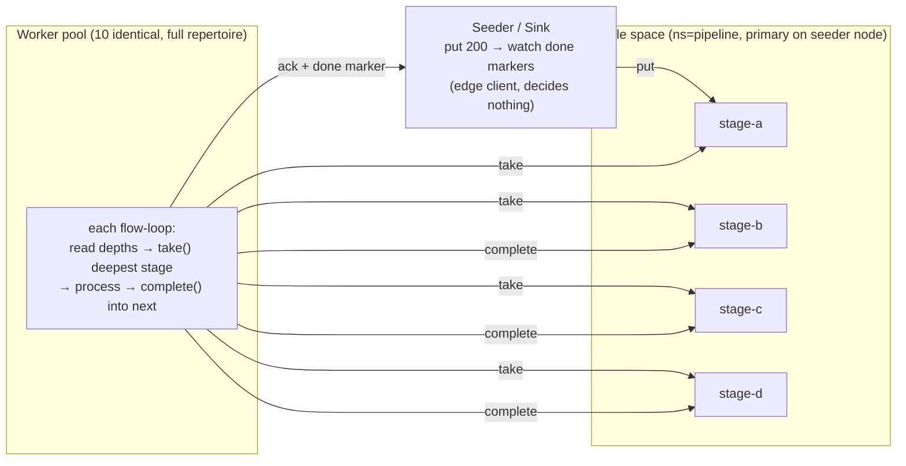

# Agentic Flow Networks — Fluid Pipeline Demo

## Concept

Traditional pipeline architectures assign workers statically to stages. This
is simple until one stage becomes a bottleneck — then you either
over-provision or re-architect.

The **fluid pool** pattern uses a fixed pool of identical workers that carry
the full stage repertoire. Workers "flow" to where demand is: if stage C is
slow, the pool masses on stage C. No static assignment, no rebalancing job,
no configuration change.

This demo runs the pattern in two modes — the canonical **pull** architecture
and the **push** baseline it refined away — selected by `PIPELINE_MODE`. The
push→pull refinement is the subject of [`flow_networks.html`](flow_networks.html)
(in this directory); the runnable A/B below is its empirical companion.

## Pull mode (default — the canonical AFN pattern)

The flow `A>B>C>D` is **data topology, not node topology**: it exists as
tuple-space stages, and a worker is "at stage B" only for the duration of one
`take()` → process → `complete()` cycle.



- **Readiness is self-announcing** — a worker `take()`s when it is actually
  free. Nobody predicts who is free, so the staleness/misroute failure mode
  of push dispatch does not exist.
- **Fluidity is self-selection against pressure** — each flow loop reads the
  per-stage depths and takes from the deepest stage. The pool automatically
  masses on the bottleneck; watch the seeder's `pressure:` log lines to see
  the front migrate A→B→C→D.
- **Stage transitions are atomic** — `complete()` acks the input and puts the
  output in one WAL record; a crash cannot half-replay a hop. Unacked items
  re-queue automatically after the in-flight deadline (at-least-once; the
  stage handlers are idempotent).
- **The seeder is not a coordinator** — it puts items into stage-a and counts
  done markers. Every distribution decision is made by a worker.

## Push mode (the pre-refinement baseline)

```bash
PIPELINE_MODE=push docker compose up --build --scale worker=10
```

The original architecture, kept runnable as the contrast case: workers
advertise four stage capabilities and serve RPCs; a **coordinator** resolves
free workers and dispatches every item through its own decision loop —
the architecture the project's Paper 1 names *the coordinator trap*. The KV
ring is the buffer (`pipeline/stage-{a,b,c,d}/{id}`), claim keys prevent
double-dispatch, and the coordinator drains stages one at a time.

It works — and comparing it against pull mode under stage skew is exactly
how the refinement earns its keep (see below).

**Key properties (pull vs push):**

| Property | Pull (canonical) | Push (baseline) |
|----------|------------------|-----------------|
| Who decides | Each worker, by taking when ready | Coordinator, by predicting who is free |
| Buffer | Tuple-space stages (single-copy, WAL-durable) | KV ring (replicated everywhere) |
| Stage transition | One atomic `complete()` record | Worker KV write + delete + claim cleanup |
| Crash recovery | In-flight deadline re-queues automatically | Claim-key TTL + coordinator retry |
| Failure surface | Tuple primary (secondary promotes via capability evaporation) | The coordinator itself |
| Topology emergence | Workers appear in the capability ring for observability | Coordinator resolves workers per dispatch |

---

## Prerequisites

```bash
docker compose version   # Docker Compose v2
```

## Run

```bash
cd examples/fluid_pipeline
docker compose up --build --scale worker=10                    # pull (default)
PIPELINE_MODE=push docker compose up --build --scale worker=10 # baseline
```

**Expected seeder output (pull):**

```
seeder: seeding 200 articles into tuple stage-a (ns=pipeline)
seeder: seed complete — workers are already draining (no dispatch step exists)
seeder:   pressure: stage-a=142(+8 inflight)  stage-b=31(+6)  stage-c=9(+4)  stage-d=0(+0)   done=0/200
seeder:   pressure: stage-a=0(+0)  stage-b=12(+8)  stage-c=88(+10)  stage-d=21(+6)   done=61/200
seeder: === pipeline complete: 200/200 articles in 41.3s (4.8 items/s) ===
```

## What to observe

**The pressure front migrating (pull mode).** With `STAGE_C_SLEEP=1.0`, watch
the depth counters: stage-c accumulates while a–b drain, then the whole pool's
inflight count concentrates on stage-c — no one told the workers to move.

```bash
STAGE_C_SLEEP=1.0 docker compose up --build --scale worker=10
```

**The same skew under push.** Run the identical workload with
`PIPELINE_MODE=push STAGE_C_SLEEP=1.0` and compare wall-clock, dispatch
retries, and coordinator log volume. Same stages, same workers, same data —
the only variable is who decides.

**Scale up mid-run:**

```bash
docker compose up --scale worker=15 --no-recreate
```

New workers join the gossip mesh and start taking within seconds — in pull
mode there is nothing to tell about them; they just start pulling.

**Query final results:**

```bash
docker exec afn-postgres psql -U pipeline -d pipeline \
  -c "SELECT id, composite_score, topics FROM articles \
      ORDER BY composite_score DESC LIMIT 10;"
```

---

## How It Works

**Seeder / coordinator** (`coordinator/coordinator.py`) — in pull mode, puts
items into tuple stage-a and polls `pipeline/done/` markers; in push mode,
runs the original resolve-and-dispatch drain loops.

**Worker** (`worker/worker.py`) — in pull mode, runs `WORKER_CONCURRENCY`
flow loops of take-deepest → process → complete; in push mode, advertises
`stage_{a..d}/worker` capabilities and serves the four stage RPCs.

**Tuple space hosting** — the seeder's sidecar Mycelium node runs with
`MYCELIUM_TUPLE_ROLE=primary` for namespace `pipeline`; worker nodes run as
`client`, so their gateway routes tuple ops to the primary via RPC. (For
primary failover — a secondary mirror promoting when the primary's capability
evaporates — see integration scenario 13 and the `mycelium-tuple-space`
crate docs.)

**Pipeline stages** live in `worker/stages/` (shared by both modes):

| Stage | File | What it does |
|-------|------|-------------|
| A — Parse | `parse.py` | Extract title, body, source, publication date |
| B — Enrich | `enrich.py` | Add tags, named entities, reading-time estimate |
| C — Score | `score.py` | Compute composite quality score (configurable sleep) |
| D — Aggregate | `aggregate.py` | Write final record to PostgreSQL |

---

## CI smoke harness

[`ci_smoke.sh`](ci_smoke.sh) runs **both modes** end-to-end without Docker:
it starts a seeder node (tuple primary) plus two worker nodes as local
processes, drives a reduced workload (24 items) through each mode with fresh
nodes per phase, and asserts `pipeline complete` with the full item count.
Wired into CI as the `afn-smoke` job.

```bash
./examples/fluid_pipeline/ci_smoke.sh            # both modes
./examples/fluid_pipeline/ci_smoke.sh pull       # one mode
```

---

## Demo assumption vs real deployment

This demo uses **identical workers that each carry all four stages**. That
choice makes fluid allocation vivid — every worker can flow to any stage.

**This is the demo's assumption, not Mycelium's.** Nothing requires a
monolithic worker. In a real deployment you could have:

- **Specialist workers** — some nodes serve only `stage-c` (the expensive
  LLM step), others only `stage-a`. In pull mode that's just a smaller
  `PIPELINE` dict: a worker takes only from stages it can serve.
- **Heterogeneous pools** — different repertoires deployed independently;
  the pipeline self-assembles from whatever is running.
- **Incremental rollout** — deploy `score_v2` workers alongside `v1`; they
  start taking from the same stage immediately. Drain `v1` by stopping its
  workers — items simply stop being taken by them. No flags, no orchestrator.

Each capability a node lacks is a stage it cannot flow to, so fluidity is
maximal when repertoires are uniform — that is a sizing dial, not a
constraint of the substrate.

---

## Dev Notes

**Adding a stage.** Add a handler in `worker/stages/`, add one entry to
`PIPELINE` in `worker.py` (and `STAGES` in `coordinator.py` for push mode).
The tuple space creates stages on first use — no other changes.

**Plugging in a real LLM.** Replace the simulated sleep in `score.py` with an
LLM call; `STAGE_C_SLEEP` exists precisely to stand in for that latency.

**In-flight deadline sizing (pull).** Items taken but not acked re-queue
after the tuple space's `worker_timeout_secs` (default 300 s). Keep it 2–3×
the slowest stage's expected duration.

**Without Docker.** `ci_smoke.sh` is the reference for running everything as
plain processes; the short version:

```bash
cargo build --example three_node_demo
MYCELIUM_ROLE=node MYCELIUM_PORT=57400 MYCELIUM_HTTP_PORT=58400 \
  MYCELIUM_TUPLE_ROLE=primary MYCELIUM_TUPLE_NS=pipeline \
  ./target/debug/examples/three_node_demo &
# … worker nodes with MYCELIUM_TUPLE_ROLE=client, then worker.py / coordinator.py
```

→ Full concept guide: [`docs/guide/07-pipelines.md`](../../docs/guide/07-pipelines.md)
→ The push→pull refinement essay: [`flow_networks.html`](flow_networks.html)
